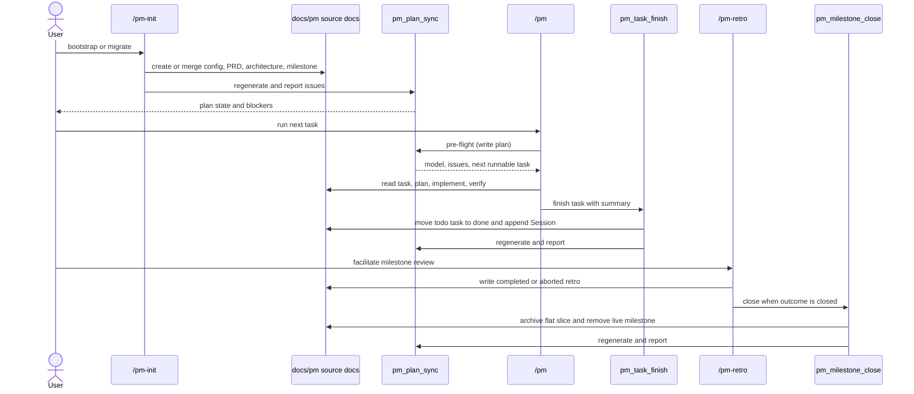

# Project-management workflow

The PM loop has an intake phase that makes the document model trustworthy and an execution phase that advances one runnable task at a time. The generated plan is refreshed at every mutation.

## End-to-end flow

## Intake: `/pm-init` and alignment

1. `/pm-init` detects greenfield or brownfield state. Greenfield initialization writes `docs/pm/config.yml`, the configured PRD and architecture documents, and a first milestone. Brownfield migration maps existing plans, AGENTS guidance, and archives into the document tree while preserving their history. Existing documents are merged and reported, never overwritten.
2. Run `pm_plan_sync` and resolve all error issues before execution. Warnings are visible in the report and become alignment work when they describe stale or incomplete intent.
3. `/pm-align` reconciles the source docs with the repository: split or merge tasks, create or retire milestones, repair `pre`, and update PRD or architecture content. It ends with a sync.
4. Ideas remain in `ideas/` until `/pm-new-task` promotes them. Decisions are stored in `decisions/` and become the durable answer to a disputed or blocking question.

## Execution: `/pm`

1. `/pm` runs `pm_plan_sync` before choosing work. The selector scans `in_progress` milestones, then `backlog` milestones, preserving each milestone's task order. It skips tasks whose `pre` entries are not done.
2. The selected task is restated from its source document. Ask only questions that prevent useful work; record a durable answer as a decision rather than relying on chat history.
3. Initialize the task as `todo`, produce an ordered plan, dispatch the appropriate implementer, run the repository's verification gates, and reconcile the task's acceptance criteria.
4. Invoke `pm_task_finish` only when the task is `status: done` and still in `todo/`. It moves the file to `done/`, sets `completed`, appends `## Session`, and synchronizes the generated plan.
5. One session advances one task. A later `/pm` run selects the next eligible task.

For a task whose prefix is configured with `impeccable: true`, load `skill://impeccable`, read the product and design direction plus the surface brief, and use the UI implementer path.

## Blocked → decision → resolve loop

A blocked task is a deliberate state, not permission to bypass priority order:

1. `/pm` sees `status: blocked` or a missing runnable candidate and stops with the task id and `/pm-resolve` as the next command. `blocked_by` names the decision that explains the block.
2. `/pm-resolve` takes the first blocked task, gathers the missing context, and calls `pm_decision_new`. The decision must be `accepted` or `deferred` before it can satisfy the `blocked-no-decision` invariant.
3. `/pm-resolve` retains the decision id in `blocked_by` while setting the task back to `todo`. The task can then be selected when its other prerequisites are done. A blocked task does not change through an unrelated edit.
4. Run `pm_plan_sync`, inspect errors and warnings, then return to `/pm`. If the decision rejects the proposed path, create the replacement task or alignment change explicitly and leave the original record auditable.

## Retrospective and closure: `/pm-retro`

When all tasks are done, an in-progress milestone should move to `retro`. `/pm-retro` reviews what landed, what stalled, and the actions to carry forward, then writes `RETRO-YYYY-MM-DD-NNN.md`. `outcome: continued` keeps the milestone active for follow-up work. `outcome: closed` calls `pm_milestone_close`, which requires a completed closed retro and zero open tasks, writes one flat `docs/archive/<M>-<slug>.md` slice, removes the live milestone directory, and syncs the plan.

## Reconciliation checkpoints

- After any edit under `docs/pm/`, run `pm_plan_sync` and report its issues.
- Use `/pm-docs` for PRD or architecture changes, ending with `pm_doc_check`.
- Use `/pm-status` for observation; it runs sync with `write: false` and never changes source docs.
- Treat `plan.yml` as generated output. Update source frontmatter or body and regenerate instead of editing the plan directly.
