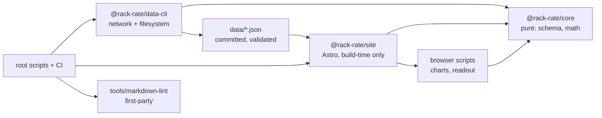

# Architecture

_This document describes the system as it is now. Per-task and per-stage records belong in
`docs/pm/<M>/done/<ID>.md` under `## Session` or in `docs/archive/`; inserting a dated record
section is a `doc-append-record` warning._

Rack Rate is three Bun workspaces and two first-party tooling trees: a pure domain package, a
data CLI that alone touches the network and the filesystem, an Astro site built statically from
committed JSON, and the Markdown lint tool the root gate and the `.omp` harness share. The
product is a static site; nothing runs on a server.

## Module graph



## Boundary rules

- `@rack-rate/core` is pure: no `fetch`, no `node:fs`, no `Bun.file`, and no clock. A function
  that needs the date takes it as an argument.
- `@rack-rate/data-cli` is the only workspace that reaches the network or writes a data file.
  The dispatcher in `packages/data-cli/src/main.ts` routes commands statically and never guesses
  an exit code.
- `@rack-rate/site` reads committed JSON at build time only. It never fetches, ships no server,
  and the browser issues zero requests for `data/*.json`.
- A client module reaches core through a narrow subpath that carries no zod value
  (`@rack-rate/core/ids`, `/cost`, `/freshness`) or through the barrel, which drops a pure value
  whole because `packages/core/package.json` declares `"sideEffects": false`. The validator never
  enters a browser chunk: a browser only ever reads committed numbers.
- Generated and frozen trees are never hand-edited. `docs/pm/plan.yml` is written by
  `pm_plan_sync`; `docs/archive/**` is append-only; `docs/history/**` is frozen pre-PM history.
  Edit the source document and let the tool regenerate.
- A reference document states current truth only. The measurements behind a change live in the
  owning task's `## Session`, never appended here.

## Subsystems

### `@rack-rate/core` — the pure domain

`packages/core/src` holds the zod schemas every committed document is parsed with
(`schema.ts`), the comparison math (`cost.ts`, `normalize.ts`, `pareto.ts`, `insights.ts`), the
shared identifiers (`ids.ts`), and the one freshness rule (`freshness.ts`,
`STALE_AFTER_DAYS = 14`, reference moment passed in). No `fetch`, no filesystem, no clock.

The public surface is the barrel plus file subpaths: `@rack-rate/core/cost`, `/ids`, and
`/freshness` carry no zod value, while `/schema` and the barrel do. A client module imports a
narrow form, so a browser bundle links no validator. `ids.ts` owns `ARTIFICIAL_ANALYSIS_BENCHMARK_ID`,
`ARTIFICIAL_ANALYSIS_SOURCE_ID`, and `BENCHMARK_SOURCE_IDS` (`deepswe` → `src-deepswe-data`,
`terminal-bench` → `src-terminal-bench`, `artificial-analysis` → `src-artificial-analysis`, a
`ReadonlyMap`). Its consumers are `apps/site/src/lib/data.ts`, `apps/site/src/pages/method.astro`,
`packages/data-cli/src/commands/sources.ts`, and `validate.ts`; the Artificial Analysis gate
compares the shared constants, and no consumer keeps a private id or a hard-coded benchmark
branch.

Constants a page prints come from the math it describes: `normalize.ts` owns
`COMPOSITE_CENTER = 50` and `COMPOSITE_SPREAD = 10`; `cost.ts` owns `DAYS_PER_MONTH = 30`,
`HOURS_PER_DAY = 24`, `DEFAULT_INPUT_OUTPUT_BLEND`, and `CACHE_TIER_CAVEAT`.

### `@rack-rate/data-cli` — the only I/O

`packages/data-cli/src` owns fetch, validation, derivation, and the `rack-rate-data <command>`
surface:

- `fetch [deepswe|terminal-bench|plans|artificial-analysis|all] [--diff]` refreshes one source or
  all four in that order; a bare `fetch` means `all`. `--diff` is a dry run that writes no file
  at all — not even a gitignored `data/raw/*` snapshot — and exits `1` when committed data would
  change.
- `validate` checks the committed source, model, plan, and benchmark documents without writing.
- `compute` deterministically writes `data/derived.json` from the committed inputs.
- `check` validates inputs, recomputes the derived document in memory, and compares its
  deterministic bytes with the committed file.
- `sources` lists source metadata, attribution requirements, freshness, and whether each source
  contributes to published data.
- `doctor` probes source and vendor URLs, reports Artificial Analysis environment state and
  data-file parsing, and counts same-day raw snapshots.
- `help` and `--help` print the command list.

Success exits `0`; invalid arguments and operational failures exit `1`. Fetch is fail-closed: a
missing research anchor or an unreachable vendor page keeps the last-good sources and exits
non-zero. `doctor` reports unreachable sites as findings but exits `0` when every probe and data
check could run; a data read or parse failure still exits `1`.

`upsertBenchmarkEntry` is a write boundary: it parses the candidate through the `Benchmark` schema
before touching `data/benchmarks.json`, so a mapping bug cannot clobber the file. Terminal-Bench
tries the flight-data path first and only then resolves `harbor`, preferring a non-empty
`HARBOR_BIN` over an executable on `PATH` and logging the resolved binary. The Artificial Analysis
gate is fail-closed in one direction and loud in the other: committed AA rows with `AA_PUBLISH`
not exactly `1` are an error, while `AA_PUBLISH=1` with committed AA rows downgrades to a loud
warning.

### `apps/site` — the static build

`apps/site/src` holds the routes, layouts, components, and the lib modules described under
[Presentation layer](#presentation-layer). The build is `output: "static"` with no adapter: the
site is generated from committed data at build time and served as files.

### `tools/markdown-lint` — first-party tooling

`tools/markdown-lint` is the repository's Markdown gate: frontmatter shape, hard line breaks, and
dangling relative links. It is typechecked through the root `tsconfig.json` and imported by the
`.omp` harness for its post-edit document checks. `tools/oxlint/anti-slop/` and `.claude/**` are
vendored and excluded whole from lint and format, because they are not ours to fix.

## Data flow

```text
upstream boards and vendor pages
  -> rack-rate-data fetch <deepswe|terminal-bench|plans|artificial-analysis|all>
  -> data/{models,plans,benchmarks,sources}.json   committed, schema-validated
  -> rack-rate-data validate                       schemas, citations, versions, AA gate
  -> rack-rate-data compute                        pure core math -> data/derived.json
  -> rack-rate-data check                          recompute in memory, compare bytes
  -> Astro build (apps/site)                       build-time only, no fetch
  -> dist/ + dist/og.png                           static output for GitHub Pages
```

`validate` is the trust boundary for committed documents, `compute` is deterministic, and `check`
is the staleness gate CI runs _before_ the write path so a stale committed file cannot be repaired
by accident. The site consumes committed bytes only, which is why a clean clone with no `.env`
still builds and why Artificial Analysis is absent from every output unless publication is
explicitly enabled.

## Data contract

`packages/core/src/schema.ts` is the executable shape; this section is the written record of it.
The pre-PM plan carries the original wording (`git show d95e6ef:PLAN.md`).

Four rules the schemas cannot state on their own:

- **Row identity.** `data/models.json` is keyed by `(id, benchmark_version)`; `data/benchmarks.json`
  holds one entry per benchmark version, never per benchmark family, with its `rows` keyed by
  `model_id`; `data/plans.json` and `data/sources.json` are keyed by `id`.
- **Labels a page must print.** `models[].cost_basis` is `list | expected-launch | disputed` and
  `plans[].price_status` is `list | disputed` (invariant 4); `plans[].confidence` is one of the
  four confidence levels (invariant 5); `sources[].attribution` is required when the licence
  demands it and is validated (invariant 8).
- **Missing stays missing.** A model absent from a benchmark version has no row, not a zero row;
  an unresolved plan quota is carried as `quota_unresolved` with `quota_note`, never as a guessed
  figure (invariants 2 and 6).
- **Units are per document.** `benchmarks[].rows[].score` is in that document's own `scale`
  (`0-1 | 0-100 | z`) with `unit` naming the metric (`pass@1 | accuracy | index`), while
  `models[].score_pct` is always 0–100 and `models[].ci_lo`/`ci_hi` are always 0–1 fractions.
  Display code picks its formatter by the units its row carries.

Also carried: `retrieved_at` on every upstream row (the freshness badge's input),
`fx: { rate, date }` on a plan priced in CNY, and `known_gaps` on a plan whose fact could not be
resolved.

### `data/derived.json`

Generated by `compute`, deterministic, committed:

```jsonc
{
  "generated_from": { "models": 28, "plans": 16, "task_count": 113 },
  "generated_at": "2026-09-03T22:24:37Z", // newest upstream generated_at
  "pairs": [{
    "model_id", "model_name", "provider", "score_pct",
    "plan_id", "plan_name", "price_usd_month",
    "quota_method", // which conversion branch was used
    "tasks_per_month", "cost_per_task_usd", "api_cost_per_task_usd",
    "days_for_full_run", "confidence"
  }],
  "best_routes": [ /* same row shape; cheapest pair per model */ ],
  "cross_check": {
    "pairs": [ /* plan_id, plan_name, model_id, model_name,
                  tasks_by_dollars, tasks_by_tokens, ratio */ ],
    "summary": { "median_ratio", "min_ratio", "max_ratio", "pair_count" }
  },
  "known_gaps": [ /* { plan, provider, reason, url? } */ ]
}
```

`compute` also writes `composites`, `frontiers` (`api` and per-plan `plan_adjusted`), `dominated`,
`token_allowances`, and the per-row `badges`. Those sections are optional in the `DerivedFile`
schema but always present in the committed file; `bun run data:check` fails when one is missing.

Two naming rules, both easy to get wrong:

- `generated_from` counts the inputs used; `generated_at` is the newest upstream timestamp and is
  the reference moment every freshness badge is measured against. Neither key is repurposed for
  the other.
- The cross-check rows live at `cross_check.pairs` with `cross_check.summary` beneath them. There
  is no `rows` array and no top-level `n`.

## Presentation layer

### Routes and data access

`apps/site/src/pages/` holds the whole route set. `output: "static"` with Astro's default
`build.format: "directory"` emits one directory per route, so a route URL ends in `/` and is
served from `<route>/index.html`; `href()` supplies that trailing slash. The 404 route is the
exception: it builds to `dist/404.html`, which GitHub Pages serves for any unmatched path.

| Route            | File                  |
| ---------------- | --------------------- |
| `/`              | `index.astro`         |
| `/models`        | `models/index.astro`  |
| `/models/[slug]` | `models/[slug].astro` |
| `/plans`         | `plans/index.astro`   |
| `/plans/[slug]`  | `plans/[slug].astro`  |
| `/compare`       | `compare.astro`       |
| `/explore`       | `explore.astro`       |
| `/start`         | `start.astro`         |
| `/method`        | `method.astro`        |
| `/sources`       | `sources.astro`       |
| `404`            | `404.astro`           |

Both dynamic routes build `getStaticPaths` from committed rows — 28 `/models/<id>` pages from
`data/models.json` and 16 `/plans/<id>` pages from `data/plans.json`, the row `id` being the slug.
A row added upstream becomes a page on the next commit with no code change, and no second slug
mapping exists to drift. Every page renders exactly one `<main id="main" tabindex="-1">` and one
`h1`, both from `Page.astro`; nav `aria-current="page"` is exact for the root route and
prefix-based elsewhere, so `/models/<id>` marks Models.

`apps/site/src/lib/data.ts` is the only module under `apps/site` that imports `data/*.json`. It
parses all five committed documents with the corresponding `@rack-rate/core` schemas and exports
the parsed rows and documents (`models`, `plans`, `planKnownGaps`, `quotaModelDocs`, `benchmarks`,
`sources`, `derived`), the id indexes (`modelsById`, `plansById`, `benchmarksById`, `sourcesById`),
and the relation indexes (`routesByModel`, `routesByPlan`, `bestRouteByModel`, `compositeByModel`,
`compositeWeights`, `apiFrontier`, `frontierByPlan`, `tokenAllowances`, `tokenAllowanceByPair`,
`badgeByPair`, `crossCheck`, `derivedKnownGaps`, `contributingSourceIds`). `pairKey(modelId,
planId)` is the single place the `(model, plan)` map key is built, using a separator absent from
either kebab-case id. `derivedGeneratedAt` is the one scalar every freshness badge is dated
against, so two builds of one commit age identically. `contributingSourceIds` applies the same
contribution semantics as the data-cli `sources` command, so whether a source feeds this build has
one definition.

Failure behavior is deliberate. A computed section that is missing, or a committed file that
drifts from its schema, throws with the file and section named, so the build fails rather than
rendering an empty page. An unknown model, plan, benchmark, or source id returns `undefined` from
its index lookup instead of throwing, so a row removed upstream degrades one page rather than
crashing the build. Row types come from `@rack-rate/core`; the module re-exports no parallel type
surface. Its JSON imports work because the root `tsconfig.json` sets `resolveJsonModule: true`.

### Layouts and shell

`apps/site/src/layouts/Base.astro` accepts `title` and `description`; `Page.astro` accepts those
plus optional `heading` and `lede` and is the only layout that renders the `main` landmark.

The shell is three components and one module, composed by `Base.astro`: `StatusBand.astro` (the
pinned 32px band), `LaneRail.astro` (the rail, the drawer, and the keyboard model),
`FooterIndex.astro` (the numbered route index, the maker credit, and the retained attributions),
and `apps/site/src/lib/nav.ts` — the single route table (`lanes`, `isCurrent`, `laneAnchorId`) that
the band, the rail, the drawer, and the footer index all read, so a label, an order, or an anchor
cannot drift between the four consumers. No file under `apps/site/src/pages/**` is edited by the
shell; every route inherits it through `Base`/`Page`.

- The band, not a header nav, computes `position: sticky`. It carries `RACK-RATE`, the committed
  `BUILD` and `DATA` stamps, the Artificial Analysis gate link into `/sources#artificial-analysis-heading`,
  and `MENU` below `lg`. The stamps read committed data only: `derivedGeneratedAt` for the build
  date — `newestRetrievedAt(sources, models, plans, benchmarks)` for the newest retrieval, which
  throws on an empty set so a build cannot print an undated stamp — and
  `artificialAnalysisState(benchmarks).published` for the gate.
- The rail is one `<dialog id="lane-rail" aria-label="Lane rail">` with no `open` attribute: the
  author `lg:block` beats the UA `dialog:not([open])` rule, so the same element is the static rail
  at `lg` and a modal drawer below it, opened by `MENU` through `showModal()`. It is dismissed by
  `Escape`, the `CLOSE` row, a backdrop click, or a lane click, each returning focus to `MENU`;
  `Tab` stays inside, arrows move and clamp, `Home`/`End` jump, and a resize across
  `(min-width: 64rem)` closes it. Chromium does not lock the root scroller for a modal `<dialog>`,
  so the rail binds non-passive `wheel` and `touchmove` listeners for as long as the drawer is
  open and removes them in the `close` handler; `overflow` on `html`/`body` is never touched.
- `Base` wraps the rail and the page slot in a 1440px-capped grid
  (`lg:grid-cols-[11rem_minmax(0,1fr)]`) with the 24/32/48px gutter progression; the band and the
  footer stay full bleed. The footer is the indexed route directory (`[01]`–`[06]` from the shared
  `lanes`, then `METHOD` and `SOURCES` unnumbered) plus the maker credit and the retained
  attribution paragraphs. The verbatim Awesome Coding Plan attribution required by
  [docs/data-sources.md](docs/data-sources.md) belongs to `/sources` and is rendered from
  `data/sources.json`, not duplicated in the layout.
- `global.css` adds three shell rules: the skip link takes `z-index: 20` above the band's `10`,
  `dialog::backdrop` is transparent (one tonal device, no scrim), and `:target, main` take
  `scroll-margin-top: 2rem` so an anchor lands below the pinned band.

`apps/site/src/lib/url.ts` exports three typed helpers, and all base handling belongs to them:

- `href(path: \`/${string}\`): string`joins the path to`import.meta.env.BASE_URL` and adds a
  trailing slash except for the root.
- `asset(path: \`/${string}\`): string`joins the path to`import.meta.env.BASE_URL`without adding
a trailing slash;`Base` uses it for the Open Graph and Twitter image paths.
- `absoluteUrl(relativePath: string, site: URL | undefined): string` turns an already
  base-relative path into an absolute URL using `site.origin`, and returns the input unchanged
  when `site` is `undefined`.

| Call               | Project page (`base: "/rack-rate"`) | Custom domain (`base === "/"`) |
| ------------------ | ----------------------------------- | ------------------------------ |
| `href("/")`        | `/rack-rate/`                       | `/`                            |
| `href("/models")`  | `/rack-rate/models/`                | `/models/`                     |
| `asset("/og.png")` | `/rack-rate/og.png`                 | `/og.png`                      |

`Base` emits head metadata in this order: charset, viewport, title (`{title} · rack-rate`),
description, canonical, generator, two media-scoped `theme-color` values, Open Graph type, site
name, title, description, URL, image, image dimensions and image alt, then Twitter card
(`summary_large_image`), title, description, and image. It links one icon and no more — the
favicon — and adds no analytics, emoji, dashed border, gradient, or shadow.

The skip link is 1 by 1 px, clipped with `clip-path: inset(50%)` until focused. The global focus
ring is `:focus-visible { outline: 2px solid var(--color-ink); outline-offset: 2px }`; interaction
chrome spends no accent hue. `.tabular` sets `font-variant-numeric: tabular-nums`.

### Display formatting

`apps/site/src/lib/format.ts` owns one rounding rule per unit, and call sites supply no precision
argument, so a figure reads identically on every page. It is pure TypeScript — no
`import.meta.env`, DOM, or Astro import — so `.astro` frontmatter and `bun test` use the same
function. Every formatter applies `roundHalfEven` from `@rack-rate/core` before string conversion,
and `Intl.NumberFormat` is pinned to `en-US`, so the runtime locale can never reach a published
figure.

| Export                                 | Unit in the data             | Rule                                                                                           |
| -------------------------------------- | ---------------------------- | ---------------------------------------------------------------------------------------------- |
| `MISSING`                              | absent value                 | the single placeholder, `—`                                                                    |
| `formatPercent(v)`                     | percent units, 0–100         | half-even to 1 dp, `%` suffix, no space (`74.12 → "74.1%"`)                                    |
| `formatFractionAsPercent(v)`           | fraction, 0–1                | ×100, then the percent rule (`0.7124 → "71.2%"`)                                               |
| `formatPoints(v)`                      | percentage-point delta       | always-signed, half-even to 1 dp, `" pp"` (`4.2 → "+4.2 pp"`)                                  |
| `formatPercentRange(lo, hi)`           | percent units, 0–100         | the percent rule on both ends, en dash, one `%` at the end; either end missing → `MISSING`     |
| `formatFractionAsPercentRange(lo, hi)` | fractions, 0–1               | the fraction rule on both ends, as above                                                       |
| `formatUsd(v)`                         | USD amount                   | up to 2 dp half-even, trailing zeros trimmed, thousands grouped, `$` (`25472 → "$25,472"`)     |
| `formatUsdPerTask(v)`                  | USD / task, both cost bases  | half-even to 4 dp fixed, grouped, `$` (`0.0304 → "$0.0304"`)                                   |
| `formatUsdPerMillionTokens(v)`         | USD / 1M tokens              | half-even to 4 dp fixed, `$`                                                                   |
| `formatTasksPerMonth(v)`               | tasks / month                | half-even to 1 dp, grouped (`5233.18 → "5,233.2"`)                                             |
| `formatDays(v)`                        | days                         | half-even to 1 dp, grouped                                                                     |
| `formatCount(v)`                       | integer count                | half-even to up to 1 dp, trailing zeros trimmed, grouped (`2400 → "2,400"`)                    |
| `formatTokens(v)`                      | token quantity               | three significant digits with a `K`/`M`/`B` suffix (base 1000); below 1000 the grouped integer |
| `formatTokensExact(v)`                 | token quantity, detail views | half-even to 0 dp, grouped                                                                     |
| `formatMultiple(v)`                    | unitless multiplier          | up to 2 dp half-even, trailing zeros trimmed, `×` suffix, no space (`3 → "3×"`)                |
| `formatZ(v)`                           | z-score                      | always-signed, half-even to 2 dp, no suffix (`1.5656 → "+1.57"`)                               |
| `formatFxRate(v)`                      | CNY→USD spot rate            | half-even to 4 dp fixed, no symbol, grouped                                                    |

The two-convention trap is explicit: `data/models.json` carries `ci_lo`/`ci_hi` as 0–1 fractions,
while `score_pct`, `data/benchmarks.json` rows, and `derived.json` composites use the 0–100
percent scale. The module therefore ships both families, and a page picks by the units its row
actually carries.

Nulls render as `MISSING`, not `0` or `N/A` (invariant 6), while a genuine `0` never renders as
missing. A one-sided range is not a reported interval: both range formatters return `MISSING`
unless both endpoints are present, so a half-range cannot read as a figure. The formatter never
appends a unit word, so `CostBasisChip` and headers own `/task`, `/mo`, `days`, and `tokens`, and
two spellings cannot drift. No consumer calls `toFixed`, `Intl`, or a template literal for a
published number.

### Provenance components

`apps/site/src/components/` holds six provenance components. They take parsed values and render
words, geometry, and citations — never a figure of their own — so the number stays owned by
`format.ts`, the vocabulary by `provenance.ts`, and the citations by `data/sources.json`.

| Component               | Props (essentials)                                                            | Contract                                                                                               |
| ----------------------- | ----------------------------------------------------------------------------- | ------------------------------------------------------------------------------------------------------ |
| `Badge.astro`           | `{ title?, state?, reason?, class? }`                                         | square 1px framed evidence marker at `--text-meta`; state as `data-state`, disabled as `aria-disabled` |
| `ConfidenceBadge.astro` | `{ level, state?, reason? }`                                                  | the confidence term from `CONFIDENCE_TERMS` behind an `sr-only` "Confidence: " prefix                  |
| `FreshnessBadge.astro`  | `{ freshness, retrievedAt, state?, reason? }`                                 | freshness term plus `retrieved <date>` in tabular digits, definition in `title`                        |
| `CostBasisChip.astro`   | `{ basis, planName?, unit?, status?, state?, reason?, class? }`               | basis label, unit, and qualifier from `provenance.ts`                                                  |
| `SourceLink.astro`      | `{ id, label?, state?, reason?, class? }`                                     | one external anchor, `title` = title · licence · retrieval date plus an `sr-only` new-tab note         |
| `CiBar.astro`           | `{ value, lo?, hi?, ciScale, method?, confidence?, state?, reason?, class? }` | square-ended 1px interval rule with value mark and confidence stroke weight                            |

Eight listing primitives share the same state vocabulary and fixed geometry:
`SectionHead.astro` (2px opener, optional uppercase mono number, error requires a reason),
`Plate.astro` (neutral panel plate; signal plate only when active), `Chip.astro` (square
basis/filter frame; amber reserved for an active plan-route basis), `ControlRow.astro` (labelled
`role="group"` strip with top and bottom rules, wrapping controls, owned empty and error copy),
`StateCell.astro` (one carriage-control glyph, `sr-only` mark label, mark description in `title`),
`Gutter.astro` (right-aligned tabular line number), `SetAside.astro` (titled visible set-aside
rail; zero rows prints `LISTING_COPY.noExcludedRows`), and `EmptyState.astro` (variant copy from
`LISTING_COPY`, gap copy from `readout.ts`).

`apps/site/src/lib/provenance.ts` is pure TypeScript and owns the vocabulary:
`PrimitiveState` (`default | disabled | loading | empty | error`), `StateMarkKind` with
`STATE_MARKS` and `STATE_MARK_TERMS`, `LISTING_COPY`, `CONFIDENCE_TERMS`, `FRESHNESS_TERMS`,
`COST_BASIS_TERMS`, `COST_UNIT_LABELS`, `costBasisTerm`, `costBasisQualifier`, and `ciGeometry`.
Its types derive from the data contract — `Confidence` is `Plan["confidence"]`, `Freshness` is
`PairBadge["freshness"]`, `CostBasisStatus` is `Model["cost_basis"] | NonNullable<Plan["price_status"]>`
— so a new level or status fails inside the module instead of rendering an unlabelled badge.

Five rules the components encode:

1. **One state mechanism.** Every primitive emits `data-state` from `PrimitiveState`; disabled
   also emits `aria-disabled="true"`, and a `Plate` button receives native `disabled`. Loading is
   static text, never a spinner or shimmer, and empty and error text carry the relevant source or
   gap reason.
2. **A basis label names its quantity.** `costBasisTerm("plan-route")` throws without a plan name,
   because `{plan} route` without the plan names nothing.
3. **Absent stays absent.** `CiBar` renders text, never a bar, when either endpoint is missing: a
   bar drawn from one end would invent the other.
4. **The interval is never zoomed.** `ciGeometry` maps the interval onto the unit's full domain
   (`0–1` for a fraction, `0–100` for percent), so a narrow interval reads narrow. `leftPct` and
   `widthPct` round to 3 dp with the width taken as the delta between the rounded ends;
   out-of-domain values clamp instead of rescaling the track, and a transposed pair is ordered
   rather than drawn inside out.
5. **One freshness rule.** `isStale` and `freshnessOf` ship in `@rack-rate/core` with
   `STALE_AFTER_DAYS` at 14 and the reference moment as an argument, and a row's verdict is
   `freshnessOf(row.retrieved_at, derivedGeneratedAt)`.

`Gutter` and `StateCell` carry the data-row height contract — 36px at `≥768px`, 44px below it —
because the frozen file list has no `Row` primitive, and `StateCell` keeps that height when
`Gutter` drops below 480px. `CiBar`'s confidence stroke weight is 2px for `measured`, 1.5px for
`high`, 1px for `medium`, and 0.75px for `low`, on a 1px track. Two layout obligations follow from
these components: any table needs an `overflow-x-auto` wrapper, and a `CiBar` needs at least its
`min-w-16` floor (64px) of room, because the floor is a `min-width` and not a hint. Every
published figure sits inside at least one provenance component, so provenance is structural
rather than a footer paragraph.

### Cursor readout

`apps/site/src/components/Readout.astro` renders the one document-level readout line —
`#cursor-readout`, `[data-readout-line]`, `role="status"`, `aria-live="polite"` — and
`apps/site/src/lib/readout.ts` owns its contract. The line carries five fields in this order:
`VALUE`, `BASIS`, `CONFIDENCE`, `SOURCE`, `RETRIEVED`. An element that declares itself a source
with `[data-readout]` and its `data-readout-*` attributes updates the line on `focusin` and
`pointerover`, so keyboard focus and pointer movement write the same record and no click is
required; a source that declares neither a value nor a gap is ignored. A table row, a chart point,
and a listing card all feed that one line, so a figure's basis cannot be reachable from one
surface and not another. `gapReason(reason)` supplies the `Known gap: {reason}` copy `EmptyState`
prints for a gap variant, and `missingReadout(reason)` fills every figure field with `MISSING` and
puts the reason in `SOURCE`. `— no interval reported` is the text `CiBar` renders when an endpoint
is missing.

### Charts

`apps/site/src/lib/charts/` holds the chart platform: one tree-shaken `echarts/core` registration,
`(data) => ChartOption` builders, and one mount helper.

| Module                 | Job                                                                                                       |
| ---------------------- | --------------------------------------------------------------------------------------------------------- |
| `registry.ts`          | the only module that calls `echarts.use()`; holds `SERIES_INSTALLS` and exports `init`/`getInstanceByDom` |
| `theme.ts`             | `ChartTokens`, `chartTokensFrom`, `readChartTokens`, and one accent per cost basis                        |
| `frame.ts`             | `cartesianFrame(input)` → `{ title, option }`, plus `seriesMarker(tokens)`                                |
| `mount.ts`             | `mountChart(target, option)` → `{ update, dispose }`, plus `ChartHandle`                                  |
| `pareto-payload.ts`    | builds and encodes the inline payload; owns `chartAriaLabel(view)`                                        |
| `pareto.ts`            | pure Pareto scatter option and tooltip builder                                                            |
| `pareto-page.ts`       | browser-only adapter; decodes `#pareto-data`, resolves controls, mounts, rebuilds title and note          |
| `bump-payload.ts`      | builds the ranked payload: one column per benchmark version, tied rank groups, the not-evaluated lane     |
| `bump.ts`              | pure bump/rank option and tooltip builder                                                                 |
| `bump-page.ts`         | browser-only adapter for `#bump-data`, with a static fallback when drawing fails                          |
| `*-payload.ts`, `*.ts` | the remaining chart families: a payload builder, a pure option builder, and a `*Section.astro` host       |
| `*.test.ts`            | the pure halves: token parsing, frame layout, axis formatters, basis titles, marker geometry              |

Rules the platform holds:

- **A builder is `(data) => ChartOption`.** No `echarts.use()`, no DOM, no `getComputedStyle`, no
  clock. Anything needing the browser belongs to `mount.ts`, the only module in the directory that
  touches `window`.
- **Registration is one place and never speculative.** `registry.ts` holds every `use()` call and
  `SERIES_INSTALLS` — one row per family pairing the install object with the `series[].type` string
  an option must use. `mountChart` refuses an option naming an unregistered type before
  `setOption`, with an error naming the type and the registry, because ECharts drops an
  unregistered series in silence and would render axes around an empty plot. `ChartOption` types
  the values of declared component keys but accepts unknown keys, so the compiler is not the guard
  for registration; the registry is.
- **The mount contract.** `mountChart` refuses an element that already holds an instance; a
  `ResizeObserver` follows the container; a live `prefers-reduced-motion` listener re-applies the
  option with `animation: !matches`; no builder sets per-series `animation`, because a series own
  value wins over the global flag. `update` after `dispose` throws rather than silently no-oping,
  and `dispose` is idempotent and empties the element so a later mount succeeds.
- **The payload boundary.** A page inlines its payload as
  `<script id="…-data" type="application/json">` with `<` escaped to `\u003c`, and the adapter
  decodes it at startup, so no chart makes a network request. The decoder refuses an empty `bases`
  array or a view with empty `points` or `frontier`, and does not revalidate every field: the same
  build writes and reads the payload.
- **The accessible name comes from one function.** `chartAriaLabel(view)` is used by the server
  template for the initial attribute and by the adapter on every rebuild, so a basis switch cannot
  leave a stale sentence behind.
- **Loading is per page.** A chart reaches a page only through that page's own `<script>`, which
  dynamically imports the builder and the mount helper. A route whose script imports no chart code
  ships no chart code and no `modulepreload` link.
- **Axis names are contained.** The frame sets `outerBoundsMode: "same"` with
  `outerBoundsContain: "all"`; the `"axisLabel"` variant skips axis-name layout entirely and draws
  the name outside the canvas.
- **One plan→model resolution.** "What does this plan cost at N tasks" is resolved once, in
  `waterfall-payload.ts`, and imported by both consumers: `measured_against_model` when that model
  has a committed route, else the plan's cheapest committed route, else a reason row drawn from
  committed data. The calculator's column is labelled **Model priced**, not "measured model",
  because the fallback makes the two different claims.
- **Composite parity is exact.** Recombining the payload's per-benchmark z-scores at the committed
  weights, renormalized over the benchmarks a model actually has, reproduces `composite` for every
  model above the two-benchmark gate; a model below it renders `single-source` with no composite.

#### Verification note

A hidden headless page cannot verify a mount: `requestAnimationFrame` stops, the rendering
lifecycle never advances, and `ResizeObserver` callbacks never arrive. Enable focus emulation
alongside `bringToFront()` before measuring resize, animation, or disposal.

### Template whitespace

Astro drops a whitespace run that contains a newline between a text node and an adjacent tag —
the space is not collapsed to one space, it is gone. Same-line whitespace survives, and an
explicit `{" "}` expression survives. The rule has two directions: the run before an opening tag
and the run after a closing tag. The repository's long-code-span wrapping style, `<code` newline
`>value</code` newline `>`, puts the closing tag on its own line, which is exactly where the
after-space is dropped. This is a property of the template language, not of CSS.

Any visible space at a line boundary between text and a tag must sit on that line or be written as
`{" "}`. The intentional exceptions do their spacing with a margin
(`Committed field:<code class="ml-1">`, `<a class="ml-1 …">`) or are `sr-only` text inside
`SourceLink`'s accessible-name suffix.

### Tokens and faces

`apps/site/src/styles/global.css` is the single CSS entry: one `@import "tailwindcss"`, one
`@theme`, and one `@layer base`. [DESIGN.md](DESIGN.md) owns every value; this section records the
mechanism, the names the built site produces, and the rules a page must not break.

`@theme` opens with `--color-*: initial` and `--text-*: initial`, which remove Tailwind's default
palette and font-size namespace, so the names below are the only colour tokens and type steps the
site ships.

| Token                 | Role                                                                                |
| --------------------- | ----------------------------------------------------------------------------------- |
| `--color-canvas`      | page ground                                                                         |
| `--color-panel`       | panel, table body and input ground                                                  |
| `--color-panel-2`     | status band, lane rail, table head and readout; the binding ground for both schemes |
| `--color-rule`        | structural 1px rule                                                                 |
| `--color-rule-strong` | 2px section and table-head rule                                                     |
| `--color-ink`         | primary text                                                                        |
| `--color-dim`         | secondary text                                                                      |
| `--color-faint`       | tertiary labels; label-only, at 11px mono legends and above                         |
| `--color-signal`      | the one signal: active lane plate, focus ring, caret, committed mark                |
| `--color-on-signal`   | text on the signal plate                                                            |

Every text pair clears 4.5:1 against the canvas, the panel, and the `panel-2` band in both
schemes; the audited ratios live in [DESIGN.md](DESIGN.md). `--color-faint` is the tightest text
pair and stays label-only. `rule` and `rule-strong` are structure and carry no threshold. A retired
accent name, an alias, or a default-palette variable reaching a utility is a defect, not a spare.

| Step             | Size               | Line-height | Tracking            | Weight | Face role |
| ---------------- | ------------------ | ----------- | ------------------- | ------ | --------- |
| `--text-micro`   | `0.6875rem` (11px) | 16px        | `0.08em` (0.88px)   | 500    | Plex Mono |
| `--text-meta`    | `0.8125rem` (13px) | 19px        | normal              | 400    | Plex Sans |
| `--text-body`    | `0.9375rem` (15px) | 24px        | normal              | 400    | Plex Sans |
| `--text-data`    | `0.875rem` (14px)  | 20px        | normal              | 400    | Plex Mono |
| `--text-title`   | `1.25rem` (20px)   | 25px        | normal              | 600    | Plex Sans |
| `--text-display` | `2rem` (32px)      | 36px        | `-0.02em` (-0.64px) | 600    | Plex Sans |

A step carries metrics only: the namespace cannot carry a face, so a step's face is a
[DESIGN.md](DESIGN.md) role applied by a utility or by `.tabular`, never by the step's own
declaration. Tailwind v4 emits only the theme variables an emitted utility consumes, so a name
with no call site yet is declared in source and absent from the emitted `@layer theme` block. A
missing name there is not a missing token.

`--signal-plate` is the one derived colour property, declared in `@layer base` as
`var(--color-signal)` in the dark scheme and as the literal `#ffb020` in the light one. It is not
an eleventh `--color-*` token and not part of `@theme`: the light signal darkens to carry contrast
on light grounds, so the amber plate is what keeps selection legible, and `::selection` pairs
`--signal-plate` with `--color-on-signal` in both schemes.

`--spacing: 0.25rem` is the single spacing unit and values are integer multiples of it. The
transition contract is one duration (`--default-transition-duration: 150ms`) and one easing
(`cubic-bezier(0.2, 0, 0, 1)`, also named `--ease-standard`), so a bare `transition-colors`
carries both. Under `prefers-reduced-motion: reduce`, transition and animation durations become
`0.01ms` (which preserves end events), animation iteration count is capped at one, and
`scroll-behavior` is forced to `auto`. The light scheme is a token re-declaration only:
`@media (prefers-color-scheme: light) { :root { … } }` in `@layer base` restates the same ten
colour names in the same order and changes no structure, utility, or geometry. Dark is the
default; there is no `.dark` class, toggle, or pre-paint script.

Both families are registered through the Astro Fonts API with the local provider
(`fontProviders.local()`), so the build self-hosts every byte it serves and no code path fetches a
font. `apps/site/astro.config.mjs` registers `--font-plex-sans` (IBM Plex Sans 400/500/600) and
`--font-plex-mono` (IBM Plex Mono 400/500) over the committed faces, with real fallback stacks, and
`Base.astro` renders `<Font cssVariable="…" preload />` for each; `global.css` binds those two
theme variables to the role names `--font-sans` and `--font-mono`. Five woff2 faces are emitted as
browser assets under a content-hashed, base-prefixed path; the two Satori `.woff` faces committed
beside them are build-time only and never reach a page. Both families are SIL Open Font License
1.1, and `apps/site/src/assets/fonts/LICENSE.txt` carries both upstream notices. Every committed
face was downloaded once from jsDelivr and verified against the digest recorded for that path
(`shasum -a 256` over the committed bytes):

| File                                   | Source (`https://cdn.jsdelivr.net/npm/` + this path)                                  |  Bytes | sha256                                                             |
| -------------------------------------- | ------------------------------------------------------------------------------------- | -----: | ------------------------------------------------------------------ |
| `ibm-plex-sans-latin-400-normal.woff2` | `@fontsource/ibm-plex-sans@5.3.0/files/ibm-plex-sans-latin-400-normal.woff2`          | 22,588 | `3b646991d30055a93a4ecc499713d4347953a74a947ecab435ab72070cbdab0e` |
| `ibm-plex-sans-latin-500-normal.woff2` | `@fontsource/ibm-plex-sans@5.3.0/files/ibm-plex-sans-latin-500-normal.woff2`          | 24,184 | `0717336fb31fcdcde4b8deb3675bb4a0f7f6d484864afcd6751ac29975962203` |
| `ibm-plex-sans-latin-600-normal.woff2` | `@fontsource/ibm-plex-sans@5.3.0/files/ibm-plex-sans-latin-600-normal.woff2`          | 24,252 | `8960851d691c054ed38e259bdcf1a6190d157b4203ed5bb32c632a863fb8ec2f` |
| `ibm-plex-sans-latin-400-normal.woff`  | `@fontsource/ibm-plex-sans@5.3.0/files/ibm-plex-sans-latin-400-normal.woff`           | 22,104 | `828907bfd14855c880789878bd2b38ffd284a6c27c8b80f6069900f70dae3901` |
| `ibm-plex-sans-latin-600-normal.woff`  | `@fontsource/ibm-plex-sans@5.3.0/files/ibm-plex-sans-latin-600-normal.woff`           | 23,876 | `7861a349af1e925a80d56547c2c9e0b1e9f6a9002a9a6867351da2f05122ad21` |
| `ibm-plex-mono-latin-400-normal.woff2` | `@fontsource/ibm-plex-mono@5.3.0/files/ibm-plex-mono-latin-400-normal.woff2`          | 14,708 | `08949f728dc52d528e69b1667d15c89a5686a4ee9a296ff90983985f99c380f7` |
| `ibm-plex-mono-latin-500-normal.woff2` | `@fontsource/ibm-plex-mono@5.3.0/files/ibm-plex-mono-latin-500-normal.woff2`          | 14,888 | `01d285447409c8a588692162439a038b8cbd7871309ee20267b0d2d91c6e8e22` |
| `LICENSE.txt`                          | `@fontsource/ibm-plex-sans@5.3.0/LICENSE` + `@fontsource/ibm-plex-mono@5.3.0/LICENSE` |  5,426 | `1ce5a37e1ccedd87fc784122101278baddf7b1cd2aa57ccb3eaee6699c471e58` |

The retired nine-token token set, its contrast matrices, its four-step type scale, and its own
anti-signal table are that redesign's record, kept in [docs/pm/M3/README.md](docs/pm/M3/README.md)
§ Stage session log and frozen in [docs/history/stages-3.md](docs/history/stages-3.md). Chart code
still resolves the four retired accents in `apps/site/src/lib/charts/theme.ts`; UI-509 owns its
re-theme.

Anti-signals, each of which shipped once and is now a defect if it returns:

| Predecessor signal                         | Shipped replacement                                                                  |
| ------------------------------------------ | ------------------------------------------------------------------------------------ |
| 3D glossy ball chart markers               | Square measured markers and 1px-stroked derived markers; no glow, gradient or shadow |
| Amber for everything, and a second hue     | One signal, spent on the active plate, focus, caret and the committed mark           |
| Monospace for everything                   | Plex Sans prose with Plex Mono on figures, identifiers and legends                   |
| Dashed-rule noise                          | One solid 1px `--color-rule` hairline; 2px for section and table-head openers        |
| Four competing animation durations         | One 150ms duration and one easing                                                    |
| Emoji empty state                          | Text-only empty states carrying the reason or the gap                                |
| Dead analytics snippet                     | None exists; nothing re-adds it                                                      |
| State or basis carried by colour alone     | A glyph, label, rule or geometry beside every tonal change                           |
| A contractual fact reachable only on hover | The table twin, the readout and the accessible name repeat it                        |

### Social card

The root `bun run build` sequence is `data:build` → Astro build → `og`: Astro's build clears
`dist/`, so `apps/site/scripts/og.ts` renders the card last. It refuses to run when
`apps/site/dist/index.html` is absent and exits `1` instead of writing a card into a `dist/` the
next build would discard.

`satori` turns an element tree into SVG and `@resvg/resvg-js` rasterises it to
`apps/site/dist/og.png` at 1200×630. Both are build-time only and no package code ships to the
browser. The size is a contract with `Base.astro`'s `og:image:width` and `og:image:height`, so the
script asserts the PNG magic bytes and the IHDR width and height before writing. The card's faces
are the two committed Satori `.woff` files, read directly by `og.ts`: satori reads TTF, OTF, and
WOFF but never woff2, and synthesises no bold, so the card's two `fontWeight: 700` requests map
onto the frozen 600 step and nothing is fetched at build time (invariant 9). The raster step uses
`loadSystemFonts: false`, because satori emits glyph outlines as paths rather than `<text>`.

The palette is read at build time from the `@theme` block in `apps/site/src/styles/global.css`: a
renamed or missing `--color-canvas`, `--color-ink`, `--color-dim`, or `--color-rule` fails the
build with the token named. The card carries the wordmark, the two questions, structural counts
read through `apps/site/src/lib/data.ts`, and the origin — deliberately no score, cost, quota, or
confidence figure, because an image cannot carry the basis, confidence, or freshness badge that
invariants 4 and 5 require of a published number. The printed URL is the built
`dist/index.html`'s canonical link, so the deployment target stays written down once in
`apps/site/astro.config.mjs`. The pipeline uses no network, clock, or environment value, and
`dist/` is gitignored, so the card is an artifact and never a committed fixture.

## Configuration and deployment

### Site configuration

`apps/site/astro.config.mjs` owns the deployment target: static output, no adapter, `site` for
canonical and Open Graph URLs, and `base: "/rack-rate"` for the GitHub Pages project page. The
custom-domain switch changes exactly two options and adds one file:

```diff
-  site: "https://marshalfevzi.github.io",
-  base: "/rack-rate",
+  site: "https://rackrate.dev",
+  base: undefined,
```

`apps/site/public/CNAME` — the bare domain `rackrate.dev` — is the third step and the one file
that must not be committed early, because GitHub Pages serves the custom domain as soon as it
exists. The file lands after the domain resolves, together with the two lines above.

`base` stays in the config object when it is `undefined`: Astro normalises that to `/`, while
deleting the line would hide half of the deployment target. The origin is written down once:
`Astro.site` is the origin without base, `import.meta.env.BASE_URL` is `/rack-rate` with no
trailing slash, and `Astro.url.pathname`/`Astro.url.href` already include the base. Internal links
go through `href()`; nothing hardcodes `/rack-rate`. The Tailwind v4 Vite plugin is registered in
this config and there is no `tailwind.config.js`.

### Crawl and discovery files

`apps/site/astro.config.mjs` registers `@astrojs/sitemap` in `integrations`; the integration builds
absolute URLs from `site` + `base`, so no origin and no prefix is hardcoded. It writes
`dist/sitemap-index.xml` and the chunk `dist/sitemap-0.xml`, so a `Sitemap:` directive must name
the index. The 404 route is excluded by the integration; nothing else needs a `filter`, because
the `robots.txt` route never enters the list and neither do `og.png`, `favicon.svg`, or `_astro/*`.
`lastmod`, `changefreq`, and `priority` are deliberately unset: `lastmod` would claim a per-page
freshness the data cannot support, since freshness is a badge dated against `derivedGeneratedAt`.

`robots.txt` is a generated route, `apps/site/src/pages/robots.txt.ts`, not a static file: the
`Sitemap:` line is necessarily absolute, and a static file would write the origin a second time
and add a third line to the custom-domain switch. It derives the URL through
`absoluteUrl(asset("/sitemap-index.xml"), site)`, and the policy is `User-agent: *` plus
`Allow: /` — every route is public and there is nothing to keep out.

`apps/site/public/favicon.svg` is the tab icon: a standalone 32×32 SVG using only the three token
hexes — a `canvas` rounded square, a 1px `rule` border, and three ascending bars in the adjusted
amber, which is wordmark chrome rather than a cost basis, since a favicon carries no number.
`Base.astro` links it as `asset("/favicon.svg")` with `type="image/svg+xml"`, so the prefix comes
from the builder. No raster `apple-touch-icon` and no web manifest ship.

### Environment

At import time, after computing the repository root, the CLI checks for the root `.env` and calls
`process.loadEnvFile` only when it exists; root scripts run through `bun run --filter` with cwd
`packages/data-cli`, where Bun's cwd-relative autoload would otherwise miss the root file. A
variable already present in the environment wins over the file.

The CLI reads `AA_API_KEY`, `AA_PUBLISH`, and `HARBOR_BIN`. `packages/core` and `apps/site` read
none of them, so no secret can reach a built asset. `.env` is gitignored and no template carries a
value.

## Invariant index

The ten invariants are the product rules enumerated in [PRODUCT.md](PRODUCT.md). This index is the
architecture-boundary view of them; violating one is a bug.

1. `benchmark_version` is part of row identity; benchmark versions are never mixed in a table or
   composite.
2. Missing data stays missing: it is not scored zero, ranked last, or allowed to silently sink a
   composite.
3. `pass@1` and `pass@4` never share a field, axis, or formula; only `pass@1` feeds scores and
   composites.
4. Every cost figure carries its basis; API list rates, plan routes, and Artificial Analysis index
   costs are distinct quantities.
5. Confidence is displayed, never laundered; multiplier arithmetic is at most medium confidence
   and aggregator-only figures never become computed rows.
6. Nulls stay null; upstream nulls are never defaulted to zero.
7. Benchmark task content never belongs in this repository; metadata and scores only.
8. Attribution is load-bearing; validation fails if required attribution strings disappear. See
   [docs/data-sources.md](docs/data-sources.md).
9. The site builds offline from committed data; CI does not fetch upstream.
10. Artificial Analysis is off unless explicitly enabled with both `AA_API_KEY` and
    `AA_PUBLISH=1`; its values remain separately labelled and are never merged into a number that
    hides their origin. See [CAVEATS.md §1](CAVEATS.md#1-artificial-analysis--the-unresolved-one)
    for the repository owner's unresolved position.

## Operations and commands

| Command                    | What it does                                                                                                                             | Gate?                  |
| -------------------------- | ---------------------------------------------------------------------------------------------------------------------------------------- | ---------------------- |
| `bun run check`            | `typecheck` (tsc) → `lint` (oxlint, every rule at error) → Markdown lint → formatting (oxfmt over TypeScript and Markdown) → site checks | yes — code quality     |
| `bun run lint:md`          | Markdown frontmatter, hard-break, and dangling-relative-link checks                                                                      | yes — document quality |
| `bun test`                 | the test suite (`bun test --pass-with-no-tests`)                                                                                         | yes                    |
| `bun run data:check`       | validates inputs, recomputes `data/derived.json` in memory, compares bytes                                                               | yes — staleness        |
| `bun run build`            | `data:build` → Astro build → `og`, writing `dist/` including the social card                                                             | —                      |
| `bun run preview`          | serves the built site; the only surface evidence may be captured from                                                                    | —                      |
| `bun run data:build`       | `validate` then `compute` — the write path                                                                                               | —                      |
| `bun run fetch[:<source>]` | refreshes one source or all four; `--diff` is a dry run that writes nothing and exits `1` when committed data would change               | —                      |
| `bun run quality`          | the `fallow` report over dead code, duplication and complexity                                                                           | advisory               |

Recovery is by regeneration, because every derived artifact is reproducible from the committed
documents: `bun run data:build` rewrites `data/derived.json`, and `bun run build` rewrites `dist/`
including the social card. Diagnostic paths are `rack-rate-data doctor` for upstream and
environment state, `rack-rate-data sources` for provenance and freshness, and `--diff` for a
no-write comparison against upstream.

### Continuous integration

`.github/workflows/ci.yml` defines one `verify` job on `ubuntu-latest` with a 15-minute timeout,
`contents: read`, and a concurrency group that cancels in-progress runs. It runs on pushes to
`main`, pull requests, and manual dispatches: `checkout` → Bun setup (`bun@1.4.2` from the root
manifest) → `bun install --frozen-lockfile` → `bun run check` → `bun run lint:md` → `bun test` →
`bun run data:check` → `bun run data:build` → a guard that fails when the compute write path
leaves `data/` dirty (`git status --porcelain -- data/`, which also catches a new untracked file).

`data:check` runs _before_ `data:build` on purpose: `compute` rewrites `data/derived.json`, so
running it first would repair a stale committed file and hide it from the in-memory comparison.
The job runs no fetcher and contacts no upstream URL: a clean clone has no `.env`, both Artificial
Analysis variables are unset, and the only network use is `bun install` against the committed
lockfile. The check path is Bun-only — no `actions/setup-node` step — and action references are
major-tag pins.

There is no `bun run build` step in CI; deployment owns it.

### Document and tooling boundaries

`docs/history/**` is frozen pre-PM history, so Markdown link checking and formatting exclude it;
its relative links deliberately reference files deleted during the PM migration (see
[the relocation note](docs/history/stages-1-2.md#relocation-note-appended-2026-09-17-not-a-rewrite)).
`.omp/**` executes inside the OMP host process, so it is outside the root TypeScript project: it
is linted with three scoped rule overrides recorded in `.oxlintrc.json` and is verified by fixture
smoke runs rather than by `tsc` or `bun test`.

## TypeScript configuration

One root `tsconfig.json` holds the whole project: `target: ES2023`, `lib: ["ES2023", "DOM"]`,
`moduleResolution: "bundler"`, `allowImportingTsExtensions`, `verbatimModuleSyntax`,
`isolatedModules`, `resolveJsonModule`, `strict`, `noUncheckedIndexedAccess`, `noEmit`,
`types: ["bun"]`, and no project references. Its `include` covers `packages/core/src`,
`packages/data-cli/src`, `apps/site/src`, `apps/site/scripts`, and `tools/markdown-lint`, so
`bun run typecheck` (`tsc --build --force`) checks all three workspaces and the first-party
Markdown tool in one pass. `apps/site/tsconfig.json` extends it only to add Astro's generated
`.astro/types.d.ts`. `.omp/**` is outside the project because it executes inside the OMP host
process, which is why the harness is verified by fixture smoke runs rather than by `tsc`.
