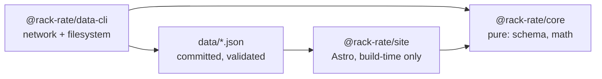

# Architecture

## Module graph



## Boundary rules

- `@rack-rate/core` is pure: no `fetch`, no `node:fs`, no `Bun.file`, and no
  clock. A function needing the date takes it as an argument.
- `@rack-rate/data-cli` owns all network and filesystem access.
- `@rack-rate/site` never fetches. The browser makes zero data requests, and
  the build works offline from committed data.
- The CLI surface is `rack-rate-data <command>`. The dispatcher in
  `packages/data-cli/src/main.ts` statically routes commands and never guesses
  an exit code.

## Subsystems

Three packages, with one direction of dependency:

- **`packages/core`** (`@rack-rate/core`) — the pure domain: the zod schemas
  every committed document is parsed with, the comparison math (`cost`,
  `normalize`, `pareto`, `insights`), the shared identifiers in `ids.ts`, and
  the one freshness rule in `freshness.ts`. No `fetch`, no filesystem, no
  clock. Its public surface is a barrel plus narrow subpaths
  (`@rack-rate/core/cost`, `/ids`, `/freshness`) that carry no zod value, so a
  client bundle can import one value without linking the validator. See
  "Invariant index", "Formatting", "Charts" and "Method and sources pages".
- **`packages/data-cli`** (`@rack-rate/data-cli`) — the only package allowed
  network or filesystem access, and the owner of the `rack-rate-data <command>`
  surface. See "Data CLI" and "Environment".
- **`apps/site`** (`@rack-rate/site`) — the Astro static build. It reads
  `@rack-rate/core` and the committed `data/*.json` at build time, never
  fetches, and ships no server. See "Site configuration", "Crawl and discovery
  files", "Layouts and links", "Routes and data access", "Provenance
  components", "Charts", "Template whitespace", "Design tokens", "Social card"
  and "TypeScript configuration".

## Data flow

```text
upstream boards and vendor pages
  -> rack-rate-data fetch <deepswe|terminal-bench|plans|artificial-analysis|all>
  -> data/{models,plans,benchmarks,sources}.json   committed, schema-validated
  -> rack-rate-data validate                       schemas, citations, versions, AA gate
  -> rack-rate-data compute                        pure core math -> data/derived.json
  -> rack-rate-data check                          recompute in memory, compare bytes
  -> Astro build (apps/site)                       build-time only, no fetch
  -> dist/ + dist/og.png                           static output for GitHub Pages
```

The fetch step is fail-closed: a missing research anchor or an unreachable
vendor page keeps the last-good sources and exits `1`, and `--diff` writes no
file at all. `validate` is the trust boundary for committed documents,
`compute` is deterministic, and `check` is the staleness gate CI runs _before_
the write path so a stale committed file cannot be repaired by accident. The
site consumes committed bytes only, which is why a clean clone with no `.env`
still builds and why Artificial Analysis is absent from every output unless
publication is explicitly enabled.

## Data contract (target schema)

Migrated verbatim from the pre-PM plan's data-contract section on 2026-09-17
(`git show d95e6ef:PLAN.md`). `packages/core/src/schema.ts` is the executable shape;
this section is the written record of it.

Shapes are frozen in Stage 1.3 and consumed by every later stage.

### `data/sources.json` — unchanged in spirit

`{ id, title, url, license, license_short?, retrieved, covers, changes,
attribution?, credited_contributor?, notes?, summary? }`. `attribution` is
required when the license demands it (Awesome Coding Plan) and validated.

### `data/models.json` — one row per model

Existing fields (`id`, `name`, `provider`, `score_pct`, `score_pass_at_4_pct`,
`reasoning_effort`, `api_cost_per_task_usd`, `input_tokens_per_task`,
`output_tokens_per_task`, `agent_steps_per_task`, `n_tasks_attempted`,
`evidence`, `effort_variants`) plus:

- `provider_slug` — stable key for grouping; `null` when unmapped.
- `benchmark_version` — e.g. `deepswe@1.1` (part of row identity).
- `ci_lo`, `ci_hi`, `ci_method` — carried through, never recomputed.
- `cost_basis` — `list` | `expected-launch` | `disputed`.
- `retrieved_at` — drives the freshness badge.

### `data/plans.json` — one row per plan

Existing fields (`id`, `name`, `provider`, `price_usd_month`, `quota_model`,
`quota_usd_month`/`credits_month`/`requests_month`/`tokens_month`,
`rolling_window_hours`, `rolling_window_usd`, `measured_against_model`,
`confidence`, `method`, `evidence`, `sources`, `available`, `model_scope`,
`cross_check_tokens_month`, `known_gaps`) plus:

- `price_status` — `list` | `disputed`.
- `quota_unresolved` + `quota_note` — for Google AI credits and SuperGrok.
- `fx` — `{ rate, date }` when the source price is CNY.
- `retrieved_at`.

### `data/benchmarks.json` — new

```jsonc
{
  "benchmarks": [{
    "id": "deepswe",
    "version": "1.1",              // part of row identity
    "title": "DeepSWE v1.1",
    "url": "https://deepswe.datacurve.ai/",
    "generated_at": "2026-09-03T22:24:37Z",
    "task_count": 113,
    "unit": "pass@1",              // pass@1 | accuracy | index
    "scale": "0-1",                // 0-1 | 0-100 | z
    "retrieved_at": "2026-09-14",
    "rows": [{
      "model_id": "gpt-6-astra",
      "score": 74.12,
      "ci_lo": 71.25, "ci_hi": 76.98,
      "cost_per_task_usd": 5.6717,
      "cost_basis": "expected-launch",
      "tokens_input": 1163918, "tokens_output": 28542, "steps": 26,
      "provenance": { "board": "…", "dataset_version_id": "…" }
    }]
  }]
}
```

Terminal-Bench and Artificial Analysis are additional entries in this array,
each with its own `version` and provenance block. Artificial Analysis is present
only when publication is explicitly enabled (see `docs/data-sources.md`);
otherwise the array has no AA entry and no AA axis appears anywhere. `MISSING`
in a benchmark means the model has no row — never a zero.

### `data/derived.json` — generated, deterministic

Shape confirmed against the live legacy output on 2026-09-14 (178 pairs, 28 best
routes, 5 known gaps). The port must reproduce these keys — do not invent a new
shape:

```jsonc
{
  "generated_from": { "models": 28, "plans": 16, "task_count": 113 },
  "pairs": [{
    "model_id", "model_name", "provider", "score_pct",
    "plan_id", "plan_name", "price_usd_month",
    "quota_method",              // which conversion branch was used
    "tasks_per_month",
    "cost_per_task_usd", "api_cost_per_task_usd",
    "days_for_full_run",
    "confidence"
  }],
  "best_routes": [ /* same row shape; cheapest pair per model — 28 rows */ ],
  "cross_check": {
    "pairs": [ /* 11 rows: plan_id, plan_name, model_id, model_name,
                  tasks_by_dollars, tasks_by_tokens, ratio */ ],
    "summary": { "median_ratio": 1.601, "min_ratio": 1.006,
                 "max_ratio": 6.713, "pair_count": 11 }
  },
  "known_gaps": [ /* 5 rows, shape { plan, provider, reason, url? } */ ]
}
```

Stage 2 **adds** to this file rather than reshaping it: `composites`,
`frontiers` (`api` and per-plan `plan_adjusted`), `dominated`,
`token_allowances` (see 2.7b), and the per-row badge objects. Existing keys keep
their names and meanings so the fixture stays comparable.

Two naming traps to avoid when writing the parity assertion:

- The legacy metadata key is **`generated_from`** (counts of inputs used), not
  `generated_at`. Add a real `generated_at` timestamp as a _new_ key in Stage 2;
  do not repurpose `generated_from`.
- The cross-check rows live under **`cross_check.pairs`** with a nested
  **`cross_check.summary`**. Parity must compare `cross_check.pairs` (11 rows)
  and `cross_check.summary.{median_ratio,min_ratio,max_ratio,pair_count}` —
  there is no `rows` array and no top-level `n`.

## Operations and commands

Root scripts call the same dispatcher as the installed `rack-rate-data`
binary.

| Command                    | What it does                                                                                                                             | Gate?                  |
| -------------------------- | ---------------------------------------------------------------------------------------------------------------------------------------- | ---------------------- |
| `bun run check`            | `typecheck` (tsc) → `lint` (oxlint, every rule at error) → Markdown lint → formatting (oxfmt over TypeScript and Markdown) → site checks | yes — code quality     |
| `bun run lint:md`          | Markdown frontmatter, hard-break, and dangling-relative-link checks                                                                      | yes — document quality |
| `bun test`                 | the test suite (`bun test --pass-with-no-tests`)                                                                                         | yes                    |
| `bun run data:check`       | validates inputs, recomputes `data/derived.json` in memory, compares bytes                                                               | yes — staleness        |
| `bun run build`            | `data:build` → Astro build → `og`, writing `dist/` including the social card                                                             | —                      |
| `bun run preview`          | serves the built site; the only surface evidence may be captured from                                                                    | —                      |
| `bun run data:build`       | `validate` then `compute` — the write path                                                                                               | —                      |
| `bun run fetch[:<source>]` | refreshes one source or all four; `--diff` is a dry run that writes nothing and exits `1` when committed data would change               | —                      |
| `bun run quality`          | the `fallow` report over dead code, duplication and complexity                                                                           | advisory               |

`.github/workflows/ci.yml` runs `check`, `test`, `data:check`, `data:build` and
a guard that fails when the compute write path leaves `data/` dirty. It never
fetches upstream and references no secrets. Deployment to GitHub Pages is
PLAN stage 7 (`docs/pm/M7/README.md`).

### Document and tooling boundaries

`tools/markdown-lint/` is first-party and is typechecked through the root
`tsconfig.json`. `tools/oxlint/anti-slop/` and `.claude/**` are vendored and
excluded whole from both lint and format. `docs/history/**` is frozen pre-PM
history, so Markdown link checking and formatting exclude it; its relative links
deliberately reference files deleted on 2026-09-17 (see
[the relocation note](docs/history/stages-1-2.md#relocation-note-appended-2026-09-17-not-a-rewrite)).
The `.omp` harness imports `tools/markdown-lint` for its post-edit and document
checks.

## Data CLI

The root scripts call the same dispatcher as the installed `rack-rate-data`
binary:

- `fetch [deepswe|terminal-bench|plans|artificial-analysis|all] [--diff]`
  refreshes one source, or all four sequentially in that order. A bare
  `fetch` means `all`; `--diff` performs the source fetcher's dry run. It writes
  no file whatsoever, including gitignored `data/raw/*` snapshots, and exits
  `1` when the source would change committed data. This also applies to
  `fetch plans --diff`.
- `validate [--help]` checks the committed source, model, plan and benchmark
  documents without writing.
- `compute [--help]` deterministically writes `data/derived.json` from the
  committed inputs.
- `check [--help]` validates inputs, recomputes the derived document in memory,
  and compares its deterministic bytes with the committed file. This is the CI
  staleness gate.
- `sources [--help]` lists source metadata, attribution requirements, freshness
  and whether each source contributes to published data.
- `doctor [--help]` probes source and plan/vendor URLs, reports AA environment
  state and data-file parsing, and counts same-day raw snapshots.
- `help` and `--help` print the command list and descriptions.

Successful commands exit `0`. Invalid arguments and operational failures exit
`1`. The fetch posture is fail-closed: a missing research anchor or unreachable
vendor page keeps the last-good plans and sources and exits non-zero. Doctor
reports unreachable sites as findings but exits `0` when all probes and data
checks could be performed; data read/parse failures still exit `1`.

`upsertBenchmarkEntry` is a write boundary: it parses the candidate through the
`Benchmark` schema before touching `data/benchmarks.json`, so a mapping bug
cannot clobber the file.

Terminal-Bench first tries the flight-data path. Only after that path fails does
it resolve `harbor`, preferring a non-empty `HARBOR_BIN` and then an executable
on `PATH`; the resolved binary is logged before the fallback runs.

Artificial Analysis validation is fail-closed in one direction and loud in the
other: committed `artificial-analysis` rows while `AA_PUBLISH` is not exactly
`1` are an error (`validate` exits `1`), while `AA_PUBLISH=1` with committed AA
rows is downgraded to a loud warning.

## Environment

At import time, after computing the repository root, the CLI checks for the
root `.env` and calls `process.loadEnvFile` only when it exists. Root scripts
run through `bun run --filter` with cwd `packages/data-cli`; Bun's
cwd-relative autoload would otherwise miss the root file. A variable already
present in the environment wins over the file.

The CLI reads:

- `AA_API_KEY`
- `AA_PUBLISH`
- `HARBOR_BIN`

`packages/core` and `apps/site` read none of these variables, so no secret can
reach a built asset.

`check` is the CI gate for stale derived data. The root `bun run check` remains
the code-quality gate (typecheck, lint, formatting and site checks).

## Invariant index

The full invariant text is in [AGENTS.md](AGENTS.md), under “Invariants”.
This index keeps the load-bearing rules visible at the architecture boundary:

1. `benchmark_version` is part of row identity; benchmark versions are never
   mixed in a table or composite.
2. Missing data stays missing: it is not scored zero, ranked last, or allowed
   to silently sink a composite.
3. `pass@1` and `pass@4` never share a field, axis, or formula; only `pass@1`
   feeds scores and composites.
4. Every cost figure carries its basis; API list rates, plan routes, and
   Artificial Analysis index costs are distinct quantities.
5. Confidence is displayed, never laundered; multiplier arithmetic is at most
   medium confidence and aggregator-only figures never become computed rows.
6. Nulls stay null; upstream nulls are never defaulted to zero.
7. Benchmark task content never belongs in this repository; metadata and scores
   only.
8. Attribution is load-bearing; validation fails if required attribution
   strings disappear. See [docs/data-sources.md](docs/data-sources.md).
9. The site builds offline from committed data; CI does not fetch upstream.
10. Artificial Analysis is off unless explicitly enabled with both
    `AA_API_KEY` and `AA_PUBLISH=1`; its values remain separately labelled and
    are never merged into a number that hides their origin. See
    [CAVEATS.md §1](CAVEATS.md#1-artificial-analysis--the-unresolved-one)
    for the repository owner's unresolved position.

## Site configuration

`apps/site/astro.config.mjs` owns the deployment target. It emits static
output with `output: "static"` and no adapter. `site` is the origin Astro
uses to build canonical and Open Graph URLs. `base: "/rack-rate"` prefixes
page and asset paths for the GitHub Pages project page.

The custom-domain switch changes exactly these two options:

```diff
-  site: "https://marshalfevzi.github.io",
-  base: "/rack-rate",
+  site: "https://rackrate.dev",
+  base: undefined,
```

`apps/site/public/CNAME` — containing the bare domain, `rackrate.dev` — is the
third step of that switch and the one file that must not be committed early: a
`CNAME` file makes GitHub Pages serve the custom domain immediately, which is a
broken site for everyone while DNS still points elsewhere. Tasks 3.9 and 6.2
own that path; the directory exists as of 3.9 (it holds `favicon.svg`), so the
file lands at the root of `dist/` when it is finally added, together with the
two lines above and after the domain resolves. The `base` option stays in the
config object when it is
`undefined`: Astro normalises that to `/` — measured, `BASE_URL` becomes `/`
and assets drop the prefix — while deleting the line instead would turn the
switch into a one-liner that hides half the deployment target. No other line
in the config moves.

The origin is written down once. Measured against a built page: `Astro.site` is
`https://marshalfevzi.github.io/` — origin, no base — while
`import.meta.env.BASE_URL` is `/rack-rate` with no trailing slash, so a consumer
joining it to a path supplies the separator itself. `Astro.url.pathname` and
`Astro.url.href` already include the base. Under the custom domain they become
`/` and `https://rackrate.dev/`. Internal links go through the `href()` helper
from task 3.3; nothing hardcodes `/rack-rate`.

The Tailwind v4 Vite plugin is registered in this config. There is no
`tailwind.config.js`. `src/styles/global.css` is the single CSS entry that
imports `tailwindcss`; task 3.2 created it and 3.3b extended it with the type,
spacing and motion tokens.

## Crawl and discovery files

`apps/site/astro.config.mjs` registers `@astrojs/sitemap` 3.7.4 in
`integrations`. The integration builds absolute URLs from `site` + `base`, so
this section hardcodes no origin and no prefix. It writes
`dist/sitemap-index.xml` and the chunk `dist/sitemap-0.xml`; the index lists the
chunk, so a `Sitemap:` directive must name the **index**, not the chunk.

Measured on the committed config: 53 built routes, 52 sitemap URLs — the
difference is `404`, which the integration excludes by default (`404` and `500`
are `STATUS_CODE_PAGES` in `@astrojs/sitemap/dist/index.js`). No `filter` is
configured because nothing else needs excluding: the `robots.txt` route never
enters the list, and neither do `og.png`, `favicon.svg` or `_astro/*`. The 52
URLs were compared as a **set** against the built `index.html` directories —
empty difference in both directions — each under
`https://marshalfevzi.github.io/rack-rate/` with a trailing slash. `lastmod`,
`changefreq` and `priority` are deliberately unset: `lastmod` would claim a
per-page freshness the data cannot support, since freshness is a badge dated
against `derivedGeneratedAt` and page content also changes with code.

`robots.txt` is a generated route, `apps/site/src/pages/robots.txt.ts`, not
`public/robots.txt`. The `Sitemap:` line is necessarily absolute, so a static
file would write the origin a second time and add a third line to the
custom-domain switch; the route derives it as
`absoluteUrl(asset("/sitemap-index.xml"), site)`. Measured: the committed config
emits `Sitemap: https://marshalfevzi.github.io/rack-rate/sitemap-index.xml`, and
the same build with the two-line switch emits
`https://rackrate.dev/sitemap-index.xml` with no edit to the route. The response
is `Content-Type: text/plain; charset=utf-8`. The policy is `User-agent: *` plus
`Allow: /`: every route is public, there is nothing authenticated to keep out,
and the 404 is not disallowed — it is already absent from the sitemap, and task
7.4 owns noindex. Task 7.4 also verifies both files against the deployed base
path.

`apps/site/public/favicon.svg` is the tab icon: a standalone 32×32 SVG (428
bytes) using only the three token hexes — a `#0A0E15` (`canvas`) rounded square,
a 1.5 px `#1D2735` (`rule`) border, and three ascending bars in `#FFB020`
(`adjusted`). Measured contrast: amber on canvas 10.57:1, amber on a dark chrome
strip (`#202124`) 8.8:1, canvas on white 19.33:1 — while that same square
against the dark strip is 1.2:1 and its border 1.07:1. On dark chrome the bars
alone carry the mark; on light chrome the square does. The border is a
light-chrome edge, not a dark-chrome one, and is described that way. The amber is
wordmark chrome, not a cost basis: a favicon carries no number, so invariant 4
has nothing to label here. `Base.astro` links it as `asset("/favicon.svg")` with
`type="image/svg+xml"`, so the prefix comes from the builder; measured, all 53
built HTML pages carry the prefixed link, and it becomes `/favicon.svg` under
the custom domain. No raster `apple-touch-icon` and no web manifest ship with
this stage.

## Layouts and links

`apps/site/src/layouts/Base.astro` accepts `title` and `description`.
`apps/site/src/layouts/Page.astro` accepts `title`, `description`, optional
`heading`, and optional `lede`. `Base` renders the skip link, the `StatusBand`
(the pinned 32px band), the capped shell grid that holds `LaneRail` and the
page slot, and the `FooterIndex`; the band — not a header nav — computes
`position: sticky`. `Page` is still the only layout that renders
`<main id="main" tabindex="-1">`, and `Base` still renders no main landmark.

`apps/site/src/lib/url.ts` exports three typed helpers:

- `href(path: \`/${string}\`): string`is the route builder. It joins the
path to`import.meta.env.BASE_URL` and adds a trailing slash except for the
  root.
- `asset(path: \`/${string}\`): string`is the file builder. It joins the
path to`import.meta.env.BASE_URL`without adding a trailing slash.`Base`
  uses it for the OG and Twitter image path.
- `absoluteUrl(relativePath: string, site: URL | undefined): string` turns an
  already base-relative path from `href()`, `asset()`, or `Astro.url.pathname`
  into an absolute URL using `site.origin`. With `site === undefined`, it
  returns the input unchanged; all base handling belongs to the two path
  builders.

The module reads `import.meta.env.BASE_URL` once at module scope. Measured
helper outputs are:

| Call               | Project page (`base: "/rack-rate"`) | Custom domain (`base === "/"`) |
| ------------------ | ----------------------------------- | ------------------------------ |
| `href("/")`        | `/rack-rate/`                       | `/`                            |
| `href("/models")`  | `/rack-rate/models/`                | `/models/`                     |
| `asset("/og.png")` | `/rack-rate/og.png`                 | `/og.png`                      |

Measured `absoluteUrl("/rack-rate/models/", site)` as
`https://marshalfevzi.github.io/rack-rate/models/` and
`absoluteUrl("/rack-rate/og.png", site)` as
`https://marshalfevzi.github.io/rack-rate/og.png`; with
`site === undefined`, it returns `/rack-rate/models/` unchanged.

Astro's `build.format: "directory"` gives route links their trailing slash;
`asset()` deliberately does not. A built project page measured
`https://marshalfevzi.github.io/rack-rate/models/` as both its canonical URL
and `og:url`, with `og:image` at
`https://marshalfevzi.github.io/rack-rate/og.png`. With `base: "/"` and
`site: https://rackrate.dev`, the corresponding URLs are
`https://rackrate.dev/models/` and `https://rackrate.dev/og.png`.

`Base` emits head metadata in this order: charset, viewport, title
(`{title} · rack-rate`), description, canonical, generator, two media-scoped
`theme-color` values (`#0a0e15` dark and `#f7f8fa` light), Open Graph type,
site name, title, description, URL, image, image dimensions and image alt,
then Twitter card (`summary_large_image`), title, description and image.

The navigation routes are `/`, `/models`, `/plans`, `/compare`, `/explore`,
`/start`, `/method`, and `/sources`. The route list is backed by
`apps/site/src/lib/nav.ts`, which exports `lanes`, `isCurrent`, and
`laneAnchorId`; the band, the rail, the drawer, and the footer index all read
that one module, so the route table cannot drift. `aria-current="page"` is
exact for the root route and prefix-based for the other routes: Overview is
current at `/rack-rate/`, Models at `/rack-rate/models/`, and no item is
current at `/rack-rate/smoke33/`.

The skip link is 1 by 1 px and clipped with `clip-path: inset(50%)` until
focused. Headless Chromium measured its focused state at 138 by 42 px at the
top left with the 2 px ink outline. The global focus ring is
`:focus-visible { outline: 2px solid var(--color-ink); outline-offset: 2px }`;
interaction chrome spends no accent hue. `.tabular` sets
`font-variant-numeric: tabular-nums`.

The footer is the indexed route directory plus the maker credit, and the two
paragraphs below are retained verbatim inside it. The credit paragraph names
DeepSWE/Datacurve, Terminal-Bench/Harbor Hub, Awesome Coding Plan by mahonzhan
under CC BY 4.0, real-api-pricing by FeiZhuLulu, and the Sources page. The
Artificial Analysis paragraph states that it is excluded unless publication
is explicitly enabled and that Sources states which state this build is in. The
verbatim Awesome Coding Plan attribution required by
`docs/data-sources.md` belongs to `/sources`, rendered from
`data/sources.json` in task 3.11; it is not duplicated in the layout.

`Base` links one icon and no more: the `favicon.svg` from task 3.9, with no
raster `apple-touch-icon` and no web manifest (see "Crawl and discovery files").
It also omits analytics, emoji, dashed borders, gradients, and shadows.

## Routes and data access

`apps/site/src/pages/` holds the whole route set. `output: "static"` with
Astro's default `build.format: "directory"` emits one directory per route, so a
route URL ends in `/` and is served from `<route>/index.html` — `href()` supplies
that trailing slash. The 404 route is the exception: it builds to
`dist/404.html`, which GitHub Pages serves for any unmatched path.

| Route            | File                  | Content stage |
| ---------------- | --------------------- | ------------- |
| `/`              | `index.astro`         | 4.12          |
| `/models`        | `models/index.astro`  | 4.8           |
| `/models/[slug]` | `models/[slug].astro` | 4.9           |
| `/plans`         | `plans/index.astro`   | 4.10          |
| `/plans/[slug]`  | `plans/[slug].astro`  | 4.10          |
| `/compare`       | `compare.astro`       | 4.11          |
| `/explore`       | `explore.astro`       | 4.13          |
| `/start`         | `start.astro`         | 5.3           |
| `/method`        | `method.astro`        | 3.11          |
| `/sources`       | `sources.astro`       | 3.11          |
| `404`            | `404.astro`           | —             |

Both dynamic routes build `getStaticPaths` from committed rows — 28
`/models/<id>` pages from `data/models.json`, 16 `/plans/<id>` pages from
`data/plans.json`, the row `id` being the slug. A row added upstream becomes a
page on the next commit with no code change. The whole set is 53 built pages:
28 + 16 + eight static routes + the 404. Every page renders exactly one
`<main id="main" tabindex="-1">` and one `h1`, both from `Page.astro`; nav
`aria-current="page"` is prefix-based, so `/models/<id>` marks Models.

Skeleton-note convention: each route carries one
`<p class="mt-6 text-meta text-dim">Route skeleton — …</p>` line naming what
lands there and in which stage, so an unfinished route is honest rather than
blank. Stages 4 and 5 delete them as content arrives; the 404 route has none.
No figure, badge or attribution string may be invented to fill a route: scores,
costs and licence text wait for the components that carry their basis.

`apps/site/src/lib/data.ts` is the only module under `apps/site` that imports
`data/*.json`. It parses all five committed documents (`models.json`,
`plans.json`, `benchmarks.json`, `sources.json`, and `derived.json`) with the
corresponding `@rack-rate/core` zod schemas, then exports the parsed rows and
documents plus prebuilt indexes. The identity rows and documents are `models`,
`plans`, `planKnownGaps`, `quotaModelDocs`, `benchmarks`, `sources`, and
`derived`; `benchmarks` has one entry per committed benchmark version, with
Artificial Analysis absent unless publication is enabled rather than
synthesized. The id indexes are `modelsById`, `plansById`, `benchmarksById`, and
`sourcesById`. The relation indexes are `routesByModel`, `routesByPlan`,
`bestRouteByModel`, `compositeByModel`, `compositeWeights`, `apiFrontier`,
`frontierByPlan`, `tokenAllowances`, `tokenAllowanceByPair`, `badgeByPair`,
`crossCheck`, `derivedKnownGaps`, and `contributingSourceIds`. `pairKey(modelId,
planId)` is the single place the `(model, plan)` map key is built, using a
separator absent from either kebab-case id. `derivedGeneratedAt` is the one
scalar: the newest upstream `generated_at` `compute` wrote into the file, which
every freshness badge is measured against instead of the wall clock.

The computed sections `composites`, `frontiers`, `token_allowances`, and
`badges` are optional in the `DerivedFile` schema but always present in the
committed document; `bun run data:check` fails when they are missing. The
module reads each section once through a local check that throws with the
section name and `data/derived.json`, then exports the non-optional view, so an
incomplete committed document fails the build instead of rendering an empty
page. A committed file that drifts from its schema likewise fails the build
rather than a page. An unknown model, plan, benchmark, or source id returns
`undefined` from its index lookup rather than throwing, so an id removed
upstream degrades instead of crashing a page. The row types come from
`@rack-rate/core`; the module does not re-export a parallel type surface. Its
JSON imports work because the root `tsconfig.json` sets `resolveJsonModule:
true`. Vite bundles the files at build time and the module reaches no browser
bundle because only Astro frontmatter imports it. `Model.id` and `Plan.id` are
used as slugs directly, so no second slug mapping exists to drift.

Measured on the Stage 3.4 build: 53 pages; a static server with the `dist` tree
mounted at `/rack-rate` returned 200 for all 53 routes, and every base-prefixed
`href`/`src` in the built HTML (eight nav links plus one stylesheet) resolved.
Headless Chromium at a 360 px viewport reported `scrollWidth` 360 on all eleven
route shapes, one `<main>` and one `h1` per page, correct `aria-current`, and
canonical URLs under `/rack-rate`.

## Formatting

Display formatting has one rounding rule per unit, owned by the module. Call
sites supply no precision argument, so a figure reads identically on every
page. `apps/site/src/lib/format.ts` is pure TypeScript: no `import.meta.env`,
DOM, or Astro import, so `.astro` frontmatter and `bun test` use the same
function.

| Export                                 | Unit in the data                                                                                                                                                                                                         | Rule                                                                                                                       | Example                                                                                            |
| -------------------------------------- | ------------------------------------------------------------------------------------------------------------------------------------------------------------------------------------------------------------------------ | -------------------------------------------------------------------------------------------------------------------------- | -------------------------------------------------------------------------------------------------- |
| `MISSING`                              | absent value                                                                                                                                                                                                             | the single placeholder                                                                                                     | `"—"`                                                                                              |
| `formatPercent(v)`                     | percent units, 0–100 (`score_pct`, `composites.rows[].composite`, `benchmarks[].rows[].score`, `benchmarks[].rows[].ci_*`, `score_pass_at_4_pct`; display-only: pass@4 never feeds a score or a composite — invariant 3) | half-even to 1 dp, `%` suffix, no space                                                                                    | `74.12 → "74.1%"`, `0 → "0.0%"`                                                                    |
| `formatFractionAsPercent(v)`           | fraction, 0–1 (`models[].ci_lo`/`ci_hi`, utilization `U = T_actual / Q`)                                                                                                                                                 | ×100, then the percent rule                                                                                                | `0.7124964807371247 → "71.2%"`                                                                     |
| `formatPoints(v)`                      | percentage-point delta (`Δy = Y_frontier(x) − y`)                                                                                                                                                                        | always-signed, half-even to 1 dp, `" pp"` suffix                                                                           | `4.2 → "+4.2 pp"`, `-1.06 → "-1.1 pp"`, `0 → "+0.0 pp"`                                            |
| `formatPercentRange(lo, hi)`           | percent units, 0–100                                                                                                                                                                                                     | the percent rule on both ends, en dash `–` between, one `%` at the end; either end missing → `MISSING`                     | `71.25, 76.98 → "71.2–77.0%"`                                                                      |
| `formatFractionAsPercentRange(lo, hi)` | fractions, 0–1                                                                                                                                                                                                           | the fraction rule on both ends, as above                                                                                   | `0.7124964807371247, 0.7698044042186275 → "71.2–77.0%"`                                            |
| `formatUsd(v)`                         | USD **amount**: `price_usd_month`, `quota_usd_month`, `rolling_window_usd`, a measured run total                                                                                                                         | up to 2 dp half-even, trailing zeros trimmed, thousands grouped, `$` prefix                                                | `20 → "$20"`, `7.23 → "$7.23"`, `9603.86 → "$9,603.86"`, `25472 → "$25,472"`                       |
| `formatUsdPerTask(v)`                  | USD / task, **both** bases (`cost_per_task_usd`, `api_cost_per_task_usd`)                                                                                                                                                | half-even to 4 dp (fixed), thousands grouped, `$` prefix                                                                   | `0.0304 → "$0.0304"`, `23.2774 → "$23.2774"`                                                       |
| `formatUsdPerMillionTokens(v)`         | USD / 1M tokens (`allowance_per_million_tokens`, `adjusted_api_cost_per_million`)                                                                                                                                        | half-even to 4 dp (fixed), `$` prefix                                                                                      | `0.0017 → "$0.0017"`, `4.7563 → "$4.7563"`                                                         |
| `formatTasksPerMonth(v)`               | tasks / month (`tasks_per_month`, `tasks_by_dollars`, `tasks_by_tokens`)                                                                                                                                                 | half-even to 1 dp, grouped                                                                                                 | `5233.18 → "5,233.2"`, `0.64 → "0.6"`                                                              |
| `formatDays(v)`                        | days (`days_for_full_run`)                                                                                                                                                                                               | half-even to 1 dp, grouped                                                                                                 | `5.15 → "5.2"`, `5260.69 → "5,260.7"`                                                              |
| `formatCount(v)`                       | integer count (`agent_steps_per_task`, `steps`, `task_count`, `n_tasks_attempted`, `k`, `pair_count`, `requests_month`, `rolling_window_hours`)                                                                          | half-even to **up to 1 dp**, trailing zeros trimmed, grouped                                                               | `113 → "113"`, `90.5 → "90.5"`, `2400 → "2,400"`                                                   |
| `formatTokens(v)`                      | token quantity (`input_tokens_per_task`, `tokens_input`, `tokens_month`, `tokens_per_task`, `tokens_per_month_allowance`, `cross_check_tokens_month`)                                                                    | **three significant digits** with a `K`/`M`/`B` suffix (base 1000), trailing zeros trimmed; below 1000 the grouped integer | `1163918 → "1.16M"`, `62795056 → "62.8M"`, `76390578947 → "76.4B"`, `616 → "616"`, `999999 → "1M"` |
| `formatTokensExact(v)`                 | token quantity, tooltip/table detail                                                                                                                                                                                     | half-even to 0 dp, grouped                                                                                                 | `1163918 → "1,163,918"`                                                                            |
| `formatMultiple(v)`                    | unitless multiplier (`value_multiple`, `cross_check.pairs[].ratio`, `cross_check.summary.*_ratio`)                                                                                                                       | up to 2 dp half-even, trailing zeros trimmed, `×` suffix (U+00D7), no space                                                | `3 → "3×"`, `127.36 → "127.36×"`, `1.601 → "1.6×"`, `1.006 → "1.01×"`                              |
| `formatZ(v)`                           | z-score (`composites.rows[].weighted_z`, `normalize` z)                                                                                                                                                                  | always-signed, half-even to 2 dp, no suffix                                                                                | `1.5656 → "+1.57"`, `-2.9945 → "-2.99"`, `0 → "+0.00"`                                             |
| `formatFxRate(v)`                      | CNY→USD spot rate (`plans[].fx.rate`)                                                                                                                                                                                    | half-even to 4 dp (fixed), no symbol, grouped                                                                              | `6.7787 → "6.7787"`                                                                                |

Display rounding follows the `PLAN`'s Stage 2 precision rule: round what this
repo computes, keep upstream precision in the data, and let the format layer
own display rounding. Every formatter applies `roundHalfEven` from
`@rack-rate/core` before string conversion, reusing the same Python-parity
semantics as the derived data.
`Intl.NumberFormat` is pinned to `en-US`, so the runtime locale can never reach
a published figure. Percentages use 1 dp because the published CIs are several
points wide and every upstream board shows 1 dp; 2 dp would be false precision.
`composites.weights` holds control inputs for 4.13's sliders rather than
published figures, so the module ships no rule for them; a page that needs to
print one adds the rule here first.
A one-sided range is not a reported interval: `formatPercentRange` and
`formatFractionAsPercentRange` return `MISSING` unless both endpoints are
present, so a half-range cannot read as a figure. Nulls render as `MISSING`,
not `0` or `N/A` (invariant 6), while a genuine `0` never renders as missing.
The formatter never appends a unit word, so `CostBasisChip` and headers own
`/task`, `/mo`, `days`, and `tokens`; two spellings cannot drift.

The two-convention trap is explicit: `data/models.json` carries `ci_lo`/`ci_hi`
as 0–1 fractions, while `score_pct`, `data/benchmarks.json` rows, and
`derived.json` composites use 0–100 percent scale. The module therefore ships
both `formatPercent`/`formatFractionAsPercent` and both range variants; a page
must pick by the units its row actually carries.

Stage 4 consumers—charts, tables, and the components below—import this module and
never call `toFixed`, `Intl`, or a template literal for a published number.
`CiBar` uses the range formatters and `CostBasisChip` owns the basis label that
keeps invariant 4 visible; both landed in 3.7.

## Provenance components

`apps/site/src/components/` holds six components: a chip shell and the five that
carry "where did this come from" for a figure. They take parsed values and render
words, geometry and citations — never a figure of their own — so the number stays
owned by `format.ts` and the cost basis by the chip.

| Component               | Props                                                                                            | Renders                                                                                                                                                     |
| ----------------------- | ------------------------------------------------------------------------------------------------ | ----------------------------------------------------------------------------------------------------------------------------------------------------------- |
| `Badge.astro`           | `{ tone?: "neutral" \| "api" \| "adjusted"; title?: string; class?: string }`                    | the one chip shell (`inline-flex … border-rule text-meta`) the three badges share, so the chip markup exists once                                           |
| `ConfidenceBadge.astro` | `{ level: Confidence }`                                                                          | the level word, prefixed by an `sr-only` "Confidence: ", with the level's definition in `title`                                                             |
| `FreshnessBadge.astro`  | `{ freshness: Freshness; retrievedAt: string }`                                                  | the `Fresh`/`Stale` word plus `retrieved <date>` in `tabular` digits, definition in `title`                                                                 |
| `CostBasisChip.astro`   | `{ basis: CostBasisKind; planName?: string; unit?: CostUnit; status?: CostBasisStatus }`         | the basis label, the unit (`/task`, `/mo`, `/1M tokens`) and, when the status is not `list`, the qualifier (`expected launch`, `disputed`, `unknown basis`) |
| `SourceLink.astro`      | `{ id: string; label?: string }`                                                                 | one external anchor to the source's `url`, `title` = title · licence · retrieval date, plus an `sr-only` new-tab note                                       |
| `CiBar.astro`           | `{ value: number; lo?: number; hi?: number; ciScale: CiScale; method?: string; class?: string }` | the interval bar with its composed accessible name, or `— no interval reported`                                                                             |

`apps/site/src/lib/provenance.ts` is the vocabulary and the arithmetic:
`CONFIDENCE_TERMS`, `FRESHNESS_TERMS`, `COST_BASIS_TERMS`, `COST_UNIT_LABELS`,
`costBasisTerm`, `costBasisQualifier` and `ciGeometry`. Its types are derived
from the data contract — `Confidence` is `Plan["confidence"]`, `Freshness` is
`PairBadge["freshness"]`, `CostBasisStatus` is
`Model["cost_basis"] | NonNullable<Plan["price_status"]>` — so a new level or
status fails the build inside the module instead of rendering an unlabelled
badge. The module is pure TypeScript, so `.astro` frontmatter and `bun test` call
the same function.

Five rules the components encode:

1. **One accent per role.** `neutral` (`text-dim`) for confidence, freshness and
   the AA index basis; `text-api-ink` for the API-list basis; `text-adjusted` for
   a `{plan} route`. `--color-measured` stays reserved for the measured quota
   basis, which no 3.7 component renders. Nothing spends an accent on chrome, on
   an interval or on interaction.
2. **A basis label names its quantity.** `costBasisTerm("plan-route")` throws
   without a plan name, because `{plan} route` without the plan names nothing.
3. **Absent stays absent.** `CiBar` renders text, never a bar, when either
   endpoint is missing: a bar drawn from one end would invent the other, the same
   rule the range formatters apply to the printed range.
4. **The interval is never zoomed.** `ciGeometry` maps the interval onto the
   unit's full domain (`0–1` for a fraction, `0–100` for percent), so a 5.7-point
   interval reads as one. `leftPct` and `widthPct` round to 3 dp with the width
   taken as a delta between the rounded ends, so `leftPct + widthPct` lands
   exactly on the interval's high end; out-of-domain values clamp instead of
   rescaling the track; a transposed pair is ordered rather than drawn inside
   out; the interval's 2 px minimum width is CSS, not geometry.
5. **One freshness rule.** `isStale` and `freshnessOf` ship in `@rack-rate/core`
   with `STALE_AFTER_DAYS` at 14 and the reference moment as an argument.
   `compute` imports them for the committed `PairBadge.freshness`, and a row's
   verdict is `freshnessOf(row.retrieved_at, derivedGeneratedAt)`. The extraction
   deleted `compute.ts`'s private copy of the rule, and `bun run data:check`
   proves the move changed no byte of `derived.json`. The research pass's
   30/90-day `aging` ladder was not adopted: the committed vocabulary is
   `fresh | stale`.

`derivedGeneratedAt` in `lib/data.ts` is that reference moment: `compute` writes
the newest upstream `generated_at` into `derived.json`, so a badge is dated
against committed data rather than the wall clock and two builds of one commit
age identically. It is read once through the same fail-fast guard as the computed
sections, because a dated row cannot exist without it.

`SourceLink` throws for an id that is not in `data/sources.json` rather than
degrading to plain text. `bun run validate` already enforces evidence and source
referential integrity, and invariant 8 makes attribution load-bearing, so a
citation that cannot resolve fails the build; the accessor's `undefined`-degrades
rule covers an id upstream retired, not a missing citation.

Stage 4's rule, unchanged from the plan: every published figure ships inside at
least one of these components, so provenance is structural rather than a footer
paragraph. Until then the components are unreachable from any entry point and
`fallow` reports them as unused files — expected, not stale.

Measured on the 3.7 probe build (54 pages; the throwaway page was deleted
afterwards): the gpt-6-astra interval emitted
`style="left:71.25%;width:5.73%;min-width:2px"` with `left:74.12%` for the point
estimate, and its accessible name was `74.1% (interval 71.2–77.0%; 95%
run-to-run: SE across repeated whole-benchmark passes (1.96 * std(runs)/sqrt(R)))`.
A chip read `API list /task · expected launch` in `text-api-ink`; the plan route
chip read `ChatGPT Pro 20x route /task` in `text-adjusted`; a `Terminal-Bench`
row rendered `— no interval reported` rather than a bar. In headless Chromium at
360 px the page reported `scrollWidth` 360 with no unclipped overflow: the track
measured 96 px inside its `w-24` container and fell to its `min-w-16` floor
(64 px) in a squeezed table cell, 4 px
tall, interval `rgb(163, 176, 196)` on a `rgb(29, 39, 53)` track with a 2 px
`rgb(234, 238, 245)` point marker — `--color-dim`, `--color-rule`, `--color-ink`,
no accent. The probe is a real gate: changing one expected interval start to
`71.24` made `bun run --filter @rack-rate/site build` exit 1 with
`stage 3.7 probe failed: astra interval start -> 71.25 (expected 71.24)`.

Width, measured in isolation at a 360 px viewport — one candidate overflow
source per section, every other section hidden, reading
`documentElement.scrollWidth`: a `CiBar` in a 32 px box 360, a `CiBar` in a 96 px
box 360, three chips in a 100 px no-wrap flex box 360, one chip in a 60 px box
360, a seven-column table 564, and the same table inside `overflow-x-auto` 360.
The components therefore force no page width at 360 px; the seven-column table
was the only source, and a scroll wrapper contains it. Two Stage 4 layout
obligations follow instead: any table needs that wrapper, and a `CiBar` needs at
least its `min-w-16` floor (64 px) of room — inside a 32 px box it renders 64 px
and overhangs its parent by 32 px rather than shrinking, because the floor is a
`min-width`, not a hint.

## Method and sources pages

Stage 3.11 landed `/method` and `/sources` as real content rather than route
skeletons. `method.astro` renders "Cost per task", "The three cost bases",
"Score normalization and the composite", "Pareto frontier", and "Missing data,
confidence and freshness"; `sources.astro` renders "Artificial Analysis
state", "Every source", "Required attribution, verbatim", "Deliberately left
out", and "Closing commitments". Both pages build only from committed data and
code: no fetch, no environment read, and no `<script>` tag reaches either
built page. Figures come from core exports or committed documents, never typed
copy.

| New export                                                                                                                                             | Structural use                                                                                                                                                                                  |
| ------------------------------------------------------------------------------------------------------------------------------------------------------ | ----------------------------------------------------------------------------------------------------------------------------------------------------------------------------------------------- |
| `packages/core/src/normalize.ts`: `COMPOSITE_CENTER = 50` and `COMPOSITE_SPREAD = 10`                                                                  | the composite and both CI endpoints use the same identifiers, so the page can print `50 + 10 × weighted_z` from the math it describes                                                           |
| `packages/core/src/cost.ts`: `DAYS_PER_MONTH = 30` and `HOURS_PER_DAY = 24`                                                                            | `daysForFullRun` owns the quota-to-days conversion constants                                                                                                                                    |
| `packages/core/src/ids.ts`: `ARTIFICIAL_ANALYSIS_BENCHMARK_ID = "artificial-analysis"` and `ARTIFICIAL_ANALYSIS_SOURCE_ID = "src-artificial-analysis"` | the AA identity decides the licensing gate and the source identity keeps attribution on one spelling                                                                                            |
| `packages/core/src/ids.ts`: `BENCHMARK_SOURCE_IDS: ReadonlyMap<string, string>`                                                                        | `deepswe` maps to `src-deepswe-data`, `terminal-bench` to `src-terminal-bench`, and `artificial-analysis` to `src-artificial-analysis`, so attribution follows one benchmark-to-source relation |

The three ids and the map moved to `packages/core/src/ids.ts` in 4.1. They hold
no zod value, and they sat in the one core module that does: importing
`ARTIFICIAL_ANALYSIS_BENCHMARK_ID` from `packages/core/src/schema.ts` linked the
validator into any client bundle that reached it. `ids.ts` imports nothing, the
barrel re-exports it, so the public surface is unchanged.

The map is a `ReadonlyMap`, not an object annotated with an open dictionary
type: the repository's `no-known-value-widening` anti-slop rule rejects that
shape, and a map reads better at the three lookup sites. Its consumers are
`apps/site/src/lib/data.ts`, `apps/site/src/pages/method.astro`, and
`packages/data-cli/src/commands/sources.ts`. The AA publication gate in
`packages/data-cli/src/commands/validate.ts` and `sources.ts` now compare
against the shared constants; `sources.ts` has no private `AA_SOURCE_ID` or
three hard-coded benchmark branches. Behaviour is unchanged. The extraction is
value-preserving: `bun run data:check` exits `0`, and `data/derived.json`
remains sha256
`7425a331008fe0a1281a6d4f0bf4f350987f656cd135141a1ac69ef3f2317348`, so no
published byte moved.

The AA state on `/sources` is derived from the committed benchmark document,
because `apps/site` cannot read `AA_PUBLISH`: `artificialAnalysisState<T
extends { id: string }>(benchmarks: readonly T[]): ArtificialAnalysisState<T>`
returns `{ published, entry }`, with `published` true exactly when a committed
benchmark carries `ARTIFICIAL_ANALYSIS_BENCHMARK_ID`;
`ArtificialAnalysisState<T>` is a named interface. The AA state section is
first because invariant 10 requires the page to say which state this build is
in. Both branches are implemented; the disabled branch ships today because no
AA row is committed. It says AA is not published here, the fetcher is skipped,
and AA is excluded from every composite and axis unless both `AA_API_KEY` and
`AA_PUBLISH=1` are set; it also says no redistribution right has been granted
and links Artificial Analysis and `CAVEATS.md` for the recorded position and
open decision. The published branch states the exception and the owner's risk,
keeps AA on a separately labelled axis, requires `Source: Artificial Analysis
(artificialanalysis.ai)`, prints the committed entry's version and
`retrieved_at`, and links `CAVEATS.md`.

`requiredAttribution(source: Source | undefined, id: string)` returns the
licence attribution string verbatim and throws naming `id` when the source is
missing or its attribution is absent or blank. `validate` retains the
exact-match attribution check, while the page calls this accessor for the
committed `data/sources.json` value inside a whitespace-preserving block. The
string is neither retyped nor duplicated on the site: a missing attribution
fails the build before an unattributed licence record can reach a reader. Both
helpers have synthetic-input coverage in
`apps/site/src/lib/provenance.test.ts`, with no JSON import, so a data refresh
cannot redden those checks.

`contributingSourceIds` is a `ReadonlySet<string>` built once at module load
from `models[].evidence`, `plans[].evidence`, `plans[].sources`, and
`BENCHMARK_SOURCE_IDS` for every committed benchmark. It is the same
contribution semantics as the data-cli `sources` command, so whether a source
feeds this build has one definition. `/sources` renders all 11 committed
sources with each licence, URL, retrieval date under
`freshnessOf(source.retrieved, derivedGeneratedAt)`, `covers`, `changes`, any
credited contributor, optional notes, and this contribution verdict. The AA
record remains visible while publication is disabled and says so rather than
claiming publication. The page also renders the 7 committed plan known-gaps as
"deliberately left out", then closes with the standing commitments: no
benchmark task content, no annual, promotional, regional, or affiliate
pricing, aggregator-only figures never become computed rows, and every
published number traces to a record on this page.

`/method` reads the four quota-conversion branches and committed field names
from `quotaModelDocs`, including its `_note` and `model_scope` prose verbatim.
It also renders the route-cost and rolling-window day formula, the
token-allowance view with `DEFAULT_INPUT_OUTPUT_BLEND` and
`CACHE_TIER_CAVEAT`, the three labels and descriptions from
`COST_BASIS_TERMS`, composite arithmetic with committed weights joined to
benchmark id, version, and title, committed composite coverage counts, Pareto
domination and distance definitions with the committed API-list frontier size,
the four confidence levels from `CONFIDENCE_TERMS`, and freshness using
`STALE_AFTER_DAYS` against `derivedGeneratedAt`. Each committed benchmark
version gets a `SourceLink` and freshness badge. No number on the page is
typed: every value is a core export or a value read from a committed document.

Measured verification is complete. `bun run check` exits `0`: typecheck,
oxlint with every rule at error severity, `oxfmt --check` clean over 46 files,
and `astro check` over 28 files with 0 errors, 0 warnings, and 0 hints. `bun
test` reports 76 pass, 0 fail, and 239 assertions in 7 files, versus 72 pass
and 231 assertions before the two new suites containing the four helper tests.
`bun run build` exits `0` with 53 routes and `dist/og.png` at 1200×630. The
deleted throwaway built-HTML gate made 63 assertions: it found the verbatim
attribution exactly once with its three lines intact, checked all 11 source
URLs and licences and the independently computed contribution verdicts,
checked the disabled two-key AA branch and its visible record, and checked
`/method` for `50 + 10 × weighted_z`, `tasks_per_month / 30`, `3:1`, stale
after 14 days, the two committed weights, 12 composite rows, 16 suppressed
rows, 28 API-list points, 6 frontier ids, and 113 committed tasks. It also
checked exactly one `<main>`, one `<h1>`, and no `<script>` on both pages; the
gate failed before the `CAVEATS.md` link was added to the shipped AA branch.

Headless Chromium against `astro preview` at the real `/rack-rate` prefix
measured both pages at 360 px with `documentElement.scrollWidth` and
`clientWidth` both 360, zero elements past the viewport, one `<main>`, one
`<h1>`, and 0 `<script>` tags; the `/sources` attribution block was 3 text
lines. At 1280 px, `/sources` had 11 source cards, a 992 px attribution block,
and no horizontal overflow.

## Charts

Stage 4.1 landed the chart platform in `apps/site/src/lib/charts/`. Its five
modules, one job each, are joined in 4.2 by the payload, builder, and page
adapter:

| Module              | Job                                                                                                                                                                                                                                                                                                                                                                                               |
| ------------------- | ------------------------------------------------------------------------------------------------------------------------------------------------------------------------------------------------------------------------------------------------------------------------------------------------------------------------------------------------------------------------------------------------- |
| `registry.ts`       | The only module that calls `echarts.use()`. Registers `CanvasRenderer`, `GridComponent`, `LegendComponent`, `TooltipComponent`, `ScatterChart`/`scatter`, `LineChart`/`line`, `DataZoomComponent`, and the `LabelLayout` feature; re-exports `init`/`getInstanceByDom`, and types `ChartOption = ComposeOption<FrameComponentOption>`. `FrameComponentOption` includes `DataZoomComponentOption`. |
| `theme.ts`          | `ChartTokens` and the two ways to build them: `chartTokensFrom(lookup, rootFontSizePx)` is pure and tested, `readChartTokens(element)` reads the live element. Plus one accent per cost basis (`costBasisColor`, `basisTextColor`), so invariant 4's three quantities stay three colours.                                                                                                         |
| `frame.ts`          | `cartesianFrame(input)` → `{ title, option }`, and `seriesMarker(tokens)`. The frame styles grid, axes, tooltip chrome, and legend; a builder adds its own series. `input.gridBottom` lets a builder reserve room under the plot for a control of its own (the Pareto slider).                                                                                                                    |
| `mount.ts`          | `mountChart(target, option)` → `{ update, dispose }`, plus `ChartHandle`.                                                                                                                                                                                                                                                                                                                         |
| `pareto-payload.ts` | Builds the inline `ParetoPayload` from committed derived frontiers and source data, encodes/decodes the JSON boundary, and owns `chartAriaLabel(view)` — the chart's accessible name, shared by the server template and the client rebuild so the two cannot drift.                                                                                                                               |
| `pareto.ts`         | Pure Pareto scatter option and tooltip builders: axes, frontier, dominated region, labels, effort trails, zoom, and tokens.                                                                                                                                                                                                                                                                       |
| `pareto-page.ts`    | Browser-only adapter that decodes the inline payload, resolves controls, mounts the option, and rebuilds the title, note, and accessible name.                                                                                                                                                                                                                                                    |
| `bump-payload.ts`   | Builds the inline `BumpPayload`: one ranked column per committed benchmark version, model-aligned cells, tied rank groups, and the not-evaluated lane.                                                                                                                                                                                                                                            |
| `bump.ts`           | Pure bump/rank option and tooltip builders: model lines, gap markers, tied-rank bands, and the lane separator.                                                                                                                                                                                                                                                                                    |
| `bump-page.ts`      | Browser-only adapter that decodes `#bump-data`, reads chart tokens, mounts the bump option, and reports a static fallback when drawing fails.                                                                                                                                                                                                                                                     |
| `*.test.ts`         | The pure halves: token parsing, frame layout, axis formatters, basis titles, marker geometry.                                                                                                                                                                                                                                                                                                     |

`MarkAreaComponent` is deliberately absent: no option uses `markArea`, and the
option type never admitted that key. A mid-stage registration was removed;
registration remains per stage rather than speculative.

**Pareto payload.** `pareto-payload.ts` turns the committed `frontiers.api`
and `frontiers.plan_adjusted` from `data/derived.json`, plus `models.json`,
`benchmarks.json`, and `plans.json`, into one `ParetoPayload`:
`{ scoreLabel, bases }`. Each `ParetoBasisView` carries its basis and optional
plan, `points`, `frontier`, `trails`, and a note. There is one API-list view and
15 plan-route views. The API view's frontier is `frontiers.api`; each plan view
uses `frontiers.plan_adjusted[plan]`. The frontier is therefore the committed
core output, not a browser recomputation.

`encodeParetoPayload` writes JSON with `<` escaped to `\u003c`.
`decodeParetoPayload` refuses an empty `bases` array or any view with an empty
`points` or `frontier` array. It does not revalidate every field: the same build
writes and reads this payload, so no external producer reaches the decoder; the
source records that boundary as a SAFETY comment.

**Pareto option.** `pareto.ts` consumes one `ParetoBasisView` and returns
`{ title, option }`. The x-axis is log-scaled `$/task`, with
`min = minCost × 0.7` and `max = maxCost × 1.4`; the y-axis is the DeepSWE
v1.1 `pass@1` score, floored and ceiled to the next 5-point mark. A view with
no points, a non-positive or non-finite cost, an unknown frontier id, or an
empty frontier list throws. The frontier's own points and the three worst-value
dominated points, sorted by descending `distance.cost_ratio`, show labels; all
other points carry `label: { show: false }`.

The frontier polyline follows the derived frontier order (ascending cost) and
extends to the x-axis maximum at the last frontier point's score. That extension
shows the region the last frontier model keeps dominating. It is drawn in
`tokens.ink`; the same line series' `areaStyle: { origin: "start" }` uses
`tokens.rule` at 0.55 opacity. Effort variants are dashed 4 px line series, one
per model with at least two variants, sorted by cost, and are drawn only for the
API-list basis. Plan views carry `trails: []` and say so in their note because
an effort variant's plan cost is not a published figure.

The x-axis has ECharts' `inside` zoom and a slider. Every slider colour —
border, background, filler, handles, move handle, data background, selected data
background, emphasis, and text — comes from a chart token rather than ECharts'
default palette; the built chart left zero default-palette pixels in either
basis.

**Pareto page.** `pareto-page.ts` is browser-only. It reads
`<script id="pareto-data" type="application/json">`, resolves the active radio
basis and plan select, mounts the chart, and rebuilds on every control change.
Each rebuild rewrites `#pareto-title`, `#pareto-note`, and the host's
`aria-label`. `explore.astro` supplies the inline payload, two basis radios,
the 15-plan select, the chart host, and a `/method` noscript link; its page
script dynamically imports the adapter. Both sides take the accessible name
from one function, `chartAriaLabel(view)` in `pareto-payload.ts`: the template
writes it into the initial attribute and the adapter rewrites it on every
rebuild, so the sentence cannot survive a basis switch only on one side. It did
once — the attribute kept claiming 28 models and an API-list basis after the
reader switched to a plan route, because the two copies were written
independently.

**Bump/rank chart.** Stage 4.3 adds the second chart section on `/explore`,
below the Pareto scatter. `explore.astro` inlines its payload as
`<script type="application/json" id="bump-data">`; the client decodes that
script at startup, so the chart makes no network request.

The payload has one column per committed `benchmark_version`. Within each
column, rows sort by score descending, then model id; a tied rank range is a
maximal consecutive run whose confidence-interval windows share a common
value. The interval join is transitive, so the group's shareable rank is its
minimum position and its displayed range is `min–max`. A model absent from a
benchmark has a null cell — never rank zero and never a rank borrowed from
another column. `laneRank = max rank + 1` is a label-only not-evaluated row,
not a rank.

The option draws one line per committed model across the columns. A null cell
breaks that line (`connectNulls: false`); the break stops it, with no
interpolation and no extension into the lane. Each model missing from a column
gets one hollow marker in that column's not-evaluated lane, spread within the
column band in payload order so every marker is individually reachable.
Tie bands are `MarkLineComponent` vertical segments at the column, one per
group; a second markLine is the lane separator. `ChartOption` does not enforce
these invariants: the option merely `satisfies ChartOption`, rather than
cross-validating the payload and rendering contract. `MarkLineComponent`
registration is load-bearing: with the feature unregistered, tie-band pixels
drop to zero and the chart total falls from 38,187 to 35,868; restoring it
produces 1,608 tie-band pixels, identical to the original.

The 16 Terminal-Bench 4.0 gaps render as 16 distinct hollow markers inside
the gap column's band, each individually hoverable. This spread held at both
900 px and 360 px; at 360 px the markers stayed inside the canvas and the
page had no horizontal overflow.
The pitch is fixed at 8.5 px because the option builder sees no layout at
option-build time—no canvas or column width—to scale against the band; the
committed 16-marker row is contained at both 900 px and 360 px as measured,
but that bound is not general: past roughly 16 gaps in one column, the fixed
pitch can overflow the column's band at narrow viewports, while clamping it
would make adjacent hollow markers overlap. A band-relative spread needs a
data-space x (a hidden value x axis aligned to the category centres), which
4.13 can adopt when it replaces this fixed chart.

The committed data makes every gap trailing: DeepSWE 1.1 carries all 28
models, while Terminal-Bench 4.0 carries 12. Consequently, changing
`connectNulls` to `true` changes almost nothing measurable (78,273 versus
78,263 painted pixels, a −10 delta), because nothing follows a null for the
line to connect to. The setting remains `false` deliberately: it makes the
break explicit rather than accidental and becomes load-bearing when a gap is
interior, such as with a third benchmark version or a source that lags. Version
4.13 replaces this fixed chart with the metric/axis/filter builder.

**Label layout is a feature registration.** The scatter sets
`labelLayout: { hideOverlap: true }`, but ECharts silently ignores it unless
`LabelLayout` is registered: `installLabelLayout` supplies the
`series:layoutlabels` lifecycle and `LabelManager.layout()` is the only caller
of the `hideOverlap` path. At 360 px, without the feature all nine data labels
were drawn on top of one another; after registration, six of nine had no data
label overlap and every remaining label was legible. Axis labels did not
collide — `AxisBuilder` has its own overlap pass — but `deepseek-v4-flash`
started over the axis gutter and partly covered the `60.0%` tick. A feature can
be as load-bearing as a series registration and fail silently in exactly the
same way.

**Stage 4.2 verification.** All 16 views' `frontier` arrays and point counts
equal their corresponding `data/derived.json` entries exactly: the API-list
view has 28 points and frontier ids `deepseek-v4-flash`, `deepseek-v4-pro`,
`glm-5.3-flash`, `gemini-3.7-flash`, `gemini-3.8-flash`, and `gpt-6-astra`;
`chatgpt-plus` has 6 points / 3 frontier models and `opencode-go` has 1 / 1.
The basis toggle updates the title, note, accent, and plot; the plan select
re-renders every plan, and keyboard input reaches the radios and switches the
basis without a mouse. The item-triggered tooltip reads
`deepseek-v4-flash · 53.3% · $0.0304 · Ollama Pro route` on a
`--color-panel` background.

At 360 px, `scrollWidth === clientWidth === 360`, no element crosses the right
edge, the chart host and canvas are both 328 px wide, and controls wrap to one
per line. With `prefers-reduced-motion: reduce`, the canvas hash is byte-identical
at 120 ms, 370 ms, and 770 ms after a basis switch; with motion allowed, the
frames at 120 ms and 370 ms differ. The page makes four requests — the
document, one CSS file, the page script, and one 562 KB JavaScript chunk carrying
ECharts and the builder — and zero requests for `data/*.json`; `/models` emits
zero `<script>` tags and zero `modulepreload` links. On every rebuild the host
name follows the active view; for ChatGPT Plus it reads `6 committed models
plotted against ChatGPT Plus route cost per task; 3 frontier models; JavaScript
is required to draw this chart.`

**Builders stay pure.** A builder is `(data) => ChartOption`: no `echarts.use()`,
no DOM, no `getComputedStyle`, no clock. Anything that needs the browser belongs
to `mount.ts`, which is the only module in the directory that touches `window`.
The registration module holds every `use()` call for the same reason — one
`use()` surface means one shared chunk and one place to grow when a stage
registers a new series type. Registration is per stage, not speculative: 4.1
registered the renderer and the three frame components; 4.2 registered
`scatter` and `line`; 4.4 still owns `heatmap` and `visualMap`, 4.6 owns `bar`,
and 4.7 owns `radar`; 4.3 and 4.5 reuse `line`.

**Loading.** A chart reaches a page only through the page's own `<script>`,
which dynamically imports the builder and the mount helper. Astro bundles that
script as its own entry, so a route whose script does not import chart code
ships none: `/models` emits zero `<script>` tags, zero `modulepreload` links,
and its browser makes zero `.js` requests. Measured on the built site against
`astro preview`, the chart-bearing probe page made 6 `.js` requests, of which
the ECharts core chunk is 458 KB and the option-builder, theme, frame, and
mount chunks are 1.5 KB, 1.7 KB, 1.5 KB, and 0.6 KB.

**The mount contract.** `mountChart` refuses an element that already holds an
instance rather than silently replacing it, initialises the canvas renderer,
applies the option with `notMerge: true`, and returns a handle:

- A `ResizeObserver` on the target calls `chart.resize()`, so a chart follows a
  container that changes with the viewport.
- A `MediaQueryList` listener for `prefers-reduced-motion: reduce` re-applies
  the current option with `animation: !matches`. It is a live listener because
  reduced motion is a setting a reader can change while the page is open; a
  chart mounted under a media query read once would keep animating.
- A series that sets its own `animation: true` wins over that global flag:
  ECharts resolves a model option own-before-parent (`Series.js` builds its
  option, `Model.js` `getShallow` returns the own value when present), so one
  animated series would animate for a reader who asked for no motion. A builder
  must leave per-series animation unset.
- An option whose `series[].type` is in no `SERIES_INSTALLS` row is refused
  before `setOption`, with an error naming the type and the registry. The
  refused mount disposes the instance it created, so the element is free and a
  retry reports the real problem instead of "already holds a chart instance".
  ECharts itself would render axes around an empty plot and stay silent.
- `update(option)` after `dispose()` throws `the chart was disposed; mount a
new one`. A silent no-op would hide a page that threw its handle away.
- `dispose()` is idempotent, disconnects the observer and the listener, and
  empties the element, so a later `mountChart` on the same element works.

**What the option type does and does not enforce.** `ChartOption` types the
registered component keys: `{ grid: { outerBoundsContain: "nope" } }` and
`{ xAxis: { type: "nonsense" } }` are compile errors. It does not reject an
unregistered key — `ComposeOption` keeps `ECBasicOption`'s string index
signature (`shared.d.ts`: `ECUnitOption` ends in `| unknown`), and measured with
`tsc --build`, `series`, `dataZoom`, and an invented component key all compile.
Registration is therefore checked by name at runtime, not by the compiler:
`registry.ts` holds `SERIES_INSTALLS`, one row per family pairing the thing
`use()` receives with the `series[].type` string an option must use to refer to
it. `use()` is fed from the same rows, so a stage cannot register a family
without teaching the guard that family's name — which is the failure this
guards against, because ECharts 6 drops a series whose type nobody registered
in silence: mounting `{ series: [{ type: "scatter", data: [[1, 2]] }] }` against
the 4.1 registry (no series rows) threw nothing, logged nothing in a production
or a development build, and left no trace in the rendered option — `getOption()`
echoed one series in the production build and zero in the dev build, so the
public option echo is not a usable detector either.

`mount.ts` calls `unregisteredSeriesTypes(option)` before `setOption` and throws
`the option declares the unregistered series type …: add it to SERIES_INSTALLS
in src/lib/charts/registry.ts`. Measured on the built site: the frame option
mounts (12,229 painted pixels); the same option plus a `scatter` series throws
that message, leaves the host with no `<canvas>`, and leaves no instance behind
— a following mount of the frame option on the same element succeeds. With a
temporary `{ install: ScatterChart, type: "scatter" }` row the same option
mounts without a word and paints 19,000 pixels against the frame's 12,227, so
the guard rejects the unregistered case without false-positiving the registered
one. The pure half is covered by `registry.test.ts`; a chart that renders axes
around an empty plot reads as "no data", which is the one meaning this site must
never produce by accident.

**Client-side core imports.** A chart module that reaches `@rack-rate/core`
imports the narrow subpath whose module carries no zod value —
`@rack-rate/core/ids` for the Artificial Analysis id, `@rack-rate/core/cost`
for `roundHalfEven`, `@rack-rate/core/freshness` for `STALE_AFTER_DAYS` — and
`packages/core/package.json` declares `"sideEffects": false` so a barrel import
of a pure core value is dropped whole. Measured with the bundler: importing
`roundHalfEven` from `@rack-rate/core` produced 99,721 bytes against 514 bytes
for the same import from `@rack-rate/core/cost`, and importing one id from
`@rack-rate/core/schema.ts` produced 99,247 bytes. No built client chunk
contains a zod marker. The rule exists because the alternative is shipping a
validator to a browser that only ever reads committed numbers.

**Axis names are contained.** The frame sets the grid's
`outerBoundsMode: "same"` with `outerBoundsContain: "all"`. The `"axisLabel"`
variant ECharts still documents is not equivalent on a labelled axis: in
`Grid.js`'s `createOrUpdateAxesView`, axis-name layout runs only when
`outerBoundsContain === "all"`, so with `"axisLabel"` the name is laid out
nowhere and is drawn outside the canvas. Measured before the fix, on the frame's
own option at two widths: `$/task` clipped in half at the canvas top and
`tasks / month` off the right edge, at both 360 px and 1280 px — the defect was
width-independent because the margins are. The frame test asserts the labelled
axes _and_ the `"all"` containment together, so a regression to `"axisLabel"`
fails a test rather than shipping a clipped chart.

**Verification.** The mount contract is checked in a real browser, and a hidden
headless page cannot check it: with the page hidden, `requestAnimationFrame`
stops, the rendering lifecycle never advances, and `ResizeObserver` callbacks
never arrive — measured: a control observer on the same element received zero
entries while the host narrowed from 990 px to 398 px and the canvas stayed at
990 px. `Emulation.setFocusEmulationEnabled({ enabled: true })` after
`bringToFront()` restores the loop (92 frames in 1.5 s) and the callback (host
418 px, canvas 418 px, backing store 522 px at `devicePixelRatio` 1.25). Any
later stage measuring resize, animation, or disposal needs that step first.
Triggering the fix through the real observer, not a manual `chart.resize()`, is
what makes "the helper resizes" a measurement rather than a restatement.

**Stage 4.4–4.15: six more builders, and one resolution rule.** Each chart is a
`*-payload.ts` (values from `data/derived.json` plus the committed labels, as a
JSON payload the page inlines in `<script id="…-data" type="application/json">`
with `<` escaped to `\u003c`), a `*.ts` pure option builder, and a
`components/*Section.astro` that decodes the payload, mounts through
`mount.ts`, and re-renders from its own controls. `heatmap.ts`, `slope.ts`,
`waterfall.ts`, and `radar.ts` are the four new option builders; the builder on
`/explore` (`builder.ts` + `builder-payload.ts` + `builder-page.ts`) ships the
per-benchmark z-scores so the composite is recomputed client-side.

The one plan→model resolution for "what does this plan cost at N tasks" lives in
`waterfall-payload.ts` and is imported by both consumers — the burn-down on
`/explore` and the calculator on `/`: `measured_against_model` when that model
has a committed route, else the plan's cheapest committed route, else a reason
row drawn from committed data (`unavailable_reason`, `quota_note`,
`known_gaps`). Measured against the committed documents, 15 of the 16 plans
resolve and only `google-ai-pro` is reason-only (its quota is unresolved). The
calculator's column is labelled **Model priced**, not "measured model", because
the fallback makes the two different claims.

Composite parity is exact, not approximate: recombining the payload's per-benchmark
z-scores at the committed weights — renormalized over the benchmarks a model
actually has, `T = 50 + 10·Σwᵢzᵢ / Σwᵢ` — reproduces `data/derived.json`'s
`composite` for all 12 models with `k ≥ 2` to within 0.001, and 16 models fall
below the gate and must render `single-source` with no `T`.

**Three layout traps, each measured before it was fixed.**

- `Badge.astro` needed `relative`. Its children include `sr-only` spans, which
  are `position: absolute`; with an unpositioned `inline-flex` badge inside a
  wide table inside an `overflow-x-auto` wrapper, the containing block is the
  initial containing block, so 28 badges in `/models` laid their accessible text
  out at x = 735 inside the overwide table and stretched the _document_ with
  them. `documentElement.scrollWidth` read 736 against a 360 px viewport and
  `window.scrollTo(9999, 0)` moved 376 px into blank space — on `/models`,
  `/models/[slug]`, `/plans`, `/plans/[slug]` and `/compare`. Hiding the
  container dropped it to 360; `contain: paint` and `translateZ(0)` on the
  wrapper also masked it, which is what identified an escaping absolute box
  rather than the table. One `relative` on the badge's own class list removes it
  on all five routes.
- A `<select>`'s min-content width is its widest option, and `min-width: auto` on
  a flex item refuses to shrink below it: the builder's X-metric control with a
  61-character option laid out 493 px wide at a 360 px viewport. Every control
  select on the explore surface now carries `min-w-0 max-w-full`.
- The heatmap's legend and its `visualMap` both anchor to the canvas bottom, so
  both series names landed on top of the colour bar, and the grid's default 16
  spacing units put the x-axis labels in the bar's band. The frame now takes
  `gridBottom: 76` and the legend sits at the right corner: the canvas bottom
  resolves into three separated bands (labels 488–498, axis name 518–527,
  colour bar and legend 535–560 on a 576 px canvas) with no shared row.

**Verification.** Ten routes at 360 px report `window.scrollTo(9999, 0) → 0`, so
the phantom horizontal scroll is gone everywhere. Every interactive element on
the seven content routes has an accessible name (28 CI bars and 7 chart hosts
carry `role="img"` and a data-derived name; the builder's is
`aria-labelledby` to a heading that the controls rewrite). `Enter` on a
`/models` header button sets that column's `aria-sort`; `Space` on the Pareto
"Plan route" radio re-renders and rewrites the chart's accessible name; the
metric, type, vendor, effort, score-floor and utilization controls each change
their chart's painted pixels. The browser issues zero requests for any `.json`
path.

## Template whitespace

Astro has a measured whitespace rule: a whitespace run containing a newline
between a text node and an adjacent tag disappears from output entirely. The
space is not collapsed to one space; it is dropped. Same-line whitespace
survives. This is a property of the template language, not of CSS.

| Source                                                 | Emitted                                                                                                                                                        |
| ------------------------------------------------------ | -------------------------------------------------------------------------------------------------------------------------------------------------------------- |
| `text1` newline `<code>A</code>`                       | `text1<code>A</code>`                                                                                                                                          |
| `text2 {" "}` newline `<code>B</code>`                 | `text2  <code>B</code>` (the explicit expression's space survives; the newline-indent run collapses, so the source carries two spaces where a reader sees one) |
| `text3 <code>C</code>` (one line)                      | `text3 <code>C</code>`                                                                                                                                         |
| `<code>D</code>` newline `text4`                       | `<code>D</code>text4`                                                                                                                                          |
| `<code` newline `>E</code` newline `>` newline `text5` | `<code>E</code>text5`                                                                                                                                          |
| `<code>F</code>{" "}` newline `text6`                  | `<code>F</code> text6`                                                                                                                                         |
| `<code` newline `>G</code>{" "}` newline `text7`       | `<code>G</code> text7`                                                                                                                                         |
| `{label}&nbsp;<code>H</code>`                          | preserved                                                                                                                                                      |

The rule has two directions: it drops the run before an opening tag and after
a closing tag. The two safe forms are a same-line space and the explicit
`{" "}` expression. The repository's long-code-span wrapping style,
`<code` newline `>value</code` newline `>`, has the closing-tag form on its
own line, which is exactly where the after-space gets dropped.

In `apps/site/src/layouts/Base.astro`, the attribution footer rendered
`Datacurve) —<a …>https://deepswe.datacurve.ai/</a>— and Terminal-Bench` with
both em-dash boundaries glued, on all 52 built pages. Six element starts were
merged onto their preceding text line and two closing-anchor boundaries got an
explicit space. `apps/site/src/pages/method.astro` rendered 15 glued
boundaries: `The route cost is<code>…`, `in<code>data/plans.json</code>`,
`z-score is<code>…`, `marked<code>single-source</code>`, and the wrapped-span
forms `</code>renormalizes`, `</code>and`, and `</code>through`. Twenty element
starts were merged onto their preceding line and five closing-tag boundaries
got an explicit space.

`apps/site/src/components/FreshnessBadge.astro` rendered
`Freshretrieved 2026-09-09` (the label and dated span were siblings across a
newline), and `apps/site/src/components/CostBasisChip.astro` rendered
`API list/task` and `Claude Pro route /mo`. Both now carry an explicit space.
Measured in headless Chromium against the built pages, the badges read
`Fresh retrieved 2026-09-09`, and the chips read `API list /task`,
`Claude Pro route /mo`, and `Claude Pro route /task` — the intended reading
recorded by the Stage 3.7 probe. The chip's unit space lives inside its
conditional (`{unit ? <> <span …>…</span></> : null}`), so a unitless chip
carries no trailing space.

Stage 4 must keep any visible space at a line boundary between text and a tag
on that line or write it as `{" "}`. The intentional exceptions are
`Committed field:<code class="ml-1">` and
`<a class="ml-1 text-api-ink …">`, where the margin does the spacing, and
`<span class="sr-only"> (opens in a new tab)` inside `SourceLink`'s
accessible-name suffix. A rescan of all 52 built `index.html` files found
exactly two pages still carrying a text-then-tag adjacency, and every hit is
intentional.

## Design tokens

> **Superseded, not deleted.** Stage 5 replaces this nine-token set, the type
> scale and both anti-signal lists in this section with the Console Listing
> system in `DESIGN.md` (`docs/pm/M5/README.md`, tasks 5.1–5.15). The values and contrast evidence
> below describe the implementation as it stood through Stage 4 and stay as that
> stage's record. An implementer working on 5.1 or later reads `DESIGN.md`.
> Task UI-501 landed that replacement; the section's last subsection is the
> stage-5 record of what `global.css` now ships.

`apps/site/src/styles/global.css` is the single CSS entry: one
`@import "tailwindcss"`, one `@theme`, and one `@layer base`. The dark scheme
is the default. `@theme` emits the custom properties and their Tailwind
utilities, and utilities continue to read `var(--color-*)` when the light
scheme re-declares the values.

| Token              | Dark hex  | Light hex | Semantic role                      |
| ------------------ | --------- | --------- | ---------------------------------- |
| `--color-canvas`   | `#0a0e15` | `#f7f8fa` | page background                    |
| `--color-panel`    | `#111825` | `#ffffff` | raised surface: cards, tables, nav |
| `--color-rule`     | `#1d2735` | `#dce2ea` | hairline border / divider          |
| `--color-ink`      | `#eaeef5` | `#0f141d` | primary text                       |
| `--color-dim`      | `#a3b0c4` | `#4f5b73` | secondary text                     |
| `--color-adjusted` | `#ffb020` | `#8a5a00` | plan-adjusted cost basis           |
| `--color-measured` | `#45d97f` | `#1a7a45` | measured quota basis               |
| `--color-api`      | `#5c6a80` | `#5c6a80` | API-list cost basis, marker/stroke |
| `--color-api-ink`  | `#8a97ab` | `#55627a` | API-list cost basis, text          |

### Dark scheme contrast

| Pair     |  Canvas |   Panel | AA threshold | Verdict  |
| -------- | ------: | ------: | -----------: | -------- |
| ink      | 16.61:1 | 15.28:1 |   4.5:1 text | PASS     |
| dim      |  8.80:1 |  8.10:1 |   4.5:1 text | PASS     |
| adjusted | 10.57:1 |  9.72:1 |   4.5:1 text | PASS     |
| measured | 10.57:1 |  9.72:1 |   4.5:1 text | PASS     |
| api      |  3.52:1 |  3.24:1 |       3:1 UI | PASS     |
| api-ink  |  6.53:1 |  6.01:1 |   4.5:1 text | PASS     |
| rule     |  1.28:1 |  1.18:1 |            — | measured |

The dark text roles pass 4.5:1. `api` passes the 3:1 non-text/UI threshold
and is marker/stroke only; `api-ink` is text-safe. `rule` is hairline
decoration and carries no threshold.

### Light scheme contrast

| Pair     |  Canvas |   Panel | AA threshold | Verdict  |
| -------- | ------: | ------: | -----------: | -------- |
| ink      | 17.36:1 | 18.45:1 |   4.5:1 text | PASS     |
| dim      |  6.42:1 |  6.83:1 |   4.5:1 text | PASS     |
| adjusted |  5.58:1 |  5.93:1 |   4.5:1 text | PASS     |
| measured |  5.05:1 |  5.37:1 |   4.5:1 text | PASS     |
| api      |  5.16:1 |  5.49:1 |   4.5:1 text | PASS     |
| api-ink  |  5.79:1 |  6.15:1 |   4.5:1 text | PASS     |
| rule     |  1.23:1 |  1.30:1 |            — | measured |

Every text role clears 4.5:1 in the light scheme. `api` also clears 4.5:1
there, but remains the marker/stroke token so chart code does not branch on
scheme. The token split is kept in both schemes. `rule` remains hairline
decoration without a threshold.

### Type scale

`--text-*: initial` removes the default Tailwind font-size namespace. The
shipped scale is:

| Token            | Rem / line height | Computed size | Use                                 |
| ---------------- | ----------------- | ------------: | ----------------------------------- |
| `--text-meta`    | 0.8125rem / 1.45  |         13 px | badges, table metadata, nav, footer |
| `--text-body`    | 0.9375rem / 1.6   |         15 px | paragraphs and table cells          |
| `--text-title`   | 1.375rem / 1.25   |         22 px | section headings and subpage h1     |
| `--text-display` | 2rem / 1.15       |         32 px | `/` hero h1                         |

`--font-sans` is the native UI stack and is the body default. `--font-mono`
is the native mono stack, opt-in for code and identifiers only. Measured
verification-page CSS is 8.5 KB; `--text-sm`, `--text-base`, `--text-lg`, and
`--text-xl` are absent from the output.

### Spacing

`--spacing: 0.25rem` is the single spacing unit. Values are integer
multiples only.

### Motion

The single transition contract is `--default-transition-duration: 150ms` and
`--default-transition-timing-function: cubic-bezier(0.2, 0, 0, 1)`. A bare
`transition-colors` therefore carries the duration and easing.
`--ease-standard: cubic-bezier(0.2, 0, 0, 1)` is also the named utility for
explicit easing use. Tailwind v4 prunes theme variables that no emitted
utility references, so `--ease-standard` is expected to be absent from
today's CSS output until a utility uses it.

Under `prefers-reduced-motion: reduce`, transition and animation durations
become `0.01ms`, animation iteration count is capped at one, and
`scroll-behavior` is forced to `auto` for `*`, `::before`, and `::after`.
`0.01ms` preserves end events.

### Scheme mechanism

The light scheme is a token re-declaration only:
`@media (prefers-color-scheme: light) { :root { … } }` appears in
`@layer base`, which wins over Tailwind's `theme` layer. Dark is the default.
There is no `.dark` class, toggle, or pre-paint script, so there is no FOUC
avoidance toggle to document; a toggle is deferred to task 6.1.

### Anti-signals

| Predecessor signal                         | Shipped replacement                                                                 |
| ------------------------------------------ | ----------------------------------------------------------------------------------- |
| 3D glossy ball chart markers               | Flat filled circles with a 1 px `--color-rule` stroke; no gradient, glow, or shadow |
| Amber for everything / a second accent hue | One accent per cost-basis role, plus an ink focus ring                              |
| Monospace for everything                   | Sans body, mono opt-in, and `tabular-nums` for figures                              |
| Dashed-rule noise                          | One solid 1 px `--color-rule` hairline                                              |
| Four competing animation durations         | One 150 ms duration and one easing                                                  |
| Emoji empty state                          | Text-only empty states, rendered by Stage 4                                         |
| Dead analytics snippet                     | None exists; task 1.5 deleted it and nothing re-adds it                             |

Stage 4 receives three load-bearing rules: chart markers are flat filled
circles with a 1 px `--color-rule` stroke and no gradient, glow, or shadow;
chart code reads tokens at runtime with `getComputedStyle` instead of
duplicating hexes in TypeScript; and amber is reserved for the
plan-adjusted cost basis.

Numbers are recomputed from the shipped hexes with WCAG 2.x relative
luminance; they are not estimates.

### Stage 5 record — the Console Listing tokens (task UI-501)

`apps/site/src/styles/global.css` is still the single CSS entry: one
`@import "tailwindcss"`, one `@theme`, and one `@layer base`. Adding
`--color-*: initial` to `@theme` removes Tailwind's default palette, so the ten
names below are the only colour tokens the site ships. The light scheme is a
values-only inversion — `@media (prefers-color-scheme: light) { :root { … } }`
re-declares the same ten names in the same order and changes no structure, no
utility and no geometry. `DESIGN.md` owns every value; this subsection is the
record of what landed and of the contrast recomputed from it.

| Token                 | Dark      | Light     | Semantic role                                                                       |
| --------------------- | --------- | --------- | ----------------------------------------------------------------------------------- |
| `--color-canvas`      | `#0b0c0e` | `#f4f5f6` | page ground                                                                         |
| `--color-panel`       | `#121417` | `#ffffff` | panel, table body and input ground                                                  |
| `--color-panel-2`     | `#171a1e` | `#edeef0` | status band, lane rail, table head and readout; the binding ground for both schemes |
| `--color-rule`        | `#262a30` | `#d6d9dd` | structural 1px rule                                                                 |
| `--color-rule-strong` | `#3a4048` | `#b7bcc3` | 2px section and table-head rule                                                     |
| `--color-ink`         | `#e8eaed` | `#14171a` | primary text                                                                        |
| `--color-dim`         | `#9aa2ab` | `#5a6169` | secondary text                                                                      |
| `--color-faint`       | `#808790` | `#646b72` | tertiary labels                                                                     |
| `--color-signal`      | `#ffb020` | `#8f4e00` | the one signal: active lane plate, focus ring, caret, committed mark                |
| `--color-on-signal`   | `#0b0c0e` | `#14171a` | text on the `#ffb020` signal plate                                                  |

`--color-faint` is label-only: uppercase mono legends at 11px and above.
`--color-panel-2` is the binding ground for both schemes, so a text token clears
4.5:1 against the band, not only against the canvas.

| Scheme | Pair                            |  Canvas |   Panel | Panel-2 | Floor        | Verdict          |
| ------ | ------------------------------- | ------: | ------: | ------: | ------------ | ---------------- |
| dark   | `--color-ink` `#e8eaed`         | 16.24:1 | 15.31:1 | 14.48:1 | 4.5:1 text   | pass             |
| dark   | `--color-dim` `#9aa2ab`         |  7.58:1 |  7.14:1 |  6.76:1 | 4.5:1 text   | pass             |
| dark   | `--color-faint` `#808790`       |  5.39:1 |  5.08:1 |  4.81:1 | 4.5:1 text   | pass, label-only |
| dark   | `--color-signal` `#ffb020`      | 10.70:1 | 10.09:1 |  9.55:1 | 3:1 non-text | pass             |
| dark   | `--color-rule` `#262a30`        |  1.36:1 |  1.28:1 |  1.21:1 | none         | structure        |
| dark   | `--color-rule-strong` `#3a4048` |  1.87:1 |  1.76:1 |  1.67:1 | none         | structure        |
| light  | `--color-ink` `#14171a`         | 16.48:1 | 17.99:1 | 15.50:1 | 4.5:1 text   | pass             |
| light  | `--color-dim` `#5a6169`         |  5.75:1 |  6.27:1 |  5.40:1 | 4.5:1 text   | pass             |
| light  | `--color-faint` `#646b72`       |  4.95:1 |  5.40:1 |  4.65:1 | 4.5:1 text   | pass, label-only |
| light  | `--color-signal` `#8f4e00`      |  5.91:1 |  6.45:1 |  5.55:1 | 3:1 non-text | pass             |
| light  | `--color-rule` `#d6d9dd`        |  1.30:1 |  1.42:1 |  1.22:1 | none         | structure        |
| light  | `--color-rule-strong` `#b7bcc3` |  1.75:1 |  1.91:1 |  1.65:1 | none         | structure        |

`--color-rule` and `--color-rule-strong` are structure and carry no threshold.
The tightest text pair in the whole matrix is `--color-faint` on
`--color-panel-2` — `#808790` on `#171a1e`, and `#646b72` on `#edeef0` in light
— and it still clears the 4.5:1 text floor; every text pair in both schemes
clears it. `--color-on-signal` never sits on a neutral ground: paired with the
`#ffb020` plate it measures 10.70:1 in dark and 9.84:1 in light.

`--signal-plate` is the one derived colour property, declared in `@layer base`
as `var(--color-signal)` in dark and as the literal `#ffb020` in light. It is
not an eleventh `--color-*` token and is not part of `@theme`. In light,
`--color-on-signal` (`#14171a`) on the mark `--color-signal` (`#8f4e00`)
measures 2.79:1 and cannot carry text, while the same text on the `#ffb020`
plate measures 9.84:1; the fixed plate is what keeps selection legible once the
mark darkens for contrast on light grounds. `::selection` therefore pairs
`--signal-plate` with `--color-on-signal` in both schemes.

The type scale is `--text-*: initial` plus six steps. The `--text-*` namespace
cannot carry a face: a step's face is a `DESIGN.md` role, applied by a utility
or by the `.tabular` figure helper, never by the step's own declaration.

| Step             | Size               | Line-height | Tracking            | Weight | Face      |
| ---------------- | ------------------ | ----------- | ------------------- | ------ | --------- |
| `--text-micro`   | `0.6875rem` (11px) | 16px        | `0.08em` (0.88px)   | 500    | Plex Mono |
| `--text-meta`    | `0.8125rem` (13px) | 19px        | normal              | 400    | Plex Sans |
| `--text-body`    | `0.9375rem` (15px) | 24px        | normal              | 400    | Plex Sans |
| `--text-data`    | `0.875rem` (14px)  | 20px        | normal              | 400    | Plex Mono |
| `--text-title`   | `1.25rem` (20px)   | 25px        | normal              | 600    | Plex Sans |
| `--text-display` | `2rem` (32px)      | 36px        | `-0.02em` (-0.64px) | 600    | Plex Sans |

`--font-sans` and `--font-mono` are now the theme's role names for the Astro
font variables — `--font-sans: var(--font-plex-sans)` and
`--font-mono: var(--font-plex-mono)` — and both resolve to the measured chains
in the UI-502 subsection below, which also records the faces and the
configuration that emits them. The face column above is the `DESIGN.md` role
for each step, not a per-step call site: `--text-micro` and `--text-data` are
still unconsumed, so Tailwind still prunes both from the emitted theme until
UI-503 and UI-505 pair a label with them. Figures bind to Plex Mono through the
`.tabular` helper instead, whose computed chain the same subsection measures.

The browser's own surfaces are themed from the same tokens, not left at their
defaults. `:root` sets `color-scheme`, `caret-color: var(--color-signal)`,
`scrollbar-color: var(--color-rule-strong) var(--color-panel-2)` and
`text-underline-offset: 2px`; `::-webkit-scrollbar-track` paints
`--color-panel-2` and `::-webkit-scrollbar-thumb` paints
`--color-rule-strong`. `:focus-visible` becomes
`outline: 2px solid var(--color-signal)` with `outline-offset: 2px`, replacing
the Stage 4 ink ring. Measured from the built preview at
`http://localhost:4321/rack-rate/method/`: the caret computes
`rgb(255, 176, 32)` in dark and `rgb(143, 78, 0)` in light; `scrollbar-color`
computes `rgb(58, 64, 72) rgb(23, 26, 30)` in dark and
`rgb(183, 188, 195) rgb(237, 238, 240)` in light; a real `Tab` keystroke lands
on the skip link with `:focus-visible` matched and the ring computing
`2px solid rgb(255, 176, 32)` in dark and `2px solid rgb(143, 78, 0)` in light,
offset `2px` in both; `text-underline-offset` computes `2px`; and
`::selection` computes an `rgb(255, 176, 32)` background in both schemes with
`rgb(11, 12, 14)` text in dark and `rgb(20, 23, 26)` text in light.

Motion is unchanged: one `--default-transition-duration: 150ms`, one
`--default-transition-timing-function: cubic-bezier(0.2, 0, 0, 1)`, the named
`--ease-standard` on the same curve, and the
`@media (prefers-reduced-motion: reduce)` block byte-identical to Stage 4.

One Tailwind v4 emission note, since `--color-*: initial` now mirrors the
existing `--text-*: initial`. Tailwind emits only the theme variables an
emitted utility consumes, and pruning behaves identically in both namespaces:
the built CSS at stage 5 declares nine of the ten colours in its emitted
`@layer theme` block — `--color-faint` is absent from that block because no
utility uses it yet — and four of the six type steps in the same block,
omitting `--text-micro` and `--text-data` for the same reason, exactly as the
stage-4 record already documents for `--ease-standard`. The names are declared
in source and appear in the output the moment UI-502 and its successors pair a
label with `--color-faint` and the two mono steps. Across the whole built
stylesheet the unique `--color-*` name set is exactly the ten frozen names, with
no retired accent name and no default-palette variable, and
`.text-adjusted`, `.border-adjusted`, `.text-api-ink` and `.decoration-api-ink`
no longer exist in the output.

### Stage 5 record — the self-hosted IBM Plex faces (task UI-502)

Both families are registered through the Astro Fonts API with the local
provider, under `DEC-2026-09-17-007`, so the build self-hosts every byte it
serves: `fontProviders.local()` only maps a `src` entry through
`createRequire`/`new URL(...)` to a filesystem path, and no code path in the
provider fetches anything. `apps/site/astro.config.mjs` carries two
registrations:

| Family        | `cssVariable`      | Weights     | Declared fallbacks          |
| ------------- | ------------------ | ----------- | --------------------------- |
| IBM Plex Sans | `--font-plex-sans` | 400/500/600 | `system-ui`, `sans-serif`   |
| IBM Plex Mono | `--font-plex-mono` | 400/500     | `ui-monospace`, `monospace` |

`options.variants` is nested rather than top-level because `FontFamilySchema`
is a strict object. Only the five woff2 faces are named in `variants.src`, so
the two Satori `.woff` faces committed beside them are never emitted as browser
assets; Astro writes content-hashed copies to
`dist/_astro/fonts/<content-hash>.woff2` with the base prefix applied, and a
page requests `/rack-rate/_astro/fonts/<content-hash>.woff2`. `Base.astro`
renders `<Font cssVariable="--font-plex-sans" preload />` and
`<Font cssVariable="--font-plex-mono" preload />`, and Astro inlines the
`@font-face` rules and the custom properties in the head.

Measured from the built preview at `http://localhost:4321/rack-rate/` (Astro
7.3.2, `bun run --filter @rack-rate/site build`):

| Property                           | Measured value                                                                                                      |
| ---------------------------------- | ------------------------------------------------------------------------------------------------------------------- |
| `--font-plex-sans` / `--font-sans` | `"IBM Plex Sans-ae9488e500f8fb25", "IBM Plex Sans-ae9488e500f8fb25 fallback: Arial", system-ui, sans-serif`         |
| `--font-plex-mono` / `--font-mono` | `"IBM Plex Mono-f18caff5948a4f1f", "IBM Plex Mono-f18caff5948a4f1f fallback: Courier New", ui-monospace, monospace` |
| `@font-face` rules per page        | 10 — the five faces plus five metric-matched fallbacks                                                              |
| Preload links per page             | 5, each `as="font" type="font/woff2" crossorigin` under `/rack-rate/_astro/fonts/`                                  |

The build emits exactly five files under `dist/_astro/fonts/` —
`58c100cc85d11210.woff2`, `ae5bc99b58cbf6a3.woff2`, `030454fc2101a8a5.woff2`,
`d5154f33ee44a8d3.woff2` and `d1241f6ca6e4bc78.woff2` — and no `.woff`, so the
two Satori faces never reach the browser. Both builds produced the same five
names.

The metric-matched fallbacks are named `fallback: Arial` for the three sans
weights and `fallback: Courier New` for the two mono weights. Each carries
`size-adjust` (101.1663% sans, 99.9837% mono), `ascent-override` and
`descent-override`; the three sans faces also carry a `line-gap-override` of
`0%`, which the mono faces do not. `getComputedStyle(document.body)` and the
same call on the `h1` of each route below return the sans chain above, and an
element carrying `.tabular` returns the mono chain. Chrome's
`CSS.getPlatformFontsForNode` reports `IBMPlexSans-Regular` painting prose,
`IBMPlexSans-SemiBold` painting `h1`, and an `IBMPlexMono-*` face painting the
`.tabular` figure of every route measured — `IBMPlexMono-Medium` for the
overview's 500- and 600-weight figures (the 20px readout and the badge legend,
where the registry offers 400 and 500), and `IBMPlexMono-Regular` for the
13–15px table cells, `<dd>` blocks and badge figures on `/models/`, `/plans/`,
`/plans/claude-max-20x/`, `/models/claude-opus-5/`, `/compare/` and `/method/`.
Those names are the response's `postScriptName` field: the same responses'
`familyName` reads `IBM Plex Sans` or `IBM Plex Sans SemiBold` for the sans
faces and `IBM Plex Mono` or `IBM Plex Mono Medium` for the mono ones, so a
reader reproducing this with `CSS.getPlatformFontsForNode` matches on
`postScriptName`.

That binding is `.tabular { font-family: var(--font-mono) }` in the
`@layer base` block of `global.css`. `.tabular` is the figure carrier the
pages and components already mark measurements, counts, dates and percentages
with, and before it named a family it declared only `font-variant-numeric` and
inherited the measured `body` chain, `var(--font-sans)`. Built with that one
declaration removed, the same elements compute the `IBM Plex Sans-*` chain and
`CSS.getPlatformFontsForNode` reports `IBMPlexSans-Regular` — or
`IBMPlexSans-SemiBold` for the 600-weight readout — instead of an
`IBMPlexMono-*` face. Identifiers were already mono through Tailwind's
preflight, which gives `code`, `kbd`, `samp` and `pre`
`font-family: var(--default-mono-font-family, ui-monospace, …)` in the emitted
stylesheet, so the same build paints `code` in `IBMPlexMono-Regular`. The wider
figures add no page-level horizontal scroll: at 1440px and 360px,
`document.documentElement.scrollWidth` equals `clientWidth` on all seven routes
measured above.

Both role variables survive in the emitted `@layer theme` block even though
`.font-mono` is absent, for the same reason: Tailwind emits
`--default-font-family: var(--font-sans)` and
`--default-mono-font-family: var(--font-mono)` alongside the overridden
namespace declarations. The mono type steps (`--text-micro`, `--text-data`) and
`--color-faint` stay pruned from the emitted `@layer theme` block exactly as the
UI-501 record above describes.

The licence is the SIL Open Font License 1.1: `Copyright 2019 IBM Corp. All
rights reserved.` for the Sans files and `Copyright 2017 IBM Corp. All rights
reserved.` for the Mono files. The two upstream `LICENSE` files differ only in
that preamble over a byte-identical OFL body, so the committed
`apps/site/src/assets/fonts/LICENSE.txt` carries both notices and one copy of
the shared body.

Every committed face was downloaded once from the jsDelivr CDN root
`https://cdn.jsdelivr.net/npm/` and verified against jsDelivr's recorded
base64 SHA-256 for that path; the digests below are `shasum -a 256` over the
committed bytes.

| File                                   | Source (`…/npm/` + this path)                                                         |  Bytes | sha256                                                             |
| -------------------------------------- | ------------------------------------------------------------------------------------- | -----: | ------------------------------------------------------------------ |
| `ibm-plex-sans-latin-400-normal.woff2` | `@fontsource/ibm-plex-sans@5.3.0/files/ibm-plex-sans-latin-400-normal.woff2`          | 22,588 | `3b646991d30055a93a4ecc499713d4347953a74a947ecab435ab72070cbdab0e` |
| `ibm-plex-sans-latin-500-normal.woff2` | `@fontsource/ibm-plex-sans@5.3.0/files/ibm-plex-sans-latin-500-normal.woff2`          | 24,184 | `0717336fb31fcdcde4b8deb3675bb4a0f7f6d484864afcd6751ac29975962203` |
| `ibm-plex-sans-latin-600-normal.woff2` | `@fontsource/ibm-plex-sans@5.3.0/files/ibm-plex-sans-latin-600-normal.woff2`          | 24,252 | `8960851d691c054ed38e259bdcf1a6190d157b4203ed5bb32c632a863fb8ec2f` |
| `ibm-plex-sans-latin-400-normal.woff`  | `@fontsource/ibm-plex-sans@5.3.0/files/ibm-plex-sans-latin-400-normal.woff`           | 22,104 | `828907bfd14855c880789878bd2b38ffd284a6c27c8b80f6069900f70dae3901` |
| `ibm-plex-sans-latin-600-normal.woff`  | `@fontsource/ibm-plex-sans@5.3.0/files/ibm-plex-sans-latin-600-normal.woff`           | 23,876 | `7861a349af1e925a80d56547c2c9e0b1e9f6a9002a9a6867351da2f05122ad21` |
| `ibm-plex-mono-latin-400-normal.woff2` | `@fontsource/ibm-plex-mono@5.3.0/files/ibm-plex-mono-latin-400-normal.woff2`          | 14,708 | `08949f728dc52d528e69b1667d15c89a5686a4ee9a296ff90983985f99c380f7` |
| `ibm-plex-mono-latin-500-normal.woff2` | `@fontsource/ibm-plex-mono@5.3.0/files/ibm-plex-mono-latin-500-normal.woff2`          | 14,888 | `01d285447409c8a588692162439a038b8cbd7871309ee20267b0d2d91c6e8e22` |
| `LICENSE.txt`                          | `@fontsource/ibm-plex-sans@5.3.0/LICENSE` + `@fontsource/ibm-plex-mono@5.3.0/LICENSE` |  5,426 | `1ce5a37e1ccedd87fc784122101278baddf7b1cd2aa57ccb3eaee6699c471e58` |

The two `theme-color` metas in `Base.astro` now carry the frozen canvas values,
`#0b0c0e` for dark and `#f4f5f6` for light, and the previously vendored `.ttf`
pair with its separate OFL notice is deleted — `og.ts` reads only the committed
faces above.

### Stage 5 record — the Console Listing shell (task UI-503)

No file under `apps/site/src/pages/**` was edited; every route inherits the
shell through `Base`/`Page`. The new surface is three components and one
module: `apps/site/src/components/StatusBand.astro` (the 32px band),
`apps/site/src/components/LaneRail.astro` (the lane rail, the mobile drawer,
and the keyboard model), `apps/site/src/components/FooterIndex.astro` (the
numbered route index, the maker credit, and the retained attributions), and
`apps/site/src/lib/nav.ts` (the single route table the band, the rail, the
drawer, and the footer index all read). `Page.astro` renders the only `<main>`
as `id="main"`, `tabindex="-1"`, `min-w-0 py-8`.
`apps/site/src/lib/provenance.ts` adds `newestRetrievedAt` with two focused
tests for the cross-collection maximum and the empty-set throw.

`lanes` is ordered `01` `/` Overview, `02` `/models` Models, `03` `/plans`
Plans, `04` `/compare` Compare, `05` `/explore` Explore, `06` `/start` Get
started, then two reference rows with `number: null` — `/method` Method and
`/sources` Sources. `isCurrent(pathname, path)` is exact for `/` and
prefix-based otherwise; `laneAnchorId` yields `lane-01` through `lane-06`,
`lane-method`, and `lane-sources`. Labels stay verbatim and only the casing
treatment is ours (the `uppercase` utility), so a route label, order, or
anchor cannot drift between the four consumers.

The band is a `header` at `position: sticky; top: 0; z-index: 10; height: 32px;
width: 100%` on the `--color-panel-2` ground with a 1px `--color-rule` bottom
rule. It is full bleed at every measured width: the band width equals the
viewport at 390, 640, 768, 1023, 1024, 1280, 1440, and 1680 while the shell
inside stays capped. Measured pinned at `scrollY` 0, 600, and 1530, the band
box is exactly `0 … 32`. The inner row is `mx-auto w-full max-w-[1440px]`
`h-full` with `px-6` (24px) gutters, `md:px-8` (32px), and at `lg` `pl-2` (8px)
with `pr-8`/`xl:pr-12` (32/48px). The row is `whitespace-nowrap` and never
wraps.

Items in order are `RACK-RATE` (link to `/`), `BUILD 2026-09-10`,
`DATA 2026-09-14`, `AA OFF`, and `MENU`. `BUILD`/`DATA` are `hidden md:flex`:
measured `display: none` at 390 and 640 and `flex` at 768 and up, with the
drawer carrying the same two strings below `md`. `AA` links to
`/rack-rate/sources/#artificial-analysis-heading`, and the built
`sources/index.html` carries `id="artificial-analysis-heading"`. The visible
`AA` plus state pair is `aria-hidden` with an `sr-only` expansion
("Artificial Analysis: not published"). `MENU` is `#lane-menu`
(`type="button"`, `aria-haspopup="dialog"`, `aria-controls="lane-rail"`,
`aria-expanded`) and is `lg:hidden`: measured `block` at 390, 640, 768, and
1023 and `none` at 1024 and up. The band's legends and values resolve to IBM
Plex Mono through `font-mono` on the inner row (`StatusBand.astro:14`) paired
with the `text-micro` step: Tailwind's `--text-*` theme namespace carries
metrics only (the compiled `.text-micro{}` emits font-size, line-height,
letter-spacing and font-weight and no family, and a `--text-micro--font-family`
declaration was measured to emit nothing and was not kept), so the family comes
from `font-mono`. Measured at 1440 the band wordmark, the `BUILD` legend and
`#lane-menu` compute the IBM Plex Mono chain while `body` and `#main p` stay
the IBM Plex Sans chain; `#lane-01` (representative) computes 11px, 0.88px
tracking, weight 500, with the family chain `"IBM Plex Mono-…", "IBM Plex
Mono-… fallback: Courier New", ui-monospace, monospace`.

The stamps come from committed data only: `BUILD` is
`derivedGeneratedAt.slice(0, 10)` (the committed generation date), `DATA` is
`newestRetrievedAt(sources, models, plans, benchmarks)` (the newest of the
four `retrieved`/`retrieved_at` sets), and `AA OFF` is
`artificialAnalysisState(benchmarks).published`. `newestRetrievedAt` throws on
an empty set, mirroring the existing generation-date guard, so a build cannot
print an undated stamp.

The rail is one element, `<dialog id="lane-rail" aria-label="Lane rail">`, and
it carries no `open` attribute. The single `<nav>` inside keeps
`aria-label="Lanes"`, as `docs/design/surfaces.md` requires, and the two names
stay different so the dialog and the landmark never share one accessible name.
The author `lg:block` beats the UA `dialog:not([open]) { display: none }` (the
same box computes `display: none` without that utility), so the static rail is
a plain block at desktop widths.
Measured at 1024, 1280, and 1440 it is `x 0, y 32, 176 × 314` at
`position: sticky; top: 32px` with `border-right: 1px --color-rule`,
`border-bottom: 0`, ground `--color-panel-2`, `overflow-y: auto`, and
`max-height: 868px` (`calc(100dvh - 2rem)`); at 1680 the shell centres and the
rail sits at `x 120`. Measured sticky at `scrollY` 0, 600, and 1530, the rail
box stays `32 … 346`. The 314 is six `h-10` rows (240) plus the 2px
`--color-rule-strong` divider on the reference group plus two `h-9` rows (72):
row heights measure 40 and 36 border-box (`row01` is 40 at every width where
the rail renders), while the anchor inside a row measures 39/35 because the
row's own 1px bottom rule sits inside the 40/36. Rows print the number in
`--color-faint` and the label in `--color-dim`, both `uppercase` in IBM Plex
Mono (`font-mono` with `text-micro` on the `nav`, `LaneRail.astro:35`), with
hover `--color-ink`; the current row carries `aria-current="page"`, the
`--signal-plate` ground, and `--color-on-signal` text (the plate measured
`rgb(255, 176, 32)` on the current row only). Exactly one row is tabbable
through a roving `tabindex`: with no matching route (measured on a 404 route)
no row is current and lane `01` holds the `0`, while on `/models` the current
row is `lane-02` and the only tabbable row.

Below 1024px the same dialog is the drawer. Closed by default it is out of the
tab order (measured `display: none`, with the mobile tab trace running skip
link to `RACK-RATE` to `AA` to `MENU` and no rail row). `MENU` calls
`showModal()`, so the sheet is a native modal in the top layer: measured at
390 × 844 as `position: fixed`, `x 0, y 32, w 390, h 408`,
`max-height: calc(100dvh - 2rem)`, `overflow-y: auto`,
`overscroll-behavior: contain`, and a 1px bottom rule, with the page behind
undisplaced (the main rect is unchanged while open). Below the band it prints
`CLOSE` (`lg:hidden`, 40px row, `font-mono` with `text-micro` on the drawer row,
`LaneRail.astro:24`), the `BUILD`/`DATA` block (`md:hidden`, `font-mono` with
`text-micro`, `LaneRail.astro:28`), and then the same eight rows; all three
resolve to IBM Plex Mono for the reason above, measured Mono on the `CLOSE`
button, the `BUILD` legend and `#lane-02` in the 390 drawer. Opening the drawer
at 1023px and resizing to 1024px closes it through
`window.matchMedia("(min-width: 64rem)")` (`LaneRail.astro:151`), matching the
compiled `@media (width>=64rem)` of the `lg` utilities (measured `open: false`,
`MENU` `display: none`, rail `display: block`). On open, focus lands on the
current row (lane `01` when nothing matches) with `aria-expanded="true"`. `Tab`
cycles inside the dialog (no element outside it receives focus; one `Tab` from
the last row parks `activeElement` on `document.body`, which is the
browser-chrome hop, and
the next `Tab` re-enters), `ArrowUp`/`ArrowDown` move one row and clamp,
`Home`/`End` jump, `Space` activates with `Enter` left native — measured
`Space` navigating to `/rack-rate/models/` and closing the sheet. All four
dismissal paths were measured — `Escape`, the `CLOSE` row, a click on the
transparent backdrop, and a lane click — each ending with
`aria-expanded="false"` and focus back on `#lane-menu`.

Scroll invariance was measured on the final build at 390 × 844 from both
`scrollY` 900 and `scrollY` 0: opening leaves the value unchanged (900 to 900,
0 to 0); `PageDown` and arrow keys while open leave it unchanged; a wheel over
the panel scrolls the panel and not the page; two wheel gestures over the
transparent backdrop leave it unchanged (900 to 900 to 900 and 0 to 0 to 0);
`Escape` close leaves it unchanged; and after close a wheel scrolls the page
again normally (+300). Chromium does not lock the root scroller for a modal
`<dialog>`, so the backdrop is a wheel path to the document — and a `wheel`
listener registered while the dialog is still `display: none` forms no
scroll-blocking region, so its `preventDefault` arrives after the scroll
(measured: the page moved 900 to 1300 to 1700 and 0 to 400 to 800). The rail
therefore binds `wheel` and `touchmove` on `document`, non-passive, for as
long as the drawer is open, removes them in the `close` handler, and prevents
the default only when the event point is outside the panel's border box. A
synthetic `touchmove` measures the same split: prevented on the backdrop, not
prevented over the panel. Nothing locks `overflow` on `html`/`body` and
nothing saves or restores scroll.

`Base` wraps the rail and the slot in
`mx-auto w-full max-w-[1440px] px-6 md:px-8 lg:grid
lg:grid-cols-[11rem_minmax(0,1fr)] lg:gap-x-8 lg:pl-0 lg:pr-8 xl:gap-x-12
xl:pr-12`, which is the 24/32/48px gutter progression under the 1440px cap.
Measured main boxes (`x`, `width`):

| Width | Main `x` | Main width | Notes                              |
| ----- | -------: | ---------: | ---------------------------------- |
| 390   |       24 |        342 | `px-6` gutters                     |
| 640   |       24 |        592 | `px-6` gutters                     |
| 768   |       32 |        704 | `md:px-8` gutters                  |
| 1023  |       32 |        959 | `md:px-8` gutters                  |
| 1024  |      208 |        784 | 176px rail plus 32px gap           |
| 1280  |      224 |       1008 | 176px rail plus 32px gap           |
| 1440  |      224 |       1168 | 176px rail plus 32px gap           |
| 1680  |      344 |       1168 | shell centred (`x 120`, 1440 wide) |

The band's wordmark, the rail's `01` text, and the footer's `[01]` land on one
text edge: `x 8` at 1024–1440 and `x 128` at 1680. No measured width produced
horizontal overflow (`document.documentElement.scrollWidth === innerWidth` at
390, 640, 768, 1023, 1024, 1280, 1440, and 1680).

The footer is full-bleed `--color-panel-2` with a 1px top rule (measured
heights 149 at 1280/1440/1680, 168 at 1024, 245 at 640/768, and 379 at 390 as
the index wraps); the inner row is capped at 1440 with the same gutters and
`lg:pl-2`, so `[01]` sits on the same 8px text edge as the rail's `01`. The
`Route index` nav prints `[01]` through `[06]` from the shared lanes
(bracketed numbers as `--color-faint` legends) and then `METHOD`/`SOURCES`
unnumbered in IBM Plex Mono (`font-mono` with `text-micro`,
`FooterIndex.astro:18,43`); the current entry is `--color-ink` with
`aria-current="page"`, and exactly one such entry was measured on `/` and on
`/models`. A `MAKER` legend and the `Bosphorus Elevate` credit follow. The two
incumbent footer paragraphs are retained verbatim as Sans prose
(DeepSWE/Datacurve, Terminal-Bench/Harbor Hub, Awesome Coding Plan by mahonzhan
under CC BY 4.0, real-api-pricing by FeiZhuLulu, the Sources link, and the
Artificial Analysis exclusion statement). No footer entry duplicates a rail
anchor id.

`global.css` gains three commented rules: the skip link takes `z-index: 20`
(the band is `z-index: 10` and later in the DOM); `dialog::backdrop` is
`transparent` (the flat world keeps one tonal device — no scrim); and
`:target, main` take `scroll-margin-top: 2rem`. Measured: after the skip link
is activated `#main` is the active element and its top edge sits at 32px,
exactly below the pinned band.

Dark and light were measured on the same build at 1440: band `0,0,1440,32`,
rail `0,32,176,314`, row 40, main `224,32,1168,2249`, footer
`0,2281,1440,149` — identical in both, so switching `prefers-color-scheme`
moves values and no geometry. Only values move: `--color-panel-2` `#171a1e`
against `#edeef0`, `--color-canvas` `#0b0c0e` against `#f4f5f6`,
`--color-dim` `rgb(154, 162, 171)` against `rgb(90, 97, 105)`, and the
on-signal text on the plate `rgb(11, 12, 14)` against `rgb(20, 23, 26)`.

`bun run check` (tsc build, oxlint, markdown-lint, `oxfmt --check`, `astro
check`) exits 0; `astro check` reports 0 errors, 0 warnings, and 0 hints over
67 files; 53 pages build. One pre-existing drift was repaired to let the gate
pass: `oxfmt` added a blank line before a list in
`.omp/agents/reviewer.md`, which was not formatter-clean at `HEAD` (verified
by running `oxfmt --check` on the `HEAD` revision of that file).

## Social card

The root `bun run build` sequence is `data:build` → Astro build → `og`.
Astro's build clears `dist/`, so `apps/site/scripts/og.ts` renders the card
last. It refuses to run when `apps/site/dist/index.html` is absent and exits
`1` with `Missing built site at …/dist/index.html; run the site build first`
instead of writing a card into a `dist/` that the next build would discard.

`satori` 0.33.4 turns the element tree into SVG. `@resvg/resvg-js` 2.6.2
rasterises that SVG to `apps/site/dist/og.png` at 1200×630. The rejected
alternative, `astro-og-canvas`, pulls `canvaskit-wasm` into the build for a
less flexible renderer. Both packages are build-time only, under MPL-2.0; no
package code ships to the browser.

The size is a contract. `Base.astro` already declares `og:image:width` 1200
and `og:image:height` 630. Before writing, the script asserts the PNG magic
bytes and the IHDR width and height, and throws if either assertion fails.

The card's faces are the two committed Satori files,
`ibm-plex-sans-latin-400-normal.woff` and `ibm-plex-sans-latin-600-normal.woff`
under `apps/site/src/assets/fonts/`, read directly by `og.ts` beside the IBM
Plex OFL 1.1 notice. Satori reads TTF, OTF and WOFF and never WOFF2 — it ships
its own `woffToSfnt()` decompressor — so the WOFF pair, not the woff2 faces the
browser loads, is the card's only possible source. The faces are static because
satori synthesises no bold, so the card's two `fontWeight: 700` requests are
mapped onto the frozen 600 step and the exact match is deterministic; nothing
is fetched at build time (invariant 9).

Satori emits glyph outlines as SVG paths rather than `<text>`. The raster step
therefore uses `loadSystemFonts: false`, so the image does not depend on the
machine's fonts.

The palette is read at build time from the `@theme` block in
`apps/site/src/styles/global.css`. A renamed or missing
`--color-canvas`, `--color-ink`, `--color-dim`, or `--color-rule` fails the
build with the token named. This is a Node-side stylesheet read, unlike Stage
4 chart code, which reads tokens from the document with `getComputedStyle`.
`--color-adjusted`, `--color-measured`, and `--color-api*` name a cost basis
(invariant 4) and are never spent on card decoration.

The card carries the wordmark, the questions `Which model should I use?` and
`Which subscription pays for itself?`, structural counts read through
`apps/site/src/lib/data.ts` (the site's only reader of `data/*.json`), and the
origin. The counts are `28 models · 16 plans · 2 benchmark versions`.
It deliberately carries no score, cost, quota, or confidence figure: an image
cannot carry the basis, confidence, or freshness badge that invariants 4 and
5 require of a published number. Figures stay on pages where a component can
label them. This is also the rule Stage 4/5 cards would have to follow.

The printed URL is the `<link rel="canonical">` of the built
`dist/index.html`. The deployment target therefore stays written down once,
in `apps/site/astro.config.mjs`; the custom-domain switch changes the card
with no second edit.

The pipeline uses no network, clock, or environment value. Two consecutive
site builds followed by `bun run og` — the tail of the root `build` script —
produced a byte-identical `dist/og.png`: sha256
`bcf190d395a4390e9bea642013858300eed76e3d61b5950ce0c8de9758a90c9d`, 44,364
bytes, 1200×630 with a `#0b0c0e` corner pixel. `dist/` is gitignored, so the
card is an artifact, never a committed fixture.

The root `tsconfig.json` `include` now lists `apps/site/scripts`, so
`bun run typecheck` covers build scripts as well as `src`. One API trap is
measured here: `satori/jsx`'s `createElement` does not typecheck for this card
(TS2345 on variadic children), so the script imports `jsx` and `jsxs` from
`satori/jsx/jsx-runtime`.

## TypeScript configuration

TypeScript uses a single root `tsconfig.json` with no project references. Its
shared libraries are `lib: ["ES2023", "DOM"]`.

## Continuous integration

`.github/workflows/ci.yml` defines one `verify` job on `ubuntu-latest`.
It has a 15-minute timeout, `contents: read` permission, and concurrency
group `ci-${{ github.ref }}` with in-progress runs cancelled. It runs on
pushes to `main`, pull requests, and manual dispatches.

| Step            | Command                                        | What it proves                                                                                        |
| --------------- | ---------------------------------------------- | ----------------------------------------------------------------------------------------------------- |
| Checkout        | `actions/checkout@v7`                          | The job uses the repository contents.                                                                 |
| Bun setup       | `oven-sh/setup-bun@v2`                         | Bun reads `bun@1.4.2` from the root `package.json`.                                                   |
| Install         | `bun install --frozen-lockfile`                | Dependencies match the committed `bun.lock`.                                                          |
| Code checks     | `bun run check`                                | Typecheck, lint, Markdown lint, formatting (oxfmt over TypeScript and Markdown) and site checks pass. |
| Markdown checks | `bun run lint:md`                              | Markdown frontmatter, hard-break, and dangling-relative-link checks pass.                             |
| Tests           | `bun test`                                     | The test suite passes.                                                                                |
| Data staleness  | `bun run data:check`                           | In-memory re-derivation matches the committed bytes.                                                  |
| Data build      | `bun run data:build`                           | Validation passes, then `compute` derives the data file.                                              |
| Compute guard   | `changes="$(git status --porcelain -- data/)"` | The compute write path leaves `data/` unchanged.                                                      |

`data:check` runs before `data:build` on purpose: `compute` rewrites
`data/derived.json`, so running it first would repair a stale committed file
and hide it from the in-memory comparison. The staleness diagnostic comes
first; the write path is asserted afterwards.

The final guard covers the write path that `bun run compute` exercises. It
prints any changed paths, emits an error and exits `1` when the status is
non-empty. It uses `git status --porcelain` rather than `git diff`, so a new
untracked file under `data/` also fails the job. The guard sits beside
`data:check`: `data:check` is the staleness gate, while the guard proves that
the write path is idempotent and the committed artifact is not stale.

There is no `bun run build` step. Task 3.10 lists install, check, test,
`data:build` and the guard; Stage 7.1's deploy workflow owns `bun run build`
and `withastro/action`. There is also no `actions/setup-node` step. The check
path is Bun-only: with `node` removed from `PATH` using
`PATH="/tmp/bunonly:/usr/bin:/bin"`, `bun run check` in `apps/site` printed
`NO NODE ON PATH` and `Result (28 files): 0 errors / 0 warnings / 0 hints`,
then exited `0`; the Node shipped by `ubuntu-latest` needs no pin.

The job runs no fetcher and contacts no upstream URL. A clean clone has no
`.env`, `AA_API_KEY` and `AA_PUBLISH` are unset so Artificial Analysis stays
off, and the only network use is `bun install --frozen-lockfile` against the
committed `bun.lock`. The workflow references no secrets, preserving
invariant 9. The action references are major-tag pins: `actions/checkout@v7`
is the `v7.0.1` release and `oven-sh/setup-bun@v2` is `v2.2.0`; this repository
does not require SHA pinning.

No tracked Vercel, Netlify or Now configuration remains. The command
`git ls-files | grep -iE 'vercel|netlify|now\.json'` printed nothing. The
predecessor's `vercel.json` was deleted in Stage 1.5, and the flat `site/`,
`scripts/`, `vercel.json` layout is gone.
