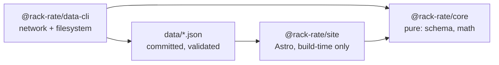

# Architecture

## Module graph



## Boundary rules

- `@rack-rate/core` is pure: no `fetch`, no `node:fs`, no `Bun.file`, and no
  clock. A function needing the date takes it as an argument.
- `@rack-rate/data-cli` owns all network and filesystem access.
- `@rack-rate/site` never fetches. The browser makes zero data requests, and
  the build works offline from committed data.
- The CLI surface is `rack-rate-data <command>`. The dispatcher in
  `packages/data-cli/src/main.ts` statically routes commands and never guesses
  an exit code.

## Data CLI

The root scripts call the same dispatcher as the installed `rack-rate-data`
binary:

- `fetch [deepswe|terminal-bench|plans|artificial-analysis|all] [--diff]`
  refreshes one source, or all four sequentially in that order. A bare
  `fetch` means `all`; `--diff` performs the source fetcher's dry run. It writes
  no file whatsoever, including gitignored `data/raw/*` snapshots, and exits
  `1` when the source would change committed data. This also applies to
  `fetch plans --diff`.
- `validate [--help]` checks the committed source, model, plan and benchmark
  documents without writing.
- `compute [--help]` deterministically writes `data/derived.json` from the
  committed inputs.
- `check [--help]` validates inputs, recomputes the derived document in memory,
  and compares its deterministic bytes with the committed file. This is the CI
  staleness gate.
- `sources [--help]` lists source metadata, attribution requirements, freshness
  and whether each source contributes to published data.
- `doctor [--help]` probes source and plan/vendor URLs, reports AA environment
  state and data-file parsing, and counts same-day raw snapshots.
- `help` and `--help` print the command list and descriptions.

Successful commands exit `0`. Invalid arguments and operational failures exit
`1`. The fetch posture is fail-closed: a missing research anchor or unreachable
vendor page keeps the last-good plans and sources and exits non-zero. Doctor
reports unreachable sites as findings but exits `0` when all probes and data
checks could be performed; data read/parse failures still exit `1`.

`upsertBenchmarkEntry` is a write boundary: it parses the candidate through the
`Benchmark` schema before touching `data/benchmarks.json`, so a mapping bug
cannot clobber the file.

Terminal-Bench first tries the flight-data path. Only after that path fails does
it resolve `harbor`, preferring a non-empty `HARBOR_BIN` and then an executable
on `PATH`; the resolved binary is logged before the fallback runs.

Artificial Analysis validation is fail-closed in one direction and loud in the
other: committed `artificial-analysis` rows while `AA_PUBLISH` is not exactly
`1` are an error (`validate` exits `1`), while `AA_PUBLISH=1` with committed AA
rows is downgraded to a loud warning.

## Environment

At import time, after computing the repository root, the CLI checks for the
root `.env` and calls `process.loadEnvFile` only when it exists. Root scripts
run through `bun run --filter` with cwd `packages/data-cli`; Bun's
cwd-relative autoload would otherwise miss the root file. A variable already
present in the environment wins over the file.

The CLI reads:

- `AA_API_KEY`
- `AA_PUBLISH`
- `HARBOR_BIN`

`packages/core` and `apps/site` read none of these variables, so no secret can
reach a built asset.

`check` is the CI gate for stale derived data. The root `bun run check` remains
the code-quality gate (typecheck, lint, formatting and site checks).

## Invariant index

The full invariant text is in [AGENTS.md](../AGENTS.md), under “Invariants”.
This index keeps the load-bearing rules visible at the architecture boundary:

1. `benchmark_version` is part of row identity; benchmark versions are never
   mixed in a table or composite.
2. Missing data stays missing: it is not scored zero, ranked last, or allowed
   to silently sink a composite.
3. `pass@1` and `pass@4` never share a field, axis, or formula; only `pass@1`
   feeds scores and composites.
4. Every cost figure carries its basis; API list rates, plan routes, and
   Artificial Analysis index costs are distinct quantities.
5. Confidence is displayed, never laundered; multiplier arithmetic is at most
   medium confidence and aggregator-only figures never become computed rows.
6. Nulls stay null; upstream nulls are never defaulted to zero.
7. Benchmark task content never belongs in this repository; metadata and scores
   only.
8. Attribution is load-bearing; validation fails if required attribution
   strings disappear. See [docs/data-sources.md](data-sources.md).
9. The site builds offline from committed data; CI does not fetch upstream.
10. Artificial Analysis is off unless explicitly enabled with both
    `AA_API_KEY` and `AA_PUBLISH=1`; its values remain separately labelled and
    are never merged into a number that hides their origin. See
    [CAVEATS.md §1](../CAVEATS.md#1-artificial-analysis--the-unresolved-one)
    for the repository owner's unresolved position.

## Site configuration

`apps/site/astro.config.mjs` owns the deployment target. It emits static
output with `output: "static"` and no adapter. `site` is the origin Astro
uses to build canonical and Open Graph URLs. `base: "/rack-rate"` prefixes
page and asset paths for the GitHub Pages project page.

The custom-domain switch changes exactly these two options:

```diff
-  site: "https://marshalfevzi.github.io",
-  base: "/rack-rate",
+  site: "https://rackrate.dev",
+  base: undefined,
```

Commit `public/CNAME` only when the custom domain is live. Tasks 3.9 and 6.2
own that file. The `base` option stays in the config object when it is
`undefined`: Astro normalises that to `/` — measured, `BASE_URL` becomes `/`
and assets drop the prefix — while deleting the line instead would turn the
switch into a one-liner that hides half the deployment target. No other line
in the config moves.

The origin is written down once. Measured against a built page: `Astro.site` is
`https://marshalfevzi.github.io/` — origin, no base — while
`import.meta.env.BASE_URL` is `/rack-rate` with no trailing slash, so a consumer
joining it to a path supplies the separator itself. `Astro.url.pathname` and
`Astro.url.href` already include the base. Under the custom domain they become
`/` and `https://rackrate.dev/`. Internal links go through the `href()` helper
from task 3.3; nothing hardcodes `/rack-rate`.

The Tailwind v4 Vite plugin is registered in this config. There is no
`tailwind.config.js`. Task 3.2 adds the single CSS entry that imports
`tailwindcss`.

## Design tokens

`apps/site/src/styles/global.css` is the single CSS entry, imported by the
layout task 3.3 adds. There is no `tailwind.config.js`; `@theme` makes
`--color-x` do double duty as the `:root` custom property and the
`bg-x`/`text-x`/`border-x` utilities. Stage 4 chart code reads it at runtime
with `getComputedStyle` instead of duplicating hexes in TS. The legacy `bg`
role is renamed to `canvas` because `--color-bg` yields `bg-bg`.

| Token | Hex | Semantic role |
|---|---|---|
| `--color-canvas` | `#0a0e15` | page background |
| `--color-panel` | `#111825` | raised surface: cards, tables, nav |
| `--color-rule` | `#1d2735` | hairline border / divider |
| `--color-ink` | `#eaeef5` | primary text |
| `--color-dim` | `#a3b0c4` | secondary text |
| `--color-adjusted` | `#ffb020` | plan-adjusted cost basis |
| `--color-measured` | `#45d97f` | measured quota basis |
| `--color-api` | `#5c6a80` | API-list cost basis, marker/stroke only |
| `--color-api-ink` | `#8a97ab` | API-list cost basis, text-safe on the dark canvas |

### Dark scheme contrast

| Pair | Ratio | AA threshold | Verdict |
|---|---:|---:|---|
| ink/canvas | 16.61:1 | 4.5:1 text | PASS |
| ink/panel | 15.28:1 | 4.5:1 text | PASS |
| dim/canvas | 8.80:1 | 4.5:1 text | PASS |
| dim/panel | 8.10:1 | 4.5:1 text | PASS |
| adjusted/canvas | 10.57:1 | 4.5:1 text | PASS |
| adjusted/panel | 9.72:1 | 4.5:1 text | PASS |
| measured/canvas | 10.57:1 | 4.5:1 text | PASS |
| measured/panel | 9.72:1 | 4.5:1 text | PASS |
| api/canvas | 3.52:1 | 3:1 UI | PASS |
| api/panel | 3.24:1 | 3:1 UI | PASS |
| api-ink/canvas | 6.53:1 | 4.5:1 text | PASS |
| api-ink/panel | 6.01:1 | 4.5:1 text | PASS |
| rule/canvas | 1.28:1 | — | measured |

Every dark text pair passes 4.5:1. `api` passes only the 3:1 non-text/UI
threshold (`3.52:1` on canvas; `3.24:1` on panel), so `--color-api` is
marker/stroke only and must never be used for text; `--color-api-ink` is
text-safe (`6.53:1` on canvas; `6.01:1` on panel). `--color-rule` is hairline
decoration; its `1.28:1` ratio is measured without an invented threshold.

### Light scheme: considered, not implemented

| Pair | Ratio | AA threshold | Verdict |
|---|---:|---:|---|
| ink/canvas | 19.33:1 | 4.5:1 text | PASS |
| ink/panel | 17.86:1 | 4.5:1 text | PASS |
| dim/canvas | 7.53:1 | 4.5:1 text | PASS |
| dim/panel | 6.96:1 | 4.5:1 text | PASS |
| adjusted/canvas | 1.83:1 | 4.5:1 text | FAIL |
| adjusted/panel | 1.69:1 | 4.5:1 text | FAIL |
| measured/canvas | 1.83:1 | 4.5:1 text | FAIL |
| measured/panel | 1.69:1 | 4.5:1 text | FAIL |
| api/canvas | 5.49:1 | 3:1 UI | PASS |
| api/panel | 5.07:1 | 3:1 UI | PASS |
| api-ink/canvas | 2.96:1 | 4.5:1 text | FAIL |
| api-ink/panel | 2.74:1 | 4.5:1 text | FAIL |
| rule/canvas | 1.36:1 | — | measured |

Under the light candidate, `adjusted` and `measured` fail as accents
(`1.83:1` on canvas; `1.69:1` on panel), and `--color-api-ink` fails as text
(`2.96:1` on canvas; `2.74:1` on panel). The API basis text role is satisfied
by a slate at least as dark as `#5c6a80`: `api` `#5c6a80` is `5.49:1` on
white and `5.07:1` on panel.

The required light-scheme accents preserve hue within each role's family:
`adjusted` → `#8a5a00` (`5.93:1` on white; `5.48:1` on panel), `measured` →
`#1a7a45` (`5.37:1` on white; `4.96:1` on panel), and the API text role →
`#55627a` (`6.15:1` on white; `5.68:1` on panel). A minimal-decrement search
over the sRGB cube reaches 4.5:1 with `#c55420` / `#45807f` / `#8a68ab` but
shifts the hue out of the role's family (orange-red for amber, teal for
green, purple for slate); role hue is what makes the accent legible as a
cost basis, so those optima are rejected (AGENTS.md invariant 4: every cost
figure carries its basis).

Decision: 3.2 ships the dark scheme only. Task 3.3b implements the light
scheme as the two-scheme palette with these hexes. The swap is a token
re-declaration (one line per changed token), so nothing in 3.2 has to change.

Numbers: a throwaway Bun script applied WCAG 2.x relative luminance; it was
deleted after the run. Ratios are computed, not estimated.

## TypeScript configuration

TypeScript uses a single root `tsconfig.json` with no project references. Its
shared libraries are `lib: ["ES2023", "DOM"]`.
