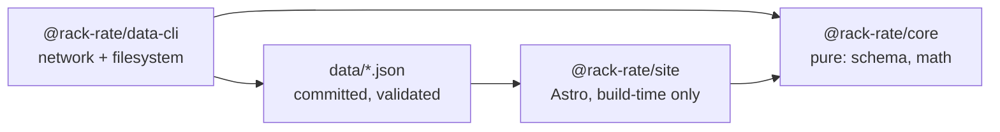

# Architecture

## Module graph

## Boundary rules

- `@rack-rate/core` is pure: no `fetch`, no `node:fs`, no `Bun.file`, and no
  clock. A function needing the date takes it as an argument.
- `@rack-rate/data-cli` owns all network and filesystem access.
- `@rack-rate/site` never fetches. The browser makes zero data requests, and
  the build works offline from committed data.
- The CLI surface is `rack-rate-data <command>`. Commands are listed here as
  they land in Stage 2.

## Invariant index

The full invariant text is in [AGENTS.md](../AGENTS.md), under “Invariants”.
This index keeps the load-bearing rules visible at the architecture boundary:

1. `benchmark_version` is part of row identity; benchmark versions are never
   mixed in a table or composite.
2. Missing data stays missing: it is not scored zero, ranked last, or allowed
   to silently sink a composite.
3. `pass@1` and `pass@4` never share a field, axis, or formula; only `pass@1`
   feeds scores and composites.
4. Every cost figure carries its basis; API list rates, plan routes, and
   Artificial Analysis index costs are distinct quantities.
5. Confidence is displayed, never laundered; multiplier arithmetic is at most
   medium confidence and aggregator-only figures never become computed rows.
6. Nulls stay null; upstream nulls are never defaulted to zero.
7. Benchmark task content never belongs in this repository; metadata and scores
   only.
8. Attribution is load-bearing; validation fails if required attribution
   strings disappear. See [docs/data-sources.md](data-sources.md).
9. The site builds offline from committed data; CI does not fetch upstream.
10. Artificial Analysis is off unless explicitly enabled with both
    `AA_API_KEY` and `AA_PUBLISH=1`; its values remain separately labelled and
    are never merged into a number that hides their origin. See
    [CAVEATS.md §1](../CAVEATS.md#1-artificial-analysis--the-unresolved-one)
    for the repository owner's unresolved position.

## TypeScript configuration

TypeScript uses a single root `tsconfig.json` with no project references. Its
shared libraries are `lib: ["ES2023", "DOM"]`.
