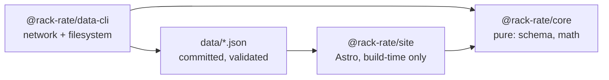

# Architecture

## Module graph



## Boundary rules

- `@rack-rate/core` is pure: no `fetch`, no `node:fs`, no `Bun.file`, and no
  clock. A function needing the date takes it as an argument.
- `@rack-rate/data-cli` owns all network and filesystem access.
- `@rack-rate/site` never fetches. The browser makes zero data requests, and
  the build works offline from committed data.
- The CLI surface is `rack-rate-data <command>`. The dispatcher in
  `packages/data-cli/src/main.ts` statically routes commands and never guesses
  an exit code.

## Data CLI

The root scripts call the same dispatcher as the installed `rack-rate-data`
binary:

- `fetch [deepswe|terminal-bench|plans|artificial-analysis|all] [--diff]`
  refreshes one source, or all four sequentially in that order. A bare
  `fetch` means `all`; `--diff` performs the source fetcher's dry run. It writes
  no file whatsoever, including gitignored `data/raw/*` snapshots, and exits
  `1` when the source would change committed data. This also applies to
  `fetch plans --diff`.
- `validate [--help]` checks the committed source, model, plan and benchmark
  documents without writing.
- `compute [--help]` deterministically writes `data/derived.json` from the
  committed inputs.
- `check [--help]` validates inputs, recomputes the derived document in memory,
  and compares its deterministic bytes with the committed file. This is the CI
  staleness gate.
- `sources [--help]` lists source metadata, attribution requirements, freshness
  and whether each source contributes to published data.
- `doctor [--help]` probes source and plan/vendor URLs, reports AA environment
  state and data-file parsing, and counts same-day raw snapshots.
- `help` and `--help` print the command list and descriptions.

Successful commands exit `0`. Invalid arguments and operational failures exit
`1`. The fetch posture is fail-closed: a missing research anchor or unreachable
vendor page keeps the last-good plans and sources and exits non-zero. Doctor
reports unreachable sites as findings but exits `0` when all probes and data
checks could be performed; data read/parse failures still exit `1`.

`upsertBenchmarkEntry` is a write boundary: it parses the candidate through the
`Benchmark` schema before touching `data/benchmarks.json`, so a mapping bug
cannot clobber the file.

Terminal-Bench first tries the flight-data path. Only after that path fails does
it resolve `harbor`, preferring a non-empty `HARBOR_BIN` and then an executable
on `PATH`; the resolved binary is logged before the fallback runs.

Artificial Analysis validation is fail-closed in one direction and loud in the
other: committed `artificial-analysis` rows while `AA_PUBLISH` is not exactly
`1` are an error (`validate` exits `1`), while `AA_PUBLISH=1` with committed AA
rows is downgraded to a loud warning.

## Environment

At import time, after computing the repository root, the CLI checks for the
root `.env` and calls `process.loadEnvFile` only when it exists. Root scripts
run through `bun run --filter` with cwd `packages/data-cli`; Bun's
cwd-relative autoload would otherwise miss the root file. A variable already
present in the environment wins over the file.

The CLI reads:

- `AA_API_KEY`
- `AA_PUBLISH`
- `HARBOR_BIN`

`packages/core` and `apps/site` read none of these variables, so no secret can
reach a built asset.

`check` is the CI gate for stale derived data. The root `bun run check` remains
the code-quality gate (typecheck, lint, formatting and site checks).

## Invariant index

The full invariant text is in [AGENTS.md](../AGENTS.md), under “Invariants”.
This index keeps the load-bearing rules visible at the architecture boundary:

1. `benchmark_version` is part of row identity; benchmark versions are never
   mixed in a table or composite.
2. Missing data stays missing: it is not scored zero, ranked last, or allowed
   to silently sink a composite.
3. `pass@1` and `pass@4` never share a field, axis, or formula; only `pass@1`
   feeds scores and composites.
4. Every cost figure carries its basis; API list rates, plan routes, and
   Artificial Analysis index costs are distinct quantities.
5. Confidence is displayed, never laundered; multiplier arithmetic is at most
   medium confidence and aggregator-only figures never become computed rows.
6. Nulls stay null; upstream nulls are never defaulted to zero.
7. Benchmark task content never belongs in this repository; metadata and scores
   only.
8. Attribution is load-bearing; validation fails if required attribution
   strings disappear. See [docs/data-sources.md](data-sources.md).
9. The site builds offline from committed data; CI does not fetch upstream.
10. Artificial Analysis is off unless explicitly enabled with both
    `AA_API_KEY` and `AA_PUBLISH=1`; its values remain separately labelled and
    are never merged into a number that hides their origin. See
    [CAVEATS.md §1](../CAVEATS.md#1-artificial-analysis--the-unresolved-one)
    for the repository owner's unresolved position.

## Site configuration

`apps/site/astro.config.mjs` owns the deployment target. It emits static
output with `output: "static"` and no adapter. `site` is the origin Astro
uses to build canonical and Open Graph URLs. `base: "/rack-rate"` prefixes
page and asset paths for the GitHub Pages project page.

The custom-domain switch changes exactly these two options:

```diff
-  site: "https://marshalfevzi.github.io",
-  base: "/rack-rate",
+  site: "https://rackrate.dev",
+  base: undefined,
```

Commit `public/CNAME` only when the custom domain is live. Tasks 3.9 and 6.2
own that file. The `base` option stays in the config object when it is
`undefined`: Astro normalises that to `/` — measured, `BASE_URL` becomes `/`
and assets drop the prefix — while deleting the line instead would turn the
switch into a one-liner that hides half the deployment target. No other line
in the config moves.

The origin is written down once. Measured against a built page: `Astro.site` is
`https://marshalfevzi.github.io/` — origin, no base — while
`import.meta.env.BASE_URL` is `/rack-rate` with no trailing slash, so a consumer
joining it to a path supplies the separator itself. `Astro.url.pathname` and
`Astro.url.href` already include the base. Under the custom domain they become
`/` and `https://rackrate.dev/`. Internal links go through the `href()` helper
from task 3.3; nothing hardcodes `/rack-rate`.

The Tailwind v4 Vite plugin is registered in this config. There is no
`tailwind.config.js`. `src/styles/global.css` is the single CSS entry that
imports `tailwindcss`; task 3.2 created it and 3.3b extended it with the type,
spacing and motion tokens.

## Layouts and links

`apps/site/src/layouts/Base.astro` accepts `title` and `description`.
`apps/site/src/layouts/Page.astro` accepts `title`, `description`, optional
`heading`, and optional `lede`. `Base` renders the skip link, sticky header,
and footer; the header computes `position: sticky`. `Page` is the only layout
that renders `<main id="main" tabindex="-1">`; `Base` renders no main landmark.

`apps/site/src/lib/url.ts` exports three typed helpers:

- `href(path: \`/${string}\`): string` is the route builder. It joins the
  path to `import.meta.env.BASE_URL` and adds a trailing slash except for the
  root.
- `asset(path: \`/${string}\`): string` is the file builder. It joins the
  path to `import.meta.env.BASE_URL` without adding a trailing slash. `Base`
  uses it for the OG and Twitter image path.
- `absoluteUrl(relativePath: string, site: URL | undefined): string` turns an
  already base-relative path from `href()`, `asset()`, or `Astro.url.pathname`
  into an absolute URL using `site.origin`. With `site === undefined`, it
  returns the input unchanged; all base handling belongs to the two path
  builders.

The module reads `import.meta.env.BASE_URL` once at module scope. Measured
helper outputs are:

| Call | Project page (`base: "/rack-rate"`) | Custom domain (`base === "/"`) |
|---|---|---|
| `href("/")` | `/rack-rate/` | `/` |
| `href("/models")` | `/rack-rate/models/` | `/models/` |
| `asset("/og.png")` | `/rack-rate/og.png` | `/og.png` |

Measured `absoluteUrl("/rack-rate/models/", site)` as
`https://marshalfevzi.github.io/rack-rate/models/` and
`absoluteUrl("/rack-rate/og.png", site)` as
`https://marshalfevzi.github.io/rack-rate/og.png`; with
`site === undefined`, it returns `/rack-rate/models/` unchanged.

Astro's `build.format: "directory"` gives route links their trailing slash;
`asset()` deliberately does not. A built project page measured
`https://marshalfevzi.github.io/rack-rate/models/` as both its canonical URL
and `og:url`, with `og:image` at
`https://marshalfevzi.github.io/rack-rate/og.png`. With `base: "/"` and
`site: https://rackrate.dev`, the corresponding URLs are
`https://rackrate.dev/models/` and `https://rackrate.dev/og.png`.

`Base` emits head metadata in this order: charset, viewport, title
(`{title} · rack-rate`), description, canonical, generator, two media-scoped
`theme-color` values (`#0a0e15` dark and `#f7f8fa` light), Open Graph type,
site name, title, description, URL, image, image dimensions and image alt,
then Twitter card (`summary_large_image`), title, description and image.

The navigation routes are `/`, `/models`, `/plans`, `/compare`, `/explore`,
`/start`, `/method`, and `/sources`. `aria-current="page"` is exact for the
root route and prefix-based for the other routes: Overview is current at
`/rack-rate/`, Models at `/rack-rate/models/`, and no item is current at
`/rack-rate/smoke33/`.

The skip link is 1 by 1 px and clipped with `clip-path: inset(50%)` until
focused. Headless Chromium measured its focused state at 138 by 42 px at the
top left with the 2 px ink outline. The global focus ring is
`:focus-visible { outline: 2px solid var(--color-ink); outline-offset: 2px }`;
interaction chrome spends no accent hue. `.tabular` sets
`font-variant-numeric: tabular-nums`.

The footer has two static paragraphs. The credit paragraph names
DeepSWE/Datacurve, Terminal-Bench/Harbor Hub, Awesome Coding Plan by mahonzhan
under CC BY 4.0, real-api-pricing by FeiZhuLulu, and the Sources page. The
Artificial Analysis paragraph states that it is excluded unless publication
is explicitly enabled and that Sources states which state this build is in. The
verbatim Awesome Coding Plan attribution required by
`docs/data-sources.md` belongs to `/sources`, rendered from
`data/sources.json` in task 3.11; it is not duplicated in the layout.

`Base` deliberately omits a favicon link; task 3.9 owns
`public/favicon.svg`. It also omits analytics, emoji, dashed borders,
gradients, and shadows.

## Routes and data access

`apps/site/src/pages/` holds the whole route set. `output: "static"` with
Astro's default `build.format: "directory"` emits one directory per route, so a
route URL ends in `/` and is served from `<route>/index.html` — `href()` supplies
that trailing slash. The 404 route is the exception: it builds to
`dist/404.html`, which GitHub Pages serves for any unmatched path.

| Route | File | Content stage |
|---|---|---|
| `/` | `index.astro` | 4.12 |
| `/models` | `models/index.astro` | 4.8 |
| `/models/[slug]` | `models/[slug].astro` | 4.9 |
| `/plans` | `plans/index.astro` | 4.10 |
| `/plans/[slug]` | `plans/[slug].astro` | 4.10 |
| `/compare` | `compare.astro` | 4.11 |
| `/explore` | `explore.astro` | 4.13 |
| `/start` | `start.astro` | 5.3 |
| `/method` | `method.astro` | 3.11 |
| `/sources` | `sources.astro` | 3.11 |
| `404` | `404.astro` | — |

Both dynamic routes build `getStaticPaths` from committed rows — 28
`/models/<id>` pages from `data/models.json`, 16 `/plans/<id>` pages from
`data/plans.json`, the row `id` being the slug. A row added upstream becomes a
page on the next commit with no code change. The whole set is 53 built pages:
28 + 16 + eight static routes + the 404. Every page renders exactly one
`<main id="main" tabindex="-1">` and one `h1`, both from `Page.astro`; nav
`aria-current="page"` is prefix-based, so `/models/<id>` marks Models.

Skeleton-note convention: each route carries one
`<p class="mt-6 text-meta text-dim">Route skeleton — …</p>` line naming what
lands there and in which stage, so an unfinished route is honest rather than
blank. Stages 4 and 5 delete them as content arrives; the 404 route has none.
No figure, badge or attribution string may be invented to fill a route: scores,
costs and licence text wait for the components that carry their basis.

`apps/site/src/lib/data.ts` is the only module under `apps/site` that imports
`data/*.json`. It parses all five committed documents (`models.json`,
`plans.json`, `benchmarks.json`, `sources.json`, and `derived.json`) with the
corresponding `@rack-rate/core` zod schemas, then exports the parsed rows and
documents plus prebuilt indexes. The identity rows and documents are `models`,
`plans`, `planKnownGaps`, `quotaModelDocs`, `benchmarks`, `sources`, and
`derived`; `benchmarks` has one entry per committed benchmark version, with
Artificial Analysis absent unless publication is enabled rather than
synthesized. The id indexes are `modelsById`, `plansById`, `benchmarksById`, and
`sourcesById`. The relation indexes are `routesByModel`, `routesByPlan`,
`bestRouteByModel`, `compositeByModel`, `compositeWeights`, `apiFrontier`,
`frontierByPlan`, `tokenAllowances`, `tokenAllowanceByPair`, `badgeByPair`,
`crossCheck`, and `derivedKnownGaps`. `pairKey(modelId, planId)` is the single
place the `(model, plan)` map key is built, using a separator absent from either
kebab-case id. `derivedGeneratedAt` is the one scalar: the newest upstream
`generated_at` `compute` wrote into the file, which every freshness badge is
measured against instead of the wall clock.

The computed sections `composites`, `frontiers`, `token_allowances`, and
`badges` are optional in the `DerivedFile` schema but always present in the
committed document; `bun run data:check` fails when they are missing. The
module reads each section once through a local check that throws with the
section name and `data/derived.json`, then exports the non-optional view, so an
incomplete committed document fails the build instead of rendering an empty
page. A committed file that drifts from its schema likewise fails the build
rather than a page. An unknown model, plan, benchmark, or source id returns
`undefined` from its index lookup rather than throwing, so an id removed
upstream degrades instead of crashing a page. The row types come from
`@rack-rate/core`; the module does not re-export a parallel type surface. Its
JSON imports work because the root `tsconfig.json` sets `resolveJsonModule:
true`. Vite bundles the files at build time and the module reaches no browser
bundle because only Astro frontmatter imports it. `Model.id` and `Plan.id` are
used as slugs directly, so no second slug mapping exists to drift.

Measured on the Stage 3.4 build: 53 pages; a static server with the `dist` tree
mounted at `/rack-rate` returned 200 for all 53 routes, and every base-prefixed
`href`/`src` in the built HTML (eight nav links plus one stylesheet) resolved.
Headless Chromium at a 360 px viewport reported `scrollWidth` 360 on all eleven
route shapes, one `<main>` and one `h1` per page, correct `aria-current`, and
canonical URLs under `/rack-rate`.

## Formatting

Display formatting has one rounding rule per unit, owned by the module. Call
sites supply no precision argument, so a figure reads identically on every
page. `apps/site/src/lib/format.ts` is pure TypeScript: no `import.meta.env`,
DOM, or Astro import, so `.astro` frontmatter and `bun test` use the same
function.

| Export | Unit in the data | Rule | Example |
|---|---|---|---|
| `MISSING` | absent value | the single placeholder | `"—"` |
| `formatPercent(v)` | percent units, 0–100 (`score_pct`, `composites.rows[].composite`, `benchmarks[].rows[].score`, `benchmarks[].rows[].ci_*`, `score_pass_at_4_pct`; display-only: pass@4 never feeds a score or a composite — invariant 3) | half-even to 1 dp, `%` suffix, no space | `74.12 → "74.1%"`, `0 → "0.0%"` |
| `formatFractionAsPercent(v)` | fraction, 0–1 (`models[].ci_lo`/`ci_hi`, utilization `U = T_actual / Q`) | ×100, then the percent rule | `0.7124964807371247 → "71.2%"` |
| `formatPoints(v)` | percentage-point delta (`Δy = Y_frontier(x) − y`) | always-signed, half-even to 1 dp, `" pp"` suffix | `4.2 → "+4.2 pp"`, `-1.06 → "-1.1 pp"`, `0 → "+0.0 pp"` |
| `formatPercentRange(lo, hi)` | percent units, 0–100 | the percent rule on both ends, en dash `–` between, one `%` at the end; either end missing → `MISSING` | `71.25, 76.98 → "71.2–77.0%"` |
| `formatFractionAsPercentRange(lo, hi)` | fractions, 0–1 | the fraction rule on both ends, as above | `0.7124964807371247, 0.7698044042186275 → "71.2–77.0%"` |
| `formatUsd(v)` | USD **amount**: `price_usd_month`, `quota_usd_month`, `rolling_window_usd`, a measured run total | up to 2 dp half-even, trailing zeros trimmed, thousands grouped, `$` prefix | `20 → "$20"`, `7.23 → "$7.23"`, `9603.86 → "$9,603.86"`, `25472 → "$25,472"` |
| `formatUsdPerTask(v)` | USD / task, **both** bases (`cost_per_task_usd`, `api_cost_per_task_usd`) | half-even to 4 dp (fixed), thousands grouped, `$` prefix | `0.0304 → "$0.0304"`, `23.2774 → "$23.2774"` |
| `formatUsdPerMillionTokens(v)` | USD / 1M tokens (`allowance_per_million_tokens`, `adjusted_api_cost_per_million`) | half-even to 4 dp (fixed), `$` prefix | `0.0017 → "$0.0017"`, `4.7563 → "$4.7563"` |
| `formatTasksPerMonth(v)` | tasks / month (`tasks_per_month`, `tasks_by_dollars`, `tasks_by_tokens`) | half-even to 1 dp, grouped | `5233.18 → "5,233.2"`, `0.64 → "0.6"` |
| `formatDays(v)` | days (`days_for_full_run`) | half-even to 1 dp, grouped | `5.15 → "5.2"`, `5260.69 → "5,260.7"` |
| `formatCount(v)` | integer count (`agent_steps_per_task`, `steps`, `task_count`, `n_tasks_attempted`, `k`, `pair_count`, `requests_month`, `rolling_window_hours`) | half-even to **up to 1 dp**, trailing zeros trimmed, grouped | `113 → "113"`, `90.5 → "90.5"`, `2400 → "2,400"` |
| `formatTokens(v)` | token quantity (`input_tokens_per_task`, `tokens_input`, `tokens_month`, `tokens_per_task`, `tokens_per_month_allowance`, `cross_check_tokens_month`) | **three significant digits** with a `K`/`M`/`B` suffix (base 1000), trailing zeros trimmed; below 1000 the grouped integer | `1163918 → "1.16M"`, `62795056 → "62.8M"`, `76390578947 → "76.4B"`, `616 → "616"`, `999999 → "1M"` |
| `formatTokensExact(v)` | token quantity, tooltip/table detail | half-even to 0 dp, grouped | `1163918 → "1,163,918"` |
| `formatMultiple(v)` | unitless multiplier (`value_multiple`, `cross_check.pairs[].ratio`, `cross_check.summary.*_ratio`) | up to 2 dp half-even, trailing zeros trimmed, `×` suffix (U+00D7), no space | `3 → "3×"`, `127.36 → "127.36×"`, `1.601 → "1.6×"`, `1.006 → "1.01×"` |
| `formatZ(v)` | z-score (`composites.rows[].weighted_z`, `normalize` z) | always-signed, half-even to 2 dp, no suffix | `1.5656 → "+1.57"`, `-2.9945 → "-2.99"`, `0 → "+0.00"` |
| `formatFxRate(v)` | CNY→USD spot rate (`plans[].fx.rate`) | half-even to 4 dp (fixed), no symbol, grouped | `6.7787 → "6.7787"` |

Display rounding follows the `PLAN`'s Stage 2 precision rule: round what this
repo computes, keep upstream precision in the data, and let the format layer
own display rounding. Every formatter applies `roundHalfEven` from
`@rack-rate/core` before string conversion, reusing the same Python-parity
semantics as the derived data.
`Intl.NumberFormat` is pinned to `en-US`, so the runtime locale can never reach
a published figure. Percentages use 1 dp because the published CIs are several
points wide and every upstream board shows 1 dp; 2 dp would be false precision.
`composites.weights` holds control inputs for 4.13's sliders rather than
published figures, so the module ships no rule for them; a page that needs to
print one adds the rule here first.
A one-sided range is not a reported interval: `formatPercentRange` and
`formatFractionAsPercentRange` return `MISSING` unless both endpoints are
present, so a half-range cannot read as a figure. Nulls render as `MISSING`,
not `0` or `N/A` (invariant 6), while a genuine `0` never renders as missing.
The formatter never appends a unit word, so `CostBasisChip` and headers own
`/task`, `/mo`, `days`, and `tokens`; two spellings cannot drift.

The two-convention trap is explicit: `data/models.json` carries `ci_lo`/`ci_hi`
as 0–1 fractions, while `score_pct`, `data/benchmarks.json` rows, and
`derived.json` composites use 0–100 percent scale. The module therefore ships
both `formatPercent`/`formatFractionAsPercent` and both range variants; a page
must pick by the units its row actually carries.

Stage 4 consumers—charts, tables, and the components below—import this module and
never call `toFixed`, `Intl`, or a template literal for a published number.
`CiBar` uses the range formatters and `CostBasisChip` owns the basis label that
keeps invariant 4 visible; both landed in 3.7.

## Provenance components

`apps/site/src/components/` holds six components: a chip shell and the five that
carry "where did this come from" for a figure. They take parsed values and render
words, geometry and citations — never a figure of their own — so the number stays
owned by `format.ts` and the cost basis by the chip.

| Component | Props | Renders |
|---|---|---|
| `Badge.astro` | `{ tone?: "neutral" \| "api" \| "adjusted"; title?: string; class?: string }` | the one chip shell (`inline-flex … border-rule text-meta`) the three badges share, so the chip markup exists once |
| `ConfidenceBadge.astro` | `{ level: Confidence }` | the level word, prefixed by an `sr-only` "Confidence: ", with the level's definition in `title` |
| `FreshnessBadge.astro` | `{ freshness: Freshness; retrievedAt: string }` | the `Fresh`/`Stale` word plus `retrieved <date>` in `tabular` digits, definition in `title` |
| `CostBasisChip.astro` | `{ basis: CostBasisKind; planName?: string; unit?: CostUnit; status?: CostBasisStatus }` | the basis label, the unit (`/task`, `/mo`, `/1M tokens`) and, when the status is not `list`, the qualifier (`expected launch`, `disputed`, `unknown basis`) |
| `SourceLink.astro` | `{ id: string; label?: string }` | one external anchor to the source's `url`, `title` = title · licence · retrieval date, plus an `sr-only` new-tab note |
| `CiBar.astro` | `{ value: number; lo?: number; hi?: number; ciScale: CiScale; method?: string; class?: string }` | the interval bar with its composed accessible name, or `— no interval reported` |

`apps/site/src/lib/provenance.ts` is the vocabulary and the arithmetic:
`CONFIDENCE_TERMS`, `FRESHNESS_TERMS`, `COST_BASIS_TERMS`, `COST_UNIT_LABELS`,
`costBasisTerm`, `costBasisQualifier` and `ciGeometry`. Its types are derived
from the data contract — `Confidence` is `Plan["confidence"]`, `Freshness` is
`PairBadge["freshness"]`, `CostBasisStatus` is
`Model["cost_basis"] | NonNullable<Plan["price_status"]>` — so a new level or
status fails the build inside the module instead of rendering an unlabelled
badge. The module is pure TypeScript, so `.astro` frontmatter and `bun test` call
the same function.

Five rules the components encode:

1. **One accent per role.** `neutral` (`text-dim`) for confidence, freshness and
   the AA index basis; `text-api-ink` for the API-list basis; `text-adjusted` for
   a `{plan} route`. `--color-measured` stays reserved for the measured quota
   basis, which no 3.7 component renders. Nothing spends an accent on chrome, on
   an interval or on interaction.
2. **A basis label names its quantity.** `costBasisTerm("plan-route")` throws
   without a plan name, because `{plan} route` without the plan names nothing.
3. **Absent stays absent.** `CiBar` renders text, never a bar, when either
   endpoint is missing: a bar drawn from one end would invent the other, the same
   rule the range formatters apply to the printed range.
4. **The interval is never zoomed.** `ciGeometry` maps the interval onto the
   unit's full domain (`0–1` for a fraction, `0–100` for percent), so a 5.7-point
   interval reads as one. `leftPct` and `widthPct` round to 3 dp with the width
   taken as a delta between the rounded ends, so `leftPct + widthPct` lands
   exactly on the interval's high end; out-of-domain values clamp instead of
   rescaling the track; a transposed pair is ordered rather than drawn inside
   out; the interval's 2 px minimum width is CSS, not geometry.
5. **One freshness rule.** `isStale` and `freshnessOf` ship in `@rack-rate/core`
   with `STALE_AFTER_DAYS` at 14 and the reference moment as an argument.
   `compute` imports them for the committed `PairBadge.freshness`, and a row's
   verdict is `freshnessOf(row.retrieved_at, derivedGeneratedAt)`. The extraction
   deleted `compute.ts`'s private copy of the rule, and `bun run data:check`
   proves the move changed no byte of `derived.json`. The research pass's
   30/90-day `aging` ladder was not adopted: the committed vocabulary is
   `fresh | stale`.

`derivedGeneratedAt` in `lib/data.ts` is that reference moment: `compute` writes
the newest upstream `generated_at` into `derived.json`, so a badge is dated
against committed data rather than the wall clock and two builds of one commit
age identically. It is read once through the same fail-fast guard as the computed
sections, because a dated row cannot exist without it.

`SourceLink` throws for an id that is not in `data/sources.json` rather than
degrading to plain text. `bun run validate` already enforces evidence and source
referential integrity, and invariant 8 makes attribution load-bearing, so a
citation that cannot resolve fails the build; the accessor's `undefined`-degrades
rule covers an id upstream retired, not a missing citation.

Stage 4's rule, unchanged from the plan: every published figure ships inside at
least one of these components, so provenance is structural rather than a footer
paragraph. Until then the components are unreachable from any entry point and
`fallow` reports them as unused files — expected, not stale.

Measured on the 3.7 probe build (54 pages; the throwaway page was deleted
afterwards): the gpt-6-astra interval emitted
`style="left:71.25%;width:5.73%;min-width:2px"` with `left:74.12%` for the point
estimate, and its accessible name was `74.1% (interval 71.2–77.0%; 95%
run-to-run: SE across repeated whole-benchmark passes (1.96 * std(runs)/sqrt(R)))`.
A chip read `API list /task · expected launch` in `text-api-ink`; the plan route
chip read `ChatGPT Pro 20x route /task` in `text-adjusted`; a `Terminal-Bench`
row rendered `— no interval reported` rather than a bar. In headless Chromium at
360 px the page reported `scrollWidth` 360 with no unclipped overflow: the track
measured 96 px inside its `w-24` container and fell to its `min-w-16` floor
(64 px) in a squeezed table cell, 4 px
tall, interval `rgb(163, 176, 196)` on a `rgb(29, 39, 53)` track with a 2 px
`rgb(234, 238, 245)` point marker — `--color-dim`, `--color-rule`, `--color-ink`,
no accent. The probe is a real gate: changing one expected interval start to
`71.24` made `bun run --filter @rack-rate/site build` exit 1 with
`stage 3.7 probe failed: astra interval start -> 71.25 (expected 71.24)`.

## Design tokens

`apps/site/src/styles/global.css` is the single CSS entry: one
`@import "tailwindcss"`, one `@theme`, and one `@layer base`. The dark scheme
is the default. `@theme` emits the custom properties and their Tailwind
utilities, and utilities continue to read `var(--color-*)` when the light
scheme re-declares the values.

| Token | Dark hex | Light hex | Semantic role |
|---|---|---|---|
| `--color-canvas` | `#0a0e15` | `#f7f8fa` | page background |
| `--color-panel` | `#111825` | `#ffffff` | raised surface: cards, tables, nav |
| `--color-rule` | `#1d2735` | `#dce2ea` | hairline border / divider |
| `--color-ink` | `#eaeef5` | `#0f141d` | primary text |
| `--color-dim` | `#a3b0c4` | `#4f5b73` | secondary text |
| `--color-adjusted` | `#ffb020` | `#8a5a00` | plan-adjusted cost basis |
| `--color-measured` | `#45d97f` | `#1a7a45` | measured quota basis |
| `--color-api` | `#5c6a80` | `#5c6a80` | API-list cost basis, marker/stroke |
| `--color-api-ink` | `#8a97ab` | `#55627a` | API-list cost basis, text |

### Dark scheme contrast

| Pair | Canvas | Panel | AA threshold | Verdict |
|---|---:|---:|---:|---|
| ink | 16.61:1 | 15.28:1 | 4.5:1 text | PASS |
| dim | 8.80:1 | 8.10:1 | 4.5:1 text | PASS |
| adjusted | 10.57:1 | 9.72:1 | 4.5:1 text | PASS |
| measured | 10.57:1 | 9.72:1 | 4.5:1 text | PASS |
| api | 3.52:1 | 3.24:1 | 3:1 UI | PASS |
| api-ink | 6.53:1 | 6.01:1 | 4.5:1 text | PASS |
| rule | 1.28:1 | 1.18:1 | — | measured |

The dark text roles pass 4.5:1. `api` passes the 3:1 non-text/UI threshold
and is marker/stroke only; `api-ink` is text-safe. `rule` is hairline
decoration and carries no threshold.

### Light scheme contrast

| Pair | Canvas | Panel | AA threshold | Verdict |
|---|---:|---:|---:|---|
| ink | 17.36:1 | 18.45:1 | 4.5:1 text | PASS |
| dim | 6.42:1 | 6.83:1 | 4.5:1 text | PASS |
| adjusted | 5.58:1 | 5.93:1 | 4.5:1 text | PASS |
| measured | 5.05:1 | 5.37:1 | 4.5:1 text | PASS |
| api | 5.16:1 | 5.49:1 | 4.5:1 text | PASS |
| api-ink | 5.79:1 | 6.15:1 | 4.5:1 text | PASS |
| rule | 1.23:1 | 1.30:1 | — | measured |

Every text role clears 4.5:1 in the light scheme. `api` also clears 4.5:1
there, but remains the marker/stroke token so chart code does not branch on
scheme. The token split is kept in both schemes. `rule` remains hairline
decoration without a threshold.

### Type scale

`--text-*: initial` removes the default Tailwind font-size namespace. The
shipped scale is:

| Token | Rem / line height | Computed size | Use |
|---|---|---:|---|
| `--text-meta` | 0.8125rem / 1.45 | 13 px | badges, table metadata, nav, footer |
| `--text-body` | 0.9375rem / 1.6 | 15 px | paragraphs and table cells |
| `--text-title` | 1.375rem / 1.25 | 22 px | section headings and subpage h1 |
| `--text-display` | 2rem / 1.15 | 32 px | `/` hero h1 |

`--font-sans` is the native UI stack and is the body default. `--font-mono`
is the native mono stack, opt-in for code and identifiers only. Measured
verification-page CSS is 8.5 KB; `--text-sm`, `--text-base`, `--text-lg`, and
`--text-xl` are absent from the output.

### Spacing

`--spacing: 0.25rem` is the single spacing unit. Values are integer
multiples only.

### Motion

The single transition contract is `--default-transition-duration: 150ms` and
`--default-transition-timing-function: cubic-bezier(0.2, 0, 0, 1)`. A bare
`transition-colors` therefore carries the duration and easing.
`--ease-standard: cubic-bezier(0.2, 0, 0, 1)` is also the named utility for
explicit easing use. Tailwind v4 prunes theme variables that no emitted
utility references, so `--ease-standard` is expected to be absent from
today's CSS output until a utility uses it.

Under `prefers-reduced-motion: reduce`, transition and animation durations
become `0.01ms`, animation iteration count is capped at one, and
`scroll-behavior` is forced to `auto` for `*`, `::before`, and `::after`.
`0.01ms` preserves end events.

### Scheme mechanism

The light scheme is a token re-declaration only:
`@media (prefers-color-scheme: light) { :root { … } }` appears in
`@layer base`, which wins over Tailwind's `theme` layer. Dark is the default.
There is no `.dark` class, toggle, or pre-paint script, so there is no FOUC
avoidance toggle to document; a toggle is deferred to task 5.1.

### Anti-signals

| Predecessor signal | Shipped replacement |
|---|---|
| 3D glossy ball chart markers | Flat filled circles with a 1 px `--color-rule` stroke; no gradient, glow, or shadow |
| Amber for everything / a second accent hue | One accent per cost-basis role, plus an ink focus ring |
| Monospace for everything | Sans body, mono opt-in, and `tabular-nums` for figures |
| Dashed-rule noise | One solid 1 px `--color-rule` hairline |
| Four competing animation durations | One 150 ms duration and one easing |
| Emoji empty state | Text-only empty states, rendered by Stage 4 |
| Dead analytics snippet | None exists; task 1.5 deleted it and nothing re-adds it |

Stage 4 receives three load-bearing rules: chart markers are flat filled
circles with a 1 px `--color-rule` stroke and no gradient, glow, or shadow;
chart code reads tokens at runtime with `getComputedStyle` instead of
duplicating hexes in TypeScript; and amber is reserved for the
plan-adjusted cost basis.

Numbers are recomputed from the shipped hexes with WCAG 2.x relative
luminance; they are not estimates.

## TypeScript configuration

TypeScript uses a single root `tsconfig.json` with no project references. Its
shared libraries are `lib: ["ES2023", "DOM"]`.
