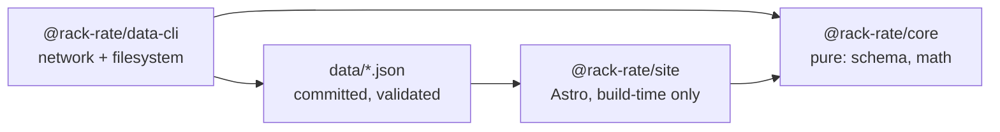

# Architecture

## Module graph

## Boundary rules

- `@rack-rate/core` is pure: no `fetch`, no `node:fs`, no `Bun.file`, and no
  clock. A function needing the date takes it as an argument.
- `@rack-rate/data-cli` owns all network and filesystem access.
- `@rack-rate/site` never fetches. The browser makes zero data requests, and
  the build works offline from committed data.
- The CLI surface is `rack-rate-data <command>`. The dispatcher in
  `packages/data-cli/src/main.ts` statically routes commands and never guesses
  an exit code.

## Data CLI

The root scripts call the same dispatcher as the installed `rack-rate-data`
binary:

- `fetch [deepswe|terminal-bench|plans|artificial-analysis|all] [--diff]`
  refreshes one source, or all four sequentially in that order. A bare
  `fetch` means `all`; `--diff` performs the source fetcher's dry run.
- `validate [--help]` checks the committed source, model, plan and benchmark
  documents without writing.
- `compute [--help]` deterministically writes `data/derived.json` from the
  committed inputs.
- `check [--help]` validates inputs, recomputes the derived document in memory,
  and compares its deterministic bytes with the committed file. This is the CI
  staleness gate.
- `sources [--help]` lists source metadata, attribution requirements, freshness
  and whether each source contributes to published data.
- `doctor [--help]` probes source and plan/vendor URLs, reports AA environment
  state and data-file parsing, and counts same-day raw snapshots.
- `help` and `--help` print the command list and descriptions.

Successful commands exit `0`. Invalid arguments and operational failures exit
`1`; `fetch --diff` also exits `1` when a source would change committed data.
The fetch posture is fail-closed: a missing research anchor or unreachable
vendor page keeps the last-good plans and sources and exits non-zero. Doctor
reports unreachable sites as findings but exits `0` when all probes and data
checks could be performed; data read/parse failures still exit `1`.

`check` is the CI gate for stale derived data. The root `bun run check` remains
the code-quality gate (typecheck, lint, formatting and site checks).

## Invariant index

The full invariant text is in [AGENTS.md](../AGENTS.md), under “Invariants”.
This index keeps the load-bearing rules visible at the architecture boundary:

1. `benchmark_version` is part of row identity; benchmark versions are never
   mixed in a table or composite.
2. Missing data stays missing: it is not scored zero, ranked last, or allowed
   to silently sink a composite.
3. `pass@1` and `pass@4` never share a field, axis, or formula; only `pass@1`
   feeds scores and composites.
4. Every cost figure carries its basis; API list rates, plan routes, and
   Artificial Analysis index costs are distinct quantities.
5. Confidence is displayed, never laundered; multiplier arithmetic is at most
   medium confidence and aggregator-only figures never become computed rows.
6. Nulls stay null; upstream nulls are never defaulted to zero.
7. Benchmark task content never belongs in this repository; metadata and scores
   only.
8. Attribution is load-bearing; validation fails if required attribution
   strings disappear. See [docs/data-sources.md](data-sources.md).
9. The site builds offline from committed data; CI does not fetch upstream.
10. Artificial Analysis is off unless explicitly enabled with both
    `AA_API_KEY` and `AA_PUBLISH=1`; its values remain separately labelled and
    are never merged into a number that hides their origin. See
    [CAVEATS.md §1](../CAVEATS.md#1-artificial-analysis--the-unresolved-one)
    for the repository owner's unresolved position.

## TypeScript configuration

TypeScript uses a single root `tsconfig.json` with no project references. Its
shared libraries are `lib: ["ES2023", "DOM"]`.
